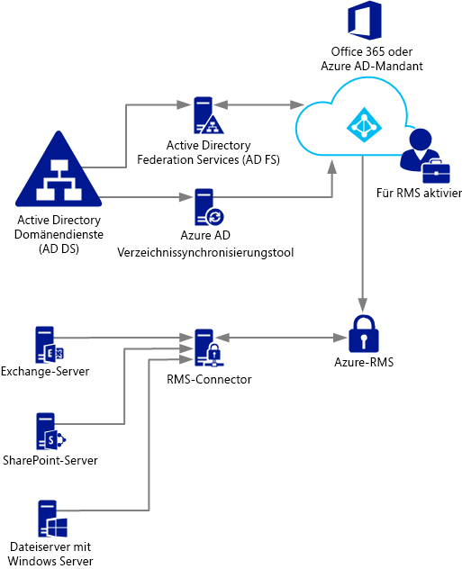
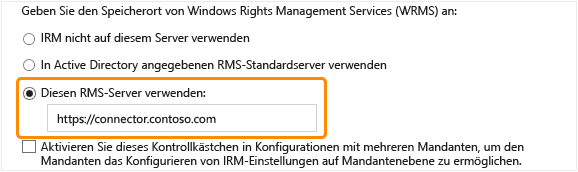

# Bereitstellen von Azure Rights Management-Connector
Mithilfe dieser Informationen erfahren Sie mehr über den Connector Microsoft Rights Management (RMS) und wie Sie Informationsschutz mit vorhandenen lokalen Bereitstellungen bereitstellen, die mithilfe von Microsoft Exchange Server, Microsoft SharePoint Server oder Dateiserver, auf denen Windows Server ausgeführt werden, und verwenden Sie die Datei Klassifizierung Infrastruktur (FCI)-Funktion der Ressourcen-Manager verwenden.

> [!TIP]
> Ein Szenario auf hoher Ebene wird mit Screenshots finden Sie in der [Automatically protecting files on file servers running Windows Server and File Classification Infrastructure](../../ems/AADRightsMgmt/What-is-Azure-Rights-Management-.md#BKMK_Example_FCI) im Abschnitt der [Was ist Azure Rights Management?](../../ems/AADRightsMgmt/What-is-Azure-Rights-Management-.md) Thema.

## <a name="OverviewConnector"></a>Überblick über den Microsoft Rights Management-connector
Der Connector für Microsoft Rights Management (RMS) können Sie schnell vorhandene lokale Server ihre Funktionalität für die Verwaltung von Informationsrechten (IRM) mit dem Cloud-basierten Microsoft Rights Management-Dienst (Azure RMS) verwenden aktivieren. Mit dieser Funktionalität können IT und Benutzer können problemlos Dokumente und Bilder innerhalb Ihrer Organisation zu schützen und außen, ohne zusätzliche Infrastruktur installieren oder Vertrauensstellungen mit anderen Organisationen einzurichten. Dieser Connector können, auch wenn einige Benutzer eine Verbindung mit online-Dienste in einer hybridszenario herstellen. Beispielsweise Postfächer einige Benutzer verwenden Exchange Online und einige Benutzerpostfächer Exchange Server verwenden. Nach der Installation der RMS-Verbindungsdienst alle Benutzer können schützen und Nutzen von e-Mail-Nachrichten und Anlagen mithilfe von Azure RMS und Informationsschutz nahtlos zwischen den zwei Bereitstellungskonfigurationen.

Der RMS-Verbindungsdienst ist ein Dienst mit geringem Speicherverbrauch, lokal auf Servern installieren, auf denen Windows Server 2012 R2, Windows Server 2012 oder Windows Server 2008 R2 ausgeführt. Zusätzlich zu den Connector auf physischen Computern ausgeführt werden, können Sie auch auf virtuellen Computern, einschließlich Azure IaaS-VMs ausführen. Nachdem Sie installieren und konfigurieren Sie den Connector, fungiert er als Kommunikationsschnittstelle (Relay) zwischen dem lokalen Server und Cloud-Dienst.

Wenn Sie Ihren eigenen mandantenschlüssel verwalten, für Azure RMS (Bring eigenen Schlüssel oder BYOK-Szenario), den RMS-Verbindungsdienst und die lokalen Server, die sie verwenden nicht die Hardwaresicherheitsmodul (HSM) zugreifen, die Ihr mandantenschlüssel enthält. Dies liegt daran, dass alle kryptografischen Vorgänge, mit denen den mandantenschlüssel in Azure RMS ausgeführt werden und nicht lokal.



Der RMS-Connector unterstützt die folgenden lokalen Server: Exchange Server, SharePoint-Server und Dateiserver, Windows Server ausgeführt werden und die Dateiklassifizierungsinfrastruktur verwenden, zu klassifizieren und Anwenden von Richtlinien auf Office-Dokumente in einem Ordner. Wenn Sie alle Dateitypen, die mit der Klassifizierung von Dateien schützen möchten, verwenden Sie den RMS-Verbindungsdienst nicht, aber verwenden Sie stattdessen die [RMS-Schutz Cmdlets](https://msdn.microsoft.com/library/azure/mt433195.aspx).

> [!NOTE]
> Unterstützte Versionen von diesen lokalen Servern, finden Sie unter "lokale Server, die Azure RMS unterstützen" in der [Applications that support Azure RMS](../../ems/AADRightsMgmt/Requirements-for-Azure-Rights-Management.md#BKMK_SupportedApplications) Teil der [Anforderungen für Azure Rights Management](../../ems/AADRightsMgmt/Requirements-for-Azure-Rights-Management.md) Thema.

Verwenden Sie in den folgenden Abschnitten können Sie planen, installieren und Konfigurieren des RMS-Connectors. Klicken Sie dann einige Konfigurationen nach der Installation ist erforderlich, damit der Server den Verbindungsdienst verwenden können.

- [Prerequisites for the RMS connector](../../ems/AADRightsMgmt/Deploying-the-Azure-Rights-Management-Connector.md#BKMK_Prereqs)

- **Schritt 1:**[Installing the RMS connector](../../ems/AADRightsMgmt/Deploying-the-Azure-Rights-Management-Connector.md#BKMK_InstallingConnector)

- **Schritt 2:**[Entering credentials](../../ems/AADRightsMgmt/Deploying-the-Azure-Rights-Management-Connector.md#EnteringCredentials)

- **Schritt 3:**[Authorizing servers to use the RMS connector](../../ems/AADRightsMgmt/Deploying-the-Azure-Rights-Management-Connector.md#AuthorizingServers)

- **Schritt 4:**[Configuring load balancing and high availability](../../ems/AADRightsMgmt/Deploying-the-Azure-Rights-Management-Connector.md#ConfiguringConnector)

- Optional: [Configuring the RMS connector to use HTTPS](../../ems/AADRightsMgmt/Deploying-the-Azure-Rights-Management-Connector.md#BKMK_ConfiguringHTTPS)

- Optional: [Configuring the RMS connector for a web proxy server](../../ems/AADRightsMgmt/Deploying-the-Azure-Rights-Management-Connector.md#BKMK_ConfiguringWebProxy)

- Optional: [Installing the RMS connector administration tool on administrative computers](../../ems/AADRightsMgmt/Deploying-the-Azure-Rights-Management-Connector.md#BKMK_InstallingStandaloneTool)

- **Schritt 5:**[Configuring servers to use the RMS connector](../../ems/AADRightsMgmt/Deploying-the-Azure-Rights-Management-Connector.md#ConfiguringServers)

   - [Configuring an Exchange server to use the connector](../../ems/AADRightsMgmt/Deploying-the-Azure-Rights-Management-Connector.md#BKMK_ExchangeServer)

   - [Configuring a SharePoint server to use the connector](../../ems/AADRightsMgmt/Deploying-the-Azure-Rights-Management-Connector.md#BKMK_ConfiguringSharePoint)

   - [Configuring a file server for File Classification Infrastructure to use the connector](../../ems/AADRightsMgmt/Deploying-the-Azure-Rights-Management-Connector.md#BKMK_FileServer)

- [Next steps](../../ems/AADRightsMgmt/Deploying-the-Azure-Rights-Management-Connector.md#BKMK_NextSteps)

## <a name="BKMK_Prereqs"></a>Erforderliche Komponenten für den RMS-connector
Bevor Sie den RMS-Verbindungsdienst installieren, stellen Sie sicher, dass die folgenden Anforderungen erfüllt sind.

|Anforderung <br /> <br />|Weitere Informationen <br /> <br />|
|---------------|-------------------------|
|Der Rights Management (RMS)-Dienst ist aktiviert. <br /> <br />|[Aktivieren von Azure Rights Management](../../ems/AADRightsMgmt/Activating-Azure-Rights-Management.md) <br /> <br />|
|Directory-Synchronisierung zwischen Ihren Active Directory-Gesamtstrukturen und Azure Active Directory <br /> <br />|Nachdem RMS aktiviert ist, muss Azure Active Directory für die Arbeit mit den Benutzern und Gruppen in Active Directory-Datenbank konfiguriert werden.________ **Important:** Dieser Schritt des Verzeichnis-Synchronisierung für den RMS-Verbindungsdienst funktionieren auch für ein Testnetzwerk ist erforderlich. Sie können zwar verwenden Office 365 und Azure Active Directory mithilfe von Konten, die Sie in Azure Active Directory manuell erstellen, muss diesen Connector mit Active Directory-Domänendiensten die Konten in Azure Active Directory synchronisiert werden. Synchronisierung von Kennwörtern ist nicht ausreichend.Weitere Informationen finden Sie unter:<ul><li>[Informationen zum Konfigurieren von Azure AD-Mandanten](http://technet.microsoft.com/library/hh967611.aspx) </li><li>[Anleitung zum Aktivieren der verzeichnissynchronisierung mit AAD mithilfe von DirSync](http://technet.microsoft.com/library/hh967642.aspx) </li> </ul>|
|Optional, jedoch empfohlen:<ul><li>Aktivieren Sie den Verbund zwischen Ihrem lokalen Active Directory und Azure Active Directory </li> </ul>|Sie können den Identitätsverbund zwischen Ihrem lokalen Verzeichnis und Azure Active Directory aktivieren. Diese Konfiguration ermöglicht eine nahtlose Benutzerfunktionalität mithilfe der einmaligen Anmeldung für den RMS-Dienst. Ohne einmaliges Anmelden werden Benutzer zur Eingabe ihrer Anmeldeinformationen aufgefordert, bevor sie den durch Rechte geschützten Inhalt verwenden können. <br /> <br />Informationen zum Konfigurieren des Verbunds mithilfe von Active Directory Federation Services (AD FS) zwischen Active Directory-Domänendiensten und Azure Active Directory finden Sie in der [Prüfliste: Verwenden von AD FS, Implementierung und Verwaltung des einmaligen Anmeldens](http://technet.microsoft.com/library/jj205462.aspx) in der Bibliothek für Windows Server. <br /> <br />|
|Mindestens zwei Mitgliedscomputer, auf dem Sie den RMS-Verbindungsdienst installieren:<ul><li>Eine 64-Bit-physische oder virtuelle Computer unter einem der folgenden Betriebssysteme:<ul><li>Windows Server 2012 R2 </li><li>Windows Server 2012 </li><li>Windows Server 2008 R2 </li> </ul> </li><li>Mindestens 1 GB RAM </li><li>Mindestens 64 GB Speicherplatz </li><li>Mindestens eine Netzwerkschnittstelle </li><li>Zugriff auf das Internet über eine Firewall (oder einen Webproxy), die keine Authentifizierung erforderlich ist </li><li>Muss in einer Gesamtstruktur oder Domäne, die anderen Gesamtstrukturen in der Organisation vertraut, die Installationen von Exchange oder SharePoint Server enthalten, die Sie mit der RMS-Verbindungsdienst verwenden möchten </li> </ul>|Für Fehlertoleranz und hohe Verfügbarkeit müssen Sie den RMS-Verbindungsdienst auf mindestens zwei Computern installieren. **Tip:** Wenn Sie Outlook Web Access oder mobile Geräte, die Exchange ActiveSync IRM verwenden und es ist wichtig, dass Sie verwalten den Zugriff auf e-Mails und Anlagen, die von Azure RMS geschützt sind, empfehlen wir, dass Sie eine Gruppe mit Lastenausgleich Connector-Server eine hohe Verfügbarkeit gewährleisten bereitstellen. <br />Sie benötigen keine dedizierten Server zum Ausführen des Konnektors, aber Sie müssen sie installieren, auf einem separaten Computer von den Servern, die den Verbindungsdienst verwenden werden. **Important:** Installieren Sie den Connector nicht auf einem Computer mit Exchange Server, SharePoint-Server oder einen Dateiserver, der für die dateiklassifizierungsinfrastruktur konfiguriert ist, wenn Sie die Funktionalität dieser Dienste mit Azure RMS verwenden möchten. Darüber hinaus dürfen diesen Connector auf einem Domänencontroller installieren. <br />|

## <a name="BKMK_InstallingConnector"></a>Installieren den RMS-Verbindungsdienst
Nachdem Sie die erforderlichen Komponenten im vorangehenden Abschnitt bestätigt haben, gehen Sie folgendermaßen vor, um den RMS-Verbindungsdienst installieren:

1. Identifizieren Sie die Computer (mindestens zwei), die den RMS-Verbindungsdienst ausgeführt wird. Sie müssen die im vorangehenden Abschnitt aufgeführte Mindestspezifikation erfüllen.

   > [!NOTE]
   >    Installieren Sie einen einzelnen RMS-Verbindungsdienst (bestehend aus mehreren Servern für hohe Verfügbarkeit) pro Mandant (Office 365-Mandanten oder Azure AD-Mandanten). Im Gegensatz zu Active Directory RMS müssen Sie nicht in jeder Gesamtstruktur einen RMS-Connector zu installieren.

2. Laden Sie die Quelldateien für den RMS-Verbindungsdienst aus der [Microsoft Download Center](http://go.microsoft.com/fwlink/?LinkId=314106).

   Um die RMS-Connector zu installieren, laden Sie RMSConnectorSetup.exe.

   Beachten Sie auch Folgendes:

   - Wenn Sie später den Connector auf einem 32-Bit-Computer konfigurieren möchten, laden Sie auch RMSConnectorAdminToolSetup_x86.exe.

   - Wenn Sie das Serverkonfigurationstool für den RMS-Verbindungsdienst verwenden möchten, zum Automatisieren der Konfigurations von Registrierungseinträgen auf Sie von lokalen Servern auch herunterladen Sie GenConnectorConfig.ps1.

3. Führen Sie auf dem Computer, auf dem Sie den RMS-Verbindungsdienst installieren möchten, **RMSConnectorSetup.exe** mit Administratorrechten.

4. Wählen Sie auf der Willkommen-Seite der Microsoft Rights Management-Connector-Setup-Seite **Installieren Sie Microsoft Rights Management-Connector auf dem Computer**, und klicken Sie dann auf **Weiter**.

5. Lesen und stimmen Sie dem Lizenzvertrag des RMS-Connector und klicken Sie dann auf **Weiter**.

Geben Sie ein Konto und Kennwort für den RMS-Connector konfigurieren, um den Vorgang fortzusetzen.

## <a name="EnteringCredentials"></a>Eingeben von Anmeldeinformationen
Bevor Sie den RMS-Verbindungsdienst konfigurieren können, müssen Sie Anmeldeinformationen für ein Konto eingeben, die über ausreichende Berechtigungen zum Konfigurieren des RMS-Connectors verfügt.

Wenn Sie implementiert haben darüber hinaus [Onboarding-Steuerelemente](https://technet.microsoft.com/library/jj658941.aspx#BKMK_OnboardingControls), stellen Sie sicher, dass das von Ihnen angegebene Konto Inhalte schützen kann. Wenn Sie den Inhalt der Gruppe "IT-Abteilung" schützen eingeschränkt, muss das Konto, das Sie hier z. B. ein Mitglied der Gruppe sein. Wenn nicht, die Fehlermeldung angezeigt wird: **ermitteln den Speicherort des Verwaltungsdiensts und Organisation ist fehlgeschlagen. Stellen Sie sicher, dass für Ihre Organisation Microsoft Rights Management-Dienst aktiviert ist.**

Sie können ein Konto verwenden, das eine der folgenden Berechtigungen verfügt:

- **Office 365-Mandanten Administrator**: ein Konto, ist kein globaler Administrator für Ihre Office 365-Mandanten.

- **Microsoft RMS-Mandanten globaler Administrator**: ein Konto mit Administratorrechten auf den Microsoft RMS-Mandanten.

- **Microsoft RMS-Verbindungsdienst Administrator**: ein Konto in Azure Active Directory, die gewährten Rechte zur Installation und Verwaltung der RMS-Verbindungsdienst für die Organisation.

   > [!NOTE]
   >    Wenn Sie den Microsoft RMS-Verbindungsdienst-Administratorkonto verwenden möchten, müssen Sie zunächst Folgendes ein, um die RMS-Connector-Administratorrolle zuweisen:
   > 
   >    1. Auf dem gleichen Computer herunterladen und Installieren von Windows PowerShell für Rights Management. Weitere Informationen finden Sie unter [Installieren WindowsPowerShell für Azure Rights Management](../../ems/AADRightsMgmt/Installing-Windows-PowerShell-for-Azure-Rights-Management.md).
   > 
   >       Starten Sie Windows PowerShell mit dem **als Administrator ausführen** Befehl, und Verbinden mit dem Azure RMS-Dienst mithilfe der [Connect-AadrmService](http://msdn.microsoft.com/library/windowsazure/dn629415.aspx) Befehl:
   > 
   >       ```
   >       Connect-AadrmService                   //provide Office365 Tenant Administrator or Microsoft RMS Tenant Global Administrator credential
   >       ```
   >    2. Führen Sie dann die [Hinzufügen AadrmRoleBasedAdministrator](http://msdn.microsoft.com/library/windowsazure/dn629417.aspx) Befehl mit nur einer der folgenden Parameter:
   > 
   >       ```
   >       Add-AadrmRoleBasedAdministrator -EmailAddress <email address> -Role "ConnectorAdministrator"
   >       ```
   > 
   >       ```
   >       Add-AadrmRoleBasedAdministrator -ObjectId <object id> -Role "ConnectorAdministrator"
   >       ```
   > 
   >       ```
   >       Add-AadrmRoleBasedAdministrator -SecurityGroupDisplayName <group Name> -Role "ConnectorAdministrator"
   >       ```
   >       Geben Sie zum Beispiel: **Add-AadrmRoleBasedAdministrator -EmailAddress melisa@contoso.com -Role " ConnectorAdministrator "**
   > 
   >       Obwohl diese Befehle die ConnectorAdministrator-Funktion verwenden, können Sie auch die Rolle "GlobalAdministrator" hier ebenfalls verwenden.

Während des Installationsvorgangs von RMS-Connector überprüft und installiert die erforderliche Software, Internet Information Services (IIS) installiert ist, sofern nicht bereits vorhanden, und die Connector-Software installiert und konfiguriert ist. Darüber hinaus wird RMS für die Konfiguration vorbereitet, indem Folgendes erstellt:

- Eine leere Tabelle von Servern, die zur Verwendung des Connectors für die Kommunikation mit Azure RMS autorisiert sind. Sie werden in dieser Tabelle später Server hinzufügen.

- Eine Reihe von Sicherheitstoken für den Connector, die Autorisierung von Vorgängen mit Azure RMS. Diese Tokens aus Azure RMS heruntergeladen und installiert werden, auf dem lokalen Computer in der Registrierung. Sie sind mit der Data Protection Application programming Interface (DPAPI) und die Anmeldeinformationen des Kontos LocalSystem geschützt.

Auf der letzten Seite des Assistenten, führen Sie die folgenden Schritte aus, und klicken Sie dann auf **Fertig stellen**:

- Wenn dies der erste Verbindungsdienst, die Sie installiert haben ist, wählen Sie nicht **Launch Verbindungsdienst-Administratorkonsole zum Autorisieren von Servern** zu diesem Zeitpunkt. Sie können diese Option auswählen, nachdem Sie Ihren zweiten (oder letzte) RMS-Verbindungsdienst installiert haben. In diesem Fall führen Sie den Assistenten erneut auf mindestens einem anderen Computer. Sie müssen mindestens zwei Verbindungsdienste installieren.

- Wenn Sie Ihren zweiten (oder letzten) Verbindungsdienst installiert haben, wählen Sie **Launch Verbindungsdienst-Administratorkonsole zum Autorisieren von Servern**.

> [!TIP]
> An diesem Punkt ist ein Überprüfungstest, den Sie ausführen können, um zu testen, ob die Webdienste für den RMS-Verbindungsdienst funktionsfähig sind:
> 
> - In einem Webbrowser eine Verbindung mit **http://&lt;connectoraddress&gt;/_wmcs/certification/servercertification.asmx**, und Ersetzen *&lt; verbindungsdienstadresse &gt;* mit der Serveradresse oder den Namen, die den RMS-Connector installiert ist. Zeigt eine erfolgreiche Verbindung einer **ServerCertificationWebService** Seite.

Wenn Sie den RMS-Verbindungsdienst deinstallieren müssen, führen Sie den Assistenten erneut aus, und wählen Sie die Deinstallationsoption.

## <a name="AuthorizingServers"></a>Autorisieren von Servern für den RMS-Verbindungsdienst verwenden.
Wenn Sie den RMS-Verbindungsdienst auf mindestens zwei Computern installiert haben, können Sie autorisieren, die Server und Dienste, die Sie den RMS-Verbindungsdienst verwenden möchten. Z. B. Server mit Exchange Server 2013 oder SharePoint Server 2013.

Um diese Server zu definieren, führen Sie das Administrationstool des RMS-Connector, und der Liste zugelassener Server fügen Sie Einträge hinzu. Sie können dieses Tool ausführen, bei der Auswahl **Launch Verbindungsdienst-Administratorkonsole zum Autorisieren von Servern** am Ende des Microsoft Rights Management-Connector-Setup-Assistenten, oder Sie können jedoch auch separat gestartet über den Assistenten.

Wenn Sie diese Server autorisieren, achten Sie darauf, dass Sie Folgendes berücksichtigen:

- Server, die Sie hinzufügen, werden spezielle Berechtigungen erteilt werden. Alle Konten, die Sie angeben, für die Exchange Server-Rolle in der Connectorkonfiguration gewährt werden die [super Benutzerrolle](https://technet.microsoft.com/library/mt147272.aspx) in Azure RMS, ermöglicht ihnen Zugriff auf alle Inhalte für diesen RMS-Mandanten. Die Administratorfunktion wird automatisch an diesem Punkt bei Bedarf aktiviert. Um das Sicherheitsrisiko Erhöhung von Berechtigungen zu vermeiden, werden Sie nur die Konten angeben, die von Exchange-Servern Ihres Unternehmens verwendet werden. Alle Server, die als SharePoint-Server oder Dateiserver, die FCI konfiguriert werden reguläre Benutzerberechtigungen gewährt.

- Sie können mehrere Server als einzelner Eintrag hinzufügen, durch die Angabe einer Active Directory-Sicherheit oder Verteilergruppe oder ein Dienstkonto, das von mehr als einem Server verwendet wird. Wenn Sie diese Konfiguration verwenden, die Gruppe von Servern gemeinsam dieselben RMS-Zertifikate und alle betrachtet Besitzer von Inhalten, die einer von ihnen geschützt sind. Um den Verwaltungsaufwand zu minimieren, empfehlen wir, dass Sie diese Konfiguration von einer einzelnen Gruppe statt einzelner Server verwenden, um Exchange-Servern Ihres Unternehmens oder einer SharePoint-Serverfarm zu autorisieren.

Auf der **Servern zugelassen wird, nutzen Sie den Connector** auf **Hinzufügen**.

### <a name="BKMK_AddServer"></a>Hinzufügen eines Servers zur Liste der zugelassenen Server
Auf der **ein Server des verbindungsdiensts** Seite, geben Sie den Namen des Objekts oder navigieren Sie zur Identifizierung des Objekts zu autorisieren.

Es ist wichtig, dass Sie das richtige Objekt autorisieren. Für einen Server den Verbindungsdienst verwenden muss das Konto, das der lokale Dienst (z. B. Exchange oder SharePoint) ausgeführt wird, für die Autorisierung ausgewählt werden. Wenn der Dienst als konfiguriertes Dienstkonto ausgeführt wird, fügen Sie den Namen dieses Dienstkontos z. B. der Liste. Wenn der Dienst als lokales System ausgeführt wird, fügen Sie den Namen des Computerobjekts (z. B. SERVERNAME$). Als bewährte Methode erstellen Sie eine Gruppe, die diese Konten enthält, und geben Sie die Gruppe anstelle einzelner Servernamen.

Weitere Informationen zu den verschiedenen Serverrollen:

- Für Server, auf denen Exchange ausgeführt: Sie müssen eine Sicherheitsgruppe angeben und Sie können die Standardgruppe (**Exchange-Server**), die Exchange automatisch erstellt und verwaltet alle Exchange-Server in der Gesamtstruktur.

- Für Server, die SharePoint ausführen:

   - Wenn ein SharePoint 2010-Server für die Ausführung als lokales System (es ist nicht über ein Dienstkonto verwenden) konfiguriert ist, erstellen Sie manuell eine Sicherheitsgruppe in Active Directory-Domänendienste und fügen Sie das Name-Computerobjekt für den Server in dieser Konfiguration zu dieser Gruppe hinzu.

   - Wenn ein SharePoint-Server konfiguriert ist, um ein Dienstkonto (empfohlen für SharePoint 2010) und die einzige Option für SharePoint 2013 verwenden, führen Sie folgende Schritte aus:

      1. Fügen Sie das Dienstkonto, das zum Aktivieren von SharePoint über sein Administratorkonsole konfiguriert werden der SharePoint-Zentraladministration-Dienst ausgeführt wird.

      2. Fügen Sie das Konto, das für den SharePoint-App-Pool konfiguriert ist.

      > [!TIP]
      >       Wenn diese beiden Konten unterschiedlich sind, sollten Sie eine Gruppe erstellen, die beide Konten, um den Verwaltungsaufwand zu minimieren enthält.

- Für Dateiserver, die Dateiklassifizierungsinfrastruktur verwenden, werden die zugeordneten Dienste als das lokale Systemkonto, daher müssen Sie das Computerkonto für den Dateiserver (z. B. SERVERNAME$) oder eine Gruppe, die diese Computerkonten enthält autorisieren.

Wenn Sie das Hinzufügen von Servern zu der Liste abgeschlossen haben, klicken Sie auf **Schließen**.

Wenn Sie dies noch nicht getan haben, müssen Sie jetzt Konfigurieren des Netzwerklastenausgleichs für Server, die die RMS-Verbindungsdienst installiert haben und erwägen, ob HTTPS für die Verbindungen zwischen diesen Servern und Servern, die Sie gerade autorisiert haben.

## <a name="ConfiguringConnector"></a>Konfigurieren der Lastausgleich und hohe Verfügbarkeit
Nachdem Sie die zweite oder letzte Instanz des RMS-Verbindungsdienst installiert haben, definieren Sie einen Connector-URL-Namen, und konfigurieren Sie ein Lastenausgleichssystem.

Der Connector-URL-Name kann einen beliebigen Namen unter einem Namespace, die Sie steuern. Sie könnten z. B. einen Eintrag erstellen, im DNS-System für **rmsconnector.contoso.com** und konfigurieren Sie diesen Eintrag, um eine IP-Adresse in Ihrem System zu verwenden. Es gibt keine speziellen Anforderungen für diesen Namen, und sie muss nicht auf die Connector-Server selbst konfiguriert werden. Nur angeben, wenn Ihre Exchange- und SharePoint Server mit dem Connector über das Internet zu kommunizieren, muss dieser Name nicht im Internet zu beheben.

> [!IMPORTANT]
> Es wird empfohlen, dass dieser Name nicht ändern, nachdem Sie Exchange oder SharePoint-Server für den Connector die Verwendung konfiguriert haben, da Sie von diesen Servern alle IRM-Konfigurationen deaktivieren und dann neu konfigurieren müssen.

Nachdem der Name in DNS erstellt und für eine IP-Adresse konfiguriert ist, konfigurieren Sie einen Lastenausgleich für diese Adresse, die Datenverkehr an die Connector-Server weiterleitet. Alle IP-basierten Lastenausgleich können zu diesem Zweck umfasst das Feature Netzwerklastenausgleich (Network Load Balancing, NLB) in Windows Server. Weitere Informationen finden Sie unter [Load Balancing Deployment Guide](http://technet.microsoft.com/library/cc754833%28v=WS.10%29.aspx).

Verwenden Sie die folgenden Einstellungen, um NLB-Cluster zu konfigurieren:

- Anschlüsse: 80 (für HTTP) oder 443 (für HTTPS)

   Weitere Informationen dazu, ob Sie HTTP oder HTTPS verwenden finden Sie im nächsten Abschnitt.

- Affinität: keine

- Verteilungsmethode: gleich

Dieser Name, die Sie für das System mit Lastenausgleich (für den Server mit dem RMS-Connector-Dienst) zu definieren ist der Name Ihrer Organisation RMS-Connector, den Sie später beim Konfigurieren der lokalen Servern mithilfe von Azure RMS verwenden.

## <a name="BKMK_ConfiguringHTTPS"></a>Konfigurieren des RMS-Connectors zur Verwendung von HTTPS
> [!NOTE]
> Dieser Konfigurationsschritt ist optional, aber empfohlen, zur Erhöhung der Sicherheit.

Obwohl die Verwendung von TLS oder SSL für den RMS-Verbindungsdienst optional ist, empfehlen wir es für alle HTTP-basierte sicherheitsrelevanten Dienst. Diese Konfiguration authentifiziert die Server mit den Connector auf Ihre Exchange- und SharePoint-Server, die den Verbindungsdienst verwenden. Darüber hinaus alle von diesen Servern an den Anschluss gesendeten Daten verschlüsselt werden.

Installieren Sie ein Serverauthentifizierungszertifikat, das den Namen enthält, den Sie für den Connector verwenden, zum Aktivieren der RMS-Verbindungsdienst TLS, auf jedem Server verwenden, der den RMS-Verbindungsdienst ausgeführt wird. Z. B. wenn der RMS-Verbindungsdienst, die Sie im definierten Namen DNS ist **rmsconnector.contoso.com**, ein Serverauthentifizierungszertifikat, das enthält bereitstellen **rmsconnector.contoso.com** in der Antragsteller des Zertifikats als allgemeinen Namen. Oder geben Sie **rmsconnector.contoso.com** in den alternativen Namen des Zertifikats als DNS-Wert. Das Zertifikat muss nicht den Namen des Servers enthalten. Klicken Sie dann in IIS Binden dieses Zertifikat auf der Standardwebsite.

Wenn Sie die HTTPS-Option verwenden, stellen Sie sicher, dass alle Server, die den Connector ausgeführt, ein gültiges Authentifizierungszertifikat haben, mit einer Stammzertifizierungsstelle verkettet Zertifikat der vertrauenswürdigen Sites Ihre Exchange- und SharePoint Server. Darüber hinaus müssen die Zertifizierungsstelle (CA), die die Zertifikate für die Connector-Server ausgestellt hat eine Zertifikatssperrliste (CRL) veröffentlicht, diese Zertifikatsperrliste Herunterladen der Exchange- und SharePoint-Server sein.

> [!TIP]
> Sie können die folgenden Informationen und Ressourcen, anfordern und Installieren eines Serverzertifikats für die Authentifizierung, und dieses Zertifikat auf der Standardwebsite in IIS binden:
> 
> - Wenn Sie Active Directory-Zertifikatdienste (AD CS) und einer Unternehmenszertifizierungsstelle (CA) verwenden, um diese Serverauthentifizierungszertifikate bereitzustellen, können Sie doppelte und verwenden Sie die Webserver-Zertifikatvorlage. Diese Zertifikatvorlage verwendet **in der Anforderung bereitgestellte** für den Antragstellernamen des Zertifikats, d. h., dass Sie den FQDN des RMS-Connector für den Antragstellernamen oder alternativen Antragstellernamen bereitstellen können, wenn Sie das Zertifikat anfordern.
> - Wenn Sie eine eigenständige Zertifizierungsstelle oder dieses Zertifikat von einem anderen Unternehmen erwerben, finden Sie unter [Konfigurieren von Internetserverzertifikaten (IIS 7)](http://technet.microsoft.com/library/cc731977%28v=ws.10%29.aspx) in der [Webserver (IIS)](http://technet.microsoft.com/library/cc753433%28v=ws.10%29.aspx) -Dokumentationsbibliothek in TechNet.
> - Konfigurieren von IIS für die Verwendung des Zertifikats finden Sie in [eine Bindung zu einer Website (IIS 7) hinzufügen](http://technet.microsoft.com/library/cc731692.aspx) in den in der [Webserver (IIS)](http://technet.microsoft.com/library/cc753433%28v=ws.10%29.aspx) auf TechNet-Dokumentationsbibliothek.

## <a name="BKMK_ConfiguringWebProxy"></a>Konfigurieren den RMS-Verbindungsdienst für einen Webproxyserver
Wenn der Connector-Server in einem Netzwerk, die keine direkte Internetkonnektivität und erfordert die manuelle Konfiguration einen Webproxyserver für ausgehenden Internetzugriff installiert sind, müssen Sie die Registrierung auf diesen Servern für den RMS-Connector konfigurieren.

1. Öffnen Sie auf jedem Server, der den RMS-Verbindungsdienst ausgeführt wird einen Registrierungs-Editor, z. B. "regedit" ein.

2. Navigieren Sie zu **HKEY_LOCAL_MACHINE\SOFTWARE\Microsoft\AADRM\Connector**

3. Fügen Sie den Zeichenfolgenwert des **ProxyAddress** und legen Sie dann die Daten für diesen Wert werden **http://&lt;MyProxyDomainOrIPaddress&gt;:&lt;MyProxyPort&gt;**

   Beispiel: **http://proxyserver.contoso.com:8080**

4. Schließen Sie den Registrierungseditor, und starten Sie den Server, oder führen Sie einen IISReset-Befehl, um IIS neu zu starten.

## <a name="BKMK_InstallingStandaloneTool"></a>Installieren das Administrationstool des RMS-Connector auf administrativen Computern
Sie können das Administrationstool des RMS-Connector auf einem Computer ausführen, die nicht den RMS-Verbindungsdienst installiert, wenn diese Computer die folgenden Anforderungen erfüllt:

- Eine physische oder virtuelle Computer unter Windows Server 2012 oder Windows Server 2012 R2 (alle Editionen), Windows Server 2008 R2 oder Windows Server 2008 R2 Service Pack 1 (alle Editionen), Windows 8.1, Windows 8 oder Windows 7.

- Mindestens 1 GB RAM.

- Mindestens 64 GB Speicherplatz.

- Mindestens eine Netzwerkschnittstelle.

- Zugriff auf das Internet über eine Firewall (oder Webproxy).

Um das Administrationstool des RMS-Connector zu installieren, führen Sie die folgenden Dateien:

- Für einen 32-Bit-Computer: RMSConnectorAdminToolSetup_x86.exe

- Für einen 64-Bit-Computer: RMSConnectorSetup.exe

Wenn Sie diese Dateien bereits heruntergeladen haben, können Sie hierzu aus den [Microsoft Download Center](http://go.microsoft.com/fwlink/?LinkId=314106).

## <a name="ConfiguringServers"></a>Konfigurieren von Servern für den RMS-Verbindungsdienst verwenden.
Nachdem Sie installiert und den RMS-Connector konfiguriert haben, können Sie Ihre lokalen Server konfigurieren, die mithilfe von Rights Management und Verbinden mit Azure RMS mit dem Connector. Das bedeutet, dass die folgenden Server konfigurieren:

- Für Exchange 2013: Client Access-Server und Postfachserver

- Für Exchange 2010: Clientzugriffsserver und Hub-Transport-Server

- Für SharePoint:-SharePoint-Front-End-Webserver, einschließlich der Hostserver der zentralen Verwaltung

- Dateiklassifizierungsinfrastruktur: Windows Server-Computer, die Ressourcen-Manager für Dateiserver installiert haben

Diese Konfiguration erfordert Registrierungseinträge. Zu diesem Zweck haben Sie zwei Optionen:

|Konfigurationsoption <br /> <br />|Vorteile <br /> <br />|Nachteile <br /> <br />|
|------------------------|------------|-------------|
|Automatisch mithilfe des Server-Konfigurationstools für Microsoft RMS-Verbindungsdienst <br /> <br />|Keine direkte Bearbeitung der Registrierung. Dies ist für Sie automatisiert, mithilfe eines Skripts. <br /> <br />Keine Notwendigkeit zum Ausführen von Windows PowerShell-Cmdlet, um Ihre Microsoft RMS-URL zu erhalten. <br /> <br />Die erforderlichen Komponenten werden automatisch für Sie überprüft (aber nicht automatisch behoben), wenn Sie lokal ausführen. <br /> <br />|Wenn Sie das Tool ausführen, müssen Sie eine Verbindung mit einem Server, die bereits der RMS-Verbindungsdienst ausgeführt wird. <br /> <br />|
|Manuell durch Bearbeiten der Registrierung <br /> <br />|Keine Verbindung mit einem Server mit der RMS-Verbindungsdienst ist erforderlich. <br /> <br />|Höherer Verwaltungsaufwand, die fehleranfällig ist. <br /> <br />Sie müssen Ihre Microsoft RMS-URL abrufen, mit dem Sie einen Windows PowerShell-Befehl ausführen müssen. <br /> <br />Sie müssen alle erforderlichen Komponenten prüft immer selbst durchführen. <br /> <br />|
> [!IMPORTANT]
> In beiden Fällen müssen Sie manuell alle erforderlichen Komponenten zu installieren und Konfigurieren von Exchange, SharePoint und die Dateiklassifizierungsinfrastruktur, um Rights Management verwenden.

In den meisten Organisationen werden automatische Konfiguration mithilfe des Server-Konfigurationstools für Microsoft RMS-Verbindungsdienst die bessere Option, da es effizienter und zuverlässiger als die manuelle Konfiguration bereitstellt.

Nach der Änderung der Konfiguration auf diesen Servern, müssen sie neu starten, wenn sie Exchange oder SharePoint ausgeführt werden und zuvor konfiguriert AD RMS verwenden. Besteht keine Notwendigkeit, diese Server neu zu starten, wenn Sie diese für die Verwaltung von Informationsrechten zum ersten Mal konfigurieren. Sie müssen immer den Dateiserver neu, der konfiguriert ist, um die Dateiklassifizierungsinfrastruktur verwenden, nachdem Sie diese Konfiguration geändert haben.

1. Wenn Sie das Skript für das Server-Konfigurationstool für Microsoft RMS-Verbindungsdienst (genconnectorconfig. ps1) noch nicht heruntergeladen haben, laden Sie es von der [Microsoft Download Center](http://go.microsoft.com/fwlink/?LinkId=314106).

2. Speichern Sie die Datei GenConnectorConfig.ps1 auf dem Computer, in dem Sie das Tool ausgeführt wird. Wenn Sie das Tool lokal ausführen, muss dies dem Server sein, den Sie für die Kommunikation mit dem RMS-Connector konfigurieren möchten. Andernfalls können Sie es auf jedem Computer speichern.

3. Entscheiden Sie, wie Sie das Tool ausführen:

   - **Lokal**: Sie können das Tool interaktiv ausführen, vom Server für die Kommunikation mit dem RMS-Connector konfiguriert werden. Dies ist nützlich für eine einmalige Konfiguration, z. B. einer Umgebung testen.

   - **Softwarebereitstellung**: Sie können das Tool, um Registrierungsdateien zu erzeugen, die Sie dann auf einem oder mehreren relevanten Servern bereitstellen mithilfe einer Systems Management-Anwendung, die Bereitstellung von Software, z. B. System Center Configuration Manager unterstützt ausführen.

   - **Von Gruppenrichtlinien**: Ausführen des Tools zum Generieren eines Skripts, mit denen Sie den Administrator, die Gruppenrichtlinienobjekte für den zu konfigurierenden Server erstellen können. Dieses Skript erstellt ein Gruppenrichtlinienobjekt für jeden Server so konfiguriert werden, die der Administrator dann die relevanten Server zuweisen können.

   > [!NOTE]
   >    Dieses Tool konfiguriert die Server mitzuteilen, dass mit der RMS-Verbindungsdienst und, die am Anfang dieses Abschnitts aufgelistet sind. Führen Sie dieses Tool nicht auf den Servern, auf denen der RMS-Verbindungsdienst ausgeführt.

4. Starten Sie Windows PowerShell mit der **als Administrator ausführen** aus, und den get-Help Get-Befehl zum Lesen von Anweisungen verwenden die Verwendung des Tools für Ihre gewählte Konfigurationsmethode anzuzeigen:

   ```
   Get-help .\GenConnectorConfig.ps1 -detailed
   ```

Wenn das Tool ausgeführt wird, sie aufgefordert, die URL des RMS-Verbindungsdienst für Ihre Organisation einzugeben. Geben Sie das Protokollpräfix (HTTP:// oder HTTPS://) und den Namen des Connectors, die Sie in DNS für den Lastenausgleich-Adresse Ihres Connectors definiert. Zum Beispiel: https://connector.contoso.com. Das Tool dann diese URL verwendet, um die Server mit der RMS-Verbindungsdienst zu kontaktieren, und erhalten weitere Parameter, die zum Erstellen der erforderlichen Konfigurationen verwendet werden.

> [!IMPORTANT]
> Wenn Sie dieses Tool ausführen, stellen Sie sicher, dass Sie geben Sie den Namen des Connectors RMS mit Lastenausgleich für Ihre Organisation und nicht den Namen eines Servers, der den RMS-Connector-Dienst ausgeführt wird.

Verwenden Sie spezifische Informationen für jeden Diensttyp in den folgenden Abschnitten:

- [Configuring an Exchange server to use the connector](../../ems/AADRightsMgmt/Deploying-the-Azure-Rights-Management-Connector.md#BKMK_ExchangeServer)

- [Configuring a SharePoint server to use the connector](../../ems/AADRightsMgmt/Deploying-the-Azure-Rights-Management-Connector.md#BKMK_ConfiguringSharePoint)

- [Configuring a file server for File Classification Infrastructure to use the connector](../../ems/AADRightsMgmt/Deploying-the-Azure-Rights-Management-Connector.md#BKMK_FileServer)

> [!NOTE]
> Nachdem dieser Server für die Verwendung des Connectors konfiguriert sind, funktionieren möglicherweise Clientanwendungen, die lokal auf diesen Servern installiert sind nicht mit RMS. In diesem Fall ist die Anwendung versucht, verwenden Sie den Connector, sondern verwenden RMS direkt, was nicht unterstützt wird.
> 
> Darüber hinaus Wenn Office 2010 lokal auf einem Exchange-Server installiert ist, die Clientanwendung IRM-Features funktionieren möglicherweise von diesem Computer aus, nachdem der Server so konfiguriert ist, dass Sie den Connector verwenden, aber dies wird nicht unterstützt.
> 
> In beiden Fällen müssen Sie die Clientanwendungen auf separaten Computern installieren, die nicht für die Verwendung des Connectors konfiguriert sind. Sie werden dann korrekt RMS direkt verwenden.

### <a name="BKMK_ExchangeServer"></a>Konfigurieren eines Exchange-Servers, um den Connector zu verwenden.
Die folgenden Exchange-Serverfunktionen kommunizieren mit dem RMS-Connector:

- Für Exchange 2013: Client Access-Server und Postfachserver

- Für Exchange 2010: Clientzugriffsserver und Hub-Transport-server

Um den RMS-Verbindungsdienst verwenden zu können, müssen diese mit Exchange Server eine der folgenden Softwareversionen ausgeführt werden:

- Exchange Server 2013 mit Exchange 2013 kumulative Update 3

- Exchange Server 2010 mit Exchange 2010 Service Pack 3-Updaterollup 6

Sie müssen auch auf diesen Servern eine Version des RMS-Clients installieren, die Unterstützung für RMS-Kryptografiemodus 2 enthält. Die minimale Version, die in Windows Server 2008 unterstützt wird, ist in dem Hotfix, die Sie herunterladen können enthalten [RSA-Schlüssellänge auf 2048 Bits erhöht für AD RMS in Windows Server 2008 R2 und Windows Server 2008](http://support.microsoft.com/kb/2627272). Die Mindestversion für Windows Server 2008 R2 kann heruntergeladen werden [RSA-Schlüssellänge auf 2048 Bits erhöht für AD RMS in Windows 7 oder Windows Server 2008 R2](http://support.microsoft.com/kb/2627273). Windows Server 2012 und Windows Server 2012 R2 bieten eine systemeigene Kryptografiemodus 2.

> [!IMPORTANT]
> Wenn diese Versionen oder spätere Versionen von Exchange und der RMS-Client nicht installiert sind, werden Sie nicht Exchange für den Connector konfigurieren können. Überprüfen Sie, dass diese Versionen installiert sind, bevor Sie fortfahren.

1. Die Exchange-Serverfunktionen, die mit der RMS-Verbindungsdienst kommunizieren, führen Sie eine der folgenden:

   - Führen Sie den Server-Konfigurationstool für Microsoft RMS-Verbindungsdienst. Weitere Informationen finden Sie im Abschnitt [How to use the server configuration tool for Microsoft RMS connector](../../ems/AADRightsMgmt/Deploying-the-Azure-Rights-Management-Connector.md#BKMK_HowToRunTheTool) in diesem Thema.

   - Bearbeiten Sie manuell die Registrierung, indem Sie die Tabellen in den folgenden Abschnitten Registrierungseinträge manuell auf den Servern hinzufügen.

2. Ermöglichen Sie die IRM-Funktionalität in Exchange. Weitere Informationen finden Sie unter [Informationen Rights Management-Prozeduren](https://technet.microsoft.com/library/dd351212%28v=exchg.150%29.aspx) in der Exchange-Bibliothek.

Verwenden Sie die Tabellen in den folgenden Abschnitten nur, wenn Sie manuell hinzufügen oder überprüfen die Registrierungseinträge auf diesen Servern, mit die Servern, um die RMS-Verbindungsdienst verwenden möchten. Hinweise zur Verwendung dieser Tabellen:

- *MicrosoftRMSURL* Microsoft RMS-Dienst-URL Ihres Unternehmens ist. Um diesen Wert zu ermitteln:

   1. Führen Sie die [Get-AadrmConfiguration](http://msdn.microsoft.com/library/windowsazure/dn629410.aspx) Cmdlet für Azure RMS. Wenn Sie Windows PowerShell-Modul für Azure RMS bereits installiert haben, finden Sie unter [Installieren WindowsPowerShell für Azure Rights Management](../../ems/AADRightsMgmt/Installing-Windows-PowerShell-for-Azure-Rights-Management.md).

   2. Identifizieren Sie anhand der Ausgabe der **LicensingIntranetDistributionPointUrl** Wert.

      Beispiel: **LicensingIntranetDistributionPointUrl: https://5c6bb73b-1038-4eec-863d-49bded473437.rms.na.aadrm.com/_wmcs/licensing**

   3. Entfernen Sie den Wert **/_wmcs/licensing** aus der Zeichenfolge. Die restliche Zeichenfolge ist Ihre Microsoft RMS-URL. In unserem Beispiel wäre der Microsoft RMS-URL die folgenden Wert:

      **https://5c6bb73b-1038-4eec-863d-49bded473437.RMS.na.aadrm.com**

- *ConnectorFQDN* der Lastenausgleich Name, den Sie in DNS für den Connector definiert. Beispiel: **rmsconnector.contoso.com**.

- Verwenden Sie das HTTPS-Präfix für den Connector-URL, wenn Sie den Connector für die Verwendung von HTTPS für die Kommunikation mit Ihren lokalen Servern konfiguriert haben. Weitere Informationen finden Sie im Abschnitt [Configuring the RMS connector to use HTTPS](../../ems/AADRightsMgmt/Deploying-the-Azure-Rights-Management-Connector.md#BKMK_ConfiguringHTTPS) dieses Themas. Die Microsoft RMS-URLs verwenden immer HTTPS.

|Registrierungspfad <br /> <br />|Typ <br /> <br />|Wert <br /> <br />|Daten <br /> <br />|
|----------------------|-------|--------|---------|
|HKEY_LOCAL_MACHINE\Software\Microsoft\MSDRM\ServiceLocation\Activation <br /> <br />|Reg_SZ <br /> <br />|Standard <br /> <br />|https://*MicrosoftRMSURL/_wmcs/Certification* <br /> <br />|
|HKEY_LOCAL_MACHINE\Software\Microsoft\MSDRM\ServiceLocation\EnterprisePublishing <br /> <br />|Reg_SZ <br /> <br />|Standard <br /> <br />|https://MicrosoftRMSURL/_wmcs/Licensing <br /> <br />|
|HKEY_LOCAL_MACHINE\SOFTWARE\Microsoft\ExchangeServer\v15\IRM\CertificationServerRedirection <br /> <br />|Reg_SZ <br /> <br />|https://*MicrosoftRMSURL* <br /> <br />|Einer der folgenden Werte, abhängig davon, ob Sie HTTP oder HTTPS von Ihrem Exchange-Server zum RMS-Connector:<ul><li>http://*ConnectorFQDN* </li><li>https://*ConnectorFQDN* </li> </ul>|
|HKEY_LOCAL_MACHINE\SOFTWARE\Microsoft\ExchangeServer\v15\IRM\LicenseServerRedirection <br /> <br />|Reg_SZ <br /> <br />|https://*MicrosoftRMSURL* <br /> <br />|Einer der folgenden Werte, abhängig davon, ob Sie HTTP oder HTTPS von Ihrem Exchange-Server zum RMS-Connector:<ul><li>http://*ConnectorFQDN* </li><li>https://*ConnectorFQDN* </li> </ul>|


|Registrierungspfad <br /> <br />|Typ <br /> <br />|Wert <br /> <br />|Daten <br /> <br />|
|----------------------|-------|--------|---------|
|HKEY_LOCAL_MACHINE\Software\Microsoft\MSDRM\ServiceLocation\Activation <br /> <br />|Reg_SZ <br /> <br />|Standard <br /> <br />|https://*MicrosoftRMSURL*/_wmcs/Zertifizierung <br /> <br />|
|HKEY_LOCAL_MACHINE\Software\Microsoft\MSDRM\ServiceLocation\EnterprisePublishing <br /> <br />|Reg_SZ <br /> <br />|Standard <br /> <br />|https://*MicrosoftRMSURL*/_wmcs/Licensing <br /> <br />|
|HKEY_LOCAL_MACHINE\SOFTWARE\Microsoft\ExchangeServer\v14\IRM\CertificationServerRedirection <br /> <br />|Reg_SZ <br /> <br />|https://*MicrosoftRMSURL* <br /> <br />|Einer der folgenden Werte, abhängig davon, ob Sie HTTP oder HTTPS von Ihrem Exchange-Server zum RMS-Connector:<ul><li>http://*ConnectorFQDN* </li><li>https://*ConnectorFQDN* </li> </ul>|
|HKEY_LOCAL_MACHINE\SOFTWARE\Microsoft\ExchangeServer\v14\IRM\LicenseServerRedirection <br /> <br />|Reg_SZ <br /> <br />|https://*MicrosoftRMSURL* <br /> <br />|Einer der folgenden Werte, abhängig davon, ob Sie HTTP oder HTTPS von Ihrem Exchange-Server zum RMS-Connector:<ul><li>http://*ConnectorFQDN* </li><li>https://*ConnectorFQDN* </li> </ul>|

### <a name="BKMK_ConfiguringSharePoint"></a>Konfigurieren von einem SharePoint-Server, um den Connector zu verwenden.
Die folgenden SharePoint-Rollen kommunizieren mit dem RMS-Connector:

- Front-End-SharePoint-Webserver, einschließlich der Hostserver der zentralen Verwaltung

Um die RMS-Verbindungsdienst verwenden zu können, müssen diese auf dem SharePoint Server eine der folgenden Softwareversionen ausgeführt werden:

- SharePoint Server 2013

- SharePoint Server 2010

SharePoint 2013-Server muss auch eine Version des MSIPC 2.1-Clients ausgeführt werden, die from1.0.622.34 über 1.0.10907.0 ist.

> [!WARNING]
> Es gibt mehrere Versionen des MSIPC 2.1-Clients, achten Sie darauf, installieren Sie eine Version, die in diesem Artikel verwiesen wird.
> 
> Sie können die Clientversion überprüfen, indem Sie die Versionsnummer der Datei, die sich im befindet **\Program Files\Active Directory Rights Management Services Client 2.1**. Das Dialogfeld "Eigenschaften" zeigt der Versionsnummer des MSIPC 2.1-Clients.

Diese Server mit SharePoint 2010 müssen eine Version des MSRDM-Clients installiert, die Unterstützung für RMS-Kryptografiemodus 2 enthält. Die minimale Version, die in Windows Server 2008 unterstützt wird, ist in dem Hotfix, die Sie herunterladen können enthalten [RSA-Schlüssellänge auf 2048 Bits erhöht für AD RMS in Windows Server 2008 R2 und Windows Server 2008](http://support.microsoft.com/kb/2627272), und die Mindestversion für Windows Server 2008 R2 kann heruntergeladen werden [RSA-Schlüssellänge auf 2048 Bits erhöht für AD RMS in Windows 7 oder Windows Server 2008 R2](http://support.microsoft.com/kb/2627273). Windows Server 2012 und Windows Server 2012 R2 bieten eine systemeigene Kryptografiemodus 2.

1. Führen Sie auf der SharePoint-Servern, die mit der RMS-Verbindungsdienst kommunizieren eine der folgenden:

   - Führen Sie den Server-Konfigurationstool für Microsoft RMS-Verbindungsdienst. Weitere Informationen finden Sie im Abschnitt [How to use the server configuration tool for Microsoft RMS connector](../../ems/AADRightsMgmt/Deploying-the-Azure-Rights-Management-Connector.md#BKMK_HowToRunTheTool) in diesem Thema.

   - Wenn Sie SharePoint 2013 verwenden, stellen Sie manuell die Registrierung unter Verwendung der Tabelle im folgenden Abschnitt Registrierungseinträge manuell auf den Servern hinzufügen.

2. Aktivieren von IRM in SharePoint. Weitere Informationen finden Sie unter [Konfigurieren Information Rights Management (SharePoint Server 2010)](https://technet.microsoft.com/library/hh545607%28v=office.14%29.aspx) in der SharePoint-Bibliothek.

   Wenn Sie diese Schritte befolgen, müssen Sie SharePoint durch Angabe des Connectors Verwendung konfigurieren **verwenden diesen RMS-Server**, und geben Sie dann den Lastenausgleich Connector-URL, die Sie konfiguriert. Geben Sie das Protokollpräfix (HTTP:// oder HTTPS://) und den Namen des Connectors, die Sie in DNS für den Lastenausgleich-Adresse Ihres Connectors definiert. Der Connectorname https://connector.contoso.com ist, wird z. B. die Konfiguration wie im folgenden Bild aussehen:

   

   Nach einer SharePoint-Farm IRM aktiviert ist, können Sie IRM für einzelne Bibliotheken aktivieren, mit der **Information Rights Management** option der **Bibliothekseinstellungen** Seite für jede der Bibliotheken.

   > [!IMPORTANT]
   >    Für SharePoint auf RMS mit dem Connector zugreifen müssen Sie die entsprechenden Konten im Administrationstool RMS-Connector autorisieren. Wenn Sie dies nicht bereits getan, finden Sie unter [Authorizing servers to use the RMS connector](../../ems/AADRightsMgmt/Deploying-the-Azure-Rights-Management-Connector.md#AuthorizingServers) in diesem Thema.

Verwenden Sie die Tabelle im folgenden Abschnitt nur, wenn Sie möchten, manuell hinzufügen oder Überprüfen der Registrierung auf einem Server mit SharePoint 2013.

Hinweise zur Verwendung dieser Tabelle:

- *MicrosoftRMSURL* Microsoft RMS-Dienst-URL Ihres Unternehmens ist. Um diesen Wert zu ermitteln:

   1. Führen Sie die [Get-AadrmConfiguration](http://msdn.microsoft.com/library/windowsazure/dn629410.aspx) Cmdlet für Azure RMS. Wenn Sie Windows PowerShell-Modul für Azure RMS bereits installiert haben, finden Sie unter [Installieren WindowsPowerShell für Azure Rights Management](../../ems/AADRightsMgmt/Installing-Windows-PowerShell-for-Azure-Rights-Management.md).

   2. Identifizieren Sie anhand der Ausgabe der **LicensingIntranetDistributionPointUrl** Wert.

      Beispiel: **LicensingIntranetDistributionPointUrl: https://5c6bb73b-1038-4eec-863d-49bded473437.rms.na.aadrm.com/_wmcs/licensing**

   3. Entfernen Sie den Wert **/_wmcs/licensing** aus der Zeichenfolge. Die restliche Zeichenfolge ist Ihre Microsoft RMS-URL. In unserem Beispiel wäre der Microsoft RMS-URL die folgenden Wert:

      **https://5c6bb73b-1038-4eec-863d-49bded473437.RMS.na.aadrm.com**

- *ConnectorFQDN* der Lastenausgleich Name, den Sie in DNS für den Connector definiert. Beispiel: **rmsconnector.contoso.com**.

- Verwenden Sie das HTTPS-Präfix für den Connector-URL, wenn Sie den Connector für die Verwendung von HTTPS für die Kommunikation mit Ihren lokalen Servern konfiguriert haben. Weitere Informationen finden Sie im Abschnitt [Configuring the RMS connector to use HTTPS](../../ems/AADRightsMgmt/Deploying-the-Azure-Rights-Management-Connector.md#BKMK_ConfiguringHTTPS) dieses Themas. Die Microsoft RMS-URLs verwenden immer HTTPS.

|Registrierungspfad <br /> <br />|Typ <br /> <br />|Wert <br /> <br />|Daten <br /> <br />|
|----------------------|-------|--------|---------|
|HKEY_LOCAL_MACHINE\SOFTWARE\Microsoft\MSIPC\ServiceLocation\LicensingRedirection <br /> <br />|Reg_SZ <br /> <br />|https://*MicrosoftRMSURL*/_wmcs/licensing <br /> <br />|Einer der folgenden Werte, abhängig davon, ob Sie HTTP oder HTTPS von Ihrem SharePoint-Server mit dem RMS-Connector:<ul><li>http://*ConnectorFQDN*/_wmcs/licensing </li><li>https://*ConnectorFQDN*/_wmcs/licensing </li> </ul>|
|HKEY_LOCAL_MACHINE\SOFTWARE\Microsoft\MSIPC\ServiceLocation\EnterpriseCertification <br /> <br />|Reg_SZ <br /> <br />|Standard <br /> <br />|Einer der folgenden Werte, abhängig davon, ob Sie HTTP oder HTTPS von Ihrem SharePoint-Server mit dem RMS-Connector:<ul><li>http://*ConnectorFQDN*/_wmcs/Zertifizierung </li><li>https://*ConnectorFQDN*/_wmcs/Zertifizierung </li> </ul>|
|HKEY_LOCAL_MACHINE\SOFTWARE\Microsoft\MSIPC\ServiceLocation\EnterprisePublishing <br /> <br />|Reg_SZ <br /> <br />|Standard <br /> <br />|Einer der folgenden Werte, abhängig davon, ob Sie HTTP oder HTTPS von Ihrem SharePoint-Server mit dem RMS-Connector:<ul><li>http://*ConnectorFQDN*/_wmcs/licensing </li><li>https://*ConnectorFQDN*/_wmcs/licensing </li> </ul>|

### <a name="BKMK_FileServer"></a>Konfigurieren eines Dateiservers für die Dateiklassifizierungsinfrastruktur zur Verwendung des Connectors
Um die RMS-Verbindungsdienst und die Dateiklassifizierungsinfrastruktur verwenden, um Office-Dokumente zu schützen, muss der Dateiserver eine der folgenden Betriebssysteme ausgeführt werden:

- Windows Server 2012 R2

- Windows Server 2012

1. Auf die Dateiservern, die für die Dateiklassifizierungsinfrastruktur konfiguriert wird die Kommunikation mit dem RMS-Connector, führen Sie eine der folgenden:

   - Führen Sie den Server-Konfigurationstool für Microsoft RMS-Verbindungsdienst. Weitere Informationen finden Sie im Abschnitt [How to use the server configuration tool for Microsoft RMS connector](../../ems/AADRightsMgmt/Deploying-the-Azure-Rights-Management-Connector.md#BKMK_HowToRunTheTool) in diesem Thema.

   - Bearbeiten Sie manuell die Registrierung, indem Sie in der Tabelle im folgenden Abschnitt Registrierungseinträge manuell auf den Servern hinzufügen.

2. Erstellen von Klassifizierungsregeln und Dateiverwaltungsaufgaben zum Schützen von Dokumenten mit RMS-Verschlüsselung, und geben Sie eine RMS-Vorlage, um automatisch die RMS-Richtlinien anzuwenden. Weitere Informationen finden Sie unter [Ressourcen-Manager (Übersicht)](http://technet.microsoft.com/library/hh831701.aspx) in der Windows Server-Dokumentationsbibliothek.

Verwenden Sie die Tabelle im folgenden Abschnitt nur, wenn Sie möchten, manuell hinzufügen oder Überprüfen der Registrierung auf einem Dateiserver, der die Dateiklassifizierungsinfrastruktur verwendet, um Dokumente zu schützen.

Hinweise zur Verwendung dieser Tabelle:

- *ConnectorFQDN* der Lastenausgleich Name, den Sie in DNS für den Connector definiert. Beispiel: **rmsconnector.contoso.com**.

- Verwenden Sie das HTTPS-Präfix für den Connector-URL, wenn Sie den Connector für die Verwendung von HTTPS für die Kommunikation mit Ihren lokalen Servern konfiguriert haben. Weitere Informationen finden Sie im Abschnitt [Configuring the RMS connector to use HTTPS](../../ems/AADRightsMgmt/Deploying-the-Azure-Rights-Management-Connector.md#BKMK_ConfiguringHTTPS) dieses Themas. Die Microsoft RMS-URLs verwenden immer HTTPS.

|Registrierungspfad <br /> <br />|Typ <br /> <br />|Wert <br /> <br />|Daten <br /> <br />|
|----------------------|-------|--------|---------|
|HKEY_LOCAL_MACHINE\SOFTWARE\Microsoft\MSDRM\ServiceLocation\EnterprisePublishing <br /> <br />|Reg_SZ <br /> <br />|Standard <br /> <br />|http://*ConnectorFQDN*/_wmcs/licensing <br /> <br />|
|HKEY_LOCAL_MACHINE\SOFTWARE\Microsoft\MSDRM\ServiceLocation\Activation <br /> <br />|Reg_SZ <br /> <br />|Standard <br /> <br />|http://*ConnectorFQDN*/_wmcs/Zertifizierung <br /> <br />|

## <a name="BKMK_NextSteps"></a>Nächste Schritte
Nun, der RMS-Verbindungsdienst installiert und konfiguriert ist, und Ihre Server so konfiguriert sind, dass es verwenden, können IT-Administratoren und Benutzer schützen und Nutzen von e-Mail-Nachrichten und Dokumente mithilfe von Azure RMS. Um dies für Benutzer zu vereinfachen, stellen Sie die RMS-Freigabe-Anwendung, die ein Add-on für Office installiert und fügt neue Kontextmenüoptionen, Datei-Explorer bereit. Weitere Informationen finden Sie unter der [Rights Management-freigabeanwendung – Administratorhandbuch](http://technet.microsoft.com/library/ dn339003%28v=ws.10%29.aspx).

Darüber hinaus sollten Sie die folgenden Optionen, um die RMS-Verbindungsdienst und Ihrer Organisation Nutzung von RMS zu überwachen:

- Die integrierte **Microsoft Rights Management-Verbindungsdienst** -Leistungsindikatoren

- [Protokollieren und Analysieren von Azure Rights Management-Nutzung](../../ems/AADRightsMgmt/Logging-and-Analyzing-Azure-Rights-Management-Usage.md)

Können die [Roadmap für die Bereitstellung von Azure Rights Management](../../ems/AADRightsMgmt/Azure-Rights-Management-Deployment-Roadmap.md) überprüfen, ob weitere Konfigurationsschritte ausführen, die Sie möchten möglicherweise vor dem Rollout [!INCLUDE[aad_rightsmanagement_1](../../ems/AADRightsMgmt/includes/aad_rightsmanagement_1_md.md)] für Benutzer und Administratoren. Es sind keine Konfigurationsschritte ausgeführt werden, die angezeigt wird müssen, [Mithilfe von Azure Rights Management](../../ems/AADRightsMgmt/Using-Azure-Rights-Management.md) für Betriebsanleitung, um eine erfolgreiche Bereitstellung für Ihre Organisation zu unterstützen.

## Siehe auch
[Konfigurieren von Azure Rights Management](../../ems/AADRightsMgmt/Configuring-Azure-Rights-Management.md)

