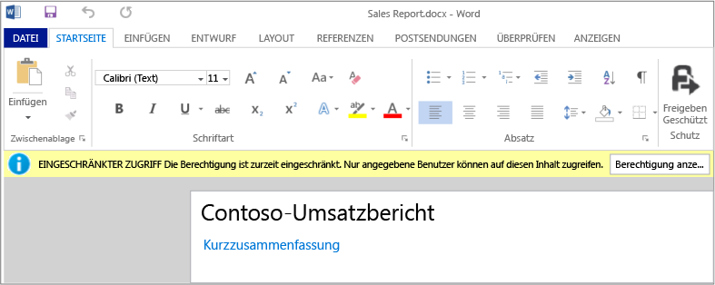

# Vollbild-Bild: eine SharePoint-gesch&#252;tzten Dokuments

Zurück zu [Azure RMS in Aktion: Geschützte Bibliotheken mit SharePoint Online](http://technet.microsoft.com/library/jj585026.aspx#BKMK_Example_SharePoint).

