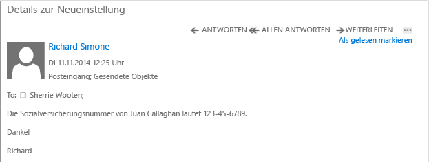

# Vollbild-Bild: eine nicht gesch&#252;tzte e-Mail (intern)

Zurück zu [Azure RMS in Aktion: Richtlinien zum automatischen Schützen von E-Mails mit Exchange Online und zum Verhindern von Datenverlusten](http://technet.microsoft.com/library/jj585026.aspx#BKMK_Example_DLP)

