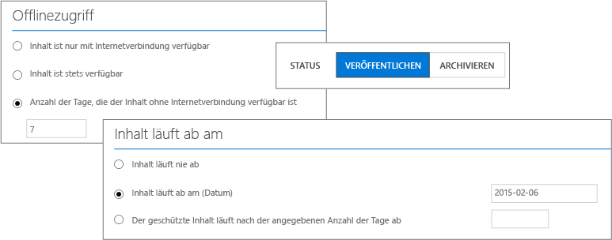

# Vollbild-Bild: verf&#252;gbaren Einstellungen f&#252;r den RMS-Vorlagen

Zurück zu [Azure RMS in Aktion: Aktivieren und Konfigurieren von Rights Management](http://technet.microsoft.com/library/jj585026.aspx#BKMK_Example_ManagementPortal)

