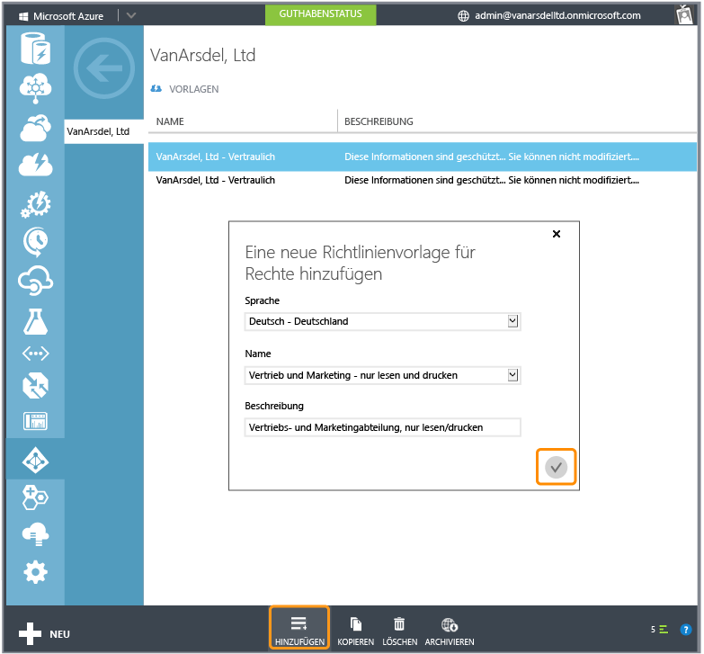

# Vollbild-Bild: RMS-Vorlagen in der Azure-Verwaltungsportal

Zurück zu [Azure RMS in Aktion: Aktivieren von Rights Management](http://technet.microsoft.com/library/jj585026.aspx#BKMK_Example_ManagementPortal).

