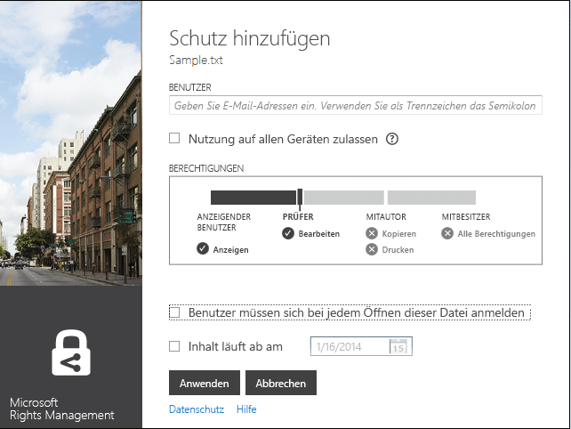
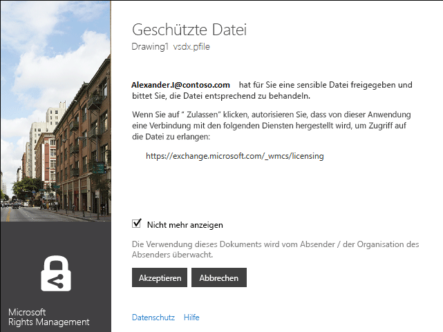
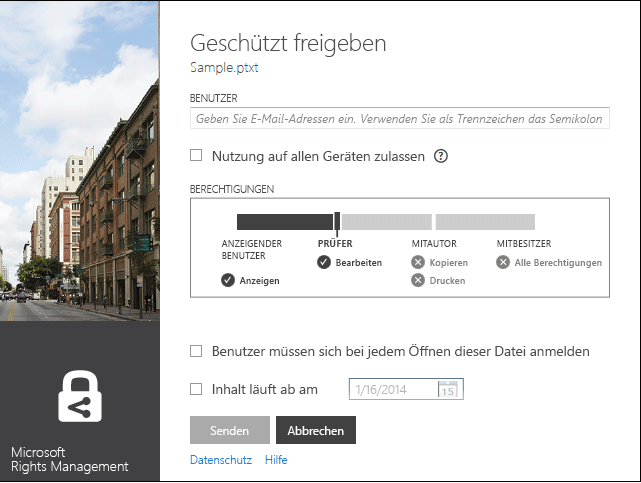
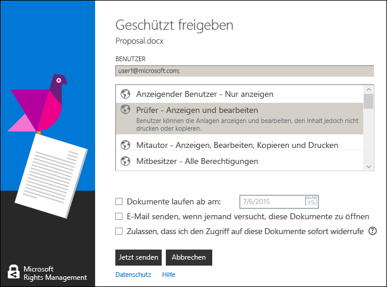
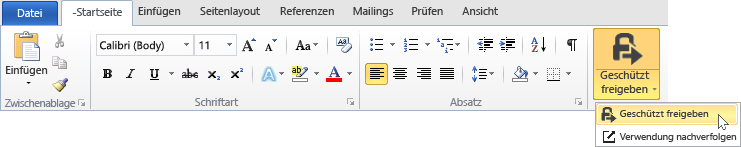

# Microsoft Rights Management freigabeanwendung – Benutzerhandbuch – urspr&#252;ngliche Ver&#246;ffentlichung.
Dieses Benutzerhandbuch für Microsoft Rights Management-freigabeanwendung für Windows enthält die folgenden Abschnitte:

-   [Evaluating and Installing Microsoft Rights Management sharing application](../../ems/RMS_Client/Microsoft-Rights-Management-sharing-application-user-guide---original-publication.md#BKMK_Eval)

-   [Using Microsoft Rights Management sharing application](../../ems/RMS_Client/Microsoft-Rights-Management-sharing-application-user-guide---original-publication.md#BKMK_UsingMSRMSApp)

-   [Using User-Authored Permissions and Sharing Protected Content](../../ems/RMS_Client/Microsoft-Rights-Management-sharing-application-user-guide---original-publication.md#BKMK_Custom)

-   [Using the Office Toolbar Add-in](../../ems/RMS_Client/Microsoft-Rights-Management-sharing-application-user-guide---original-publication.md#BKMK_OfficeToolbar)

-   [Administrator’s guidance for Microsoft Rights Management sharing application](../../ems/RMS_Client/Microsoft-Rights-Management-sharing-application-user-guide---original-publication.md#BKMK_AdminGuide)

Häufig gestellte Fragen und Informationen zur Problembehandlung finden Sie unter [häufig gestellte Fragen zur Microsoft Rights Management Freigabe-Anwendung für Windows](http://go.microsoft.com/fwlink/?LinkId=303971).

## <a name="BKMK_Eval"></a>Auswerten und Installieren von Microsoft Rights Management-freigabeanwendung
In diesem Abschnitt wird erklärt, was Microsoft Rights Management-freigabeanwendung ist und wie Sie diese installieren:

-   [What is the Microsoft Rights Management sharing application?](../../ems/RMS_Client/Microsoft-Rights-Management-sharing-application-user-guide---original-publication.md#BKMK_WhatIs)

-   [Requirements for Microsoft Rights Management sharing application](../../ems/RMS_Client/Microsoft-Rights-Management-sharing-application-user-guide---original-publication.md#BKMK_Reqs)

-   [Installing the Microsoft Rights Management sharing application](../../ems/RMS_Client/Microsoft-Rights-Management-sharing-application-user-guide---original-publication.md#BKMK_Install)

### <a name="BKMK_WhatIs"></a>Was ist die gemeinsame Nutzung von Microsoft Rights Management-Anwendung?
Microsoft Rights Management-freigabeanwendung ist eine optional herunterladbare Anwendung für Microsoft Windows, das Folgendes bereitstellt:

-   Datei-Explorer (auch bekannt als Windows-Explorer in Windows 7 und frühere Versionen) verbessert, um ermöglichen es Ihnen, eine einzelne Datei zu schützen oder Bulk schützen mehrerer Dateien sowie alle Dateien in einem ausgewählten Ordner.

-   Fügt Unterstützung für den Schutz eines beliebigen Typs der Datei und eine integrierte Anzeige für häufig verwendeten Text und Bild-Dateitypen.

-   Fügt neue Schaltflächen auf der Symbolleiste von Microsoft Office für Word, PowerPoint und Excel.

### <a name="BKMK_Reqs"></a>Anforderungen für Microsoft Rights Management-freigabeanwendung
Um die gemeinsame Nutzung von Microsoft Rights Management-Anwendung verwenden zu können, muss auf Ihrem Computer Windows 8.1, Windows 8 oder Windows 7 ausgeführt werden.

Die Microsoft Rights Management-Freigabe-Anwendung erfordert den AD RMS-Client 2.1, die als Teil des Installationspakets installiert ist. Die Microsoft Rights Management-freigabeanwendung funktioniert nur mit dieser Version des AD RMS-Clients.

### <a name="BKMK_Install"></a>Installieren der Microsoft Rights Management-freigabeanwendung
Um die Microsoft Rights Management-Freigabe-Anwendung zu installieren, führen Sie folgende Schritte aus:

1.  Klicken Sie auf die [Microsoft Rights Management](http://go.microsoft.com/fwlink/?LinkId=303970) Seite der Microsoft-Website.

2.  In der **Computer** auf das Symbol für die **RMS-app für Windows** und das Installationspaket von Microsoft Rights Management für gemeinsame Nutzung von Anwendung auf Ihrem Computer speichern.

3.  Die komprimierte Datei, die heruntergeladen wurde, und doppelklicken Sie dann auf einen Doppelklick **setup.exe**. Wenn Sie aufgefordert werden, um den Vorgang fortzusetzen, klicken Sie auf **Ja**.

4.  Auf der **Setup Microsoft RMS** auf **Weiter**, und warten Sie, bis die Installation abgeschlossen.

5.  Wenn die Installation abgeschlossen ist, klicken Sie auf **Starten** auf Ihren Computer neu starten und die Installation abzuschließen. Klicken Sie auf **Schließen** und starten Sie den Computer später, um die Installation abzuschließen.

## <a name="BKMK_UsingMSRMSApp"></a>Mithilfe von Microsoft Rights Management-freigabeanwendung
Dieser Abschnitt enthält verschiedene Möglichkeiten, Microsoft Rights Management-freigabeanwendung verwenden:

-   [Creating a protected text (.ptxt) file](../../ems/RMS_Client/Microsoft-Rights-Management-sharing-application-user-guide---original-publication.md#BKMK_CreatePTXT)

-   [Viewing a protected text (.ptxt) or a protected image file](../../ems/RMS_Client/Microsoft-Rights-Management-sharing-application-user-guide---original-publication.md#BKMK_ViewPTXT)

-   [Creating a generic protected (.pfile) file](../../ems/RMS_Client/Microsoft-Rights-Management-sharing-application-user-guide---original-publication.md#BKMK_CreatePFILE)

-   [Viewing a generic protected (.pfile) file](../../ems/RMS_Client/Microsoft-Rights-Management-sharing-application-user-guide---original-publication.md#BKMK_ViewPFILE)

-   [Removing protection from a file](../../ems/RMS_Client/Microsoft-Rights-Management-sharing-application-user-guide---original-publication.md#BKMK_Unprotect)

### <a name="BKMK_CreatePTXT"></a>Erstellen einer geschützten Textdatei (.ptxt)
Microsoft Rights Management-freigabeanwendung kann verwendet werden, um eine normale Textdatei (.txt) in eine geschützte (.ptxt) zu konvertieren.

##### Erstellen Sie eine geschützte Textdatei (.ptxt)

1.  Datei-Explorer mit der rechten Maustaste in einen Ordner, zeigen Sie auf **Neu**, und klicken Sie dann auf **Textdokument**.

2.  Benennen Sie die Datei (z. B. "Sample.txt").

3.  Doppelklicken Sie auf die Datei, um sie im Editor zu öffnen.

4.  Im Editor, fügen Sie einige Textzeilen in die Datei, z. B. Folgendes ein, und speichern Sie sie:

    ```
    This is a sample text file. This is a sample text file. This is a sample text file. This is a sample text file. This is a sample text file. This is a sample text file.
    ```

5.  Mit der rechten Maustaste in der Datei, zeigen Sie auf **direkt schützen**, und wählen Sie eine Vorlage aus der Liste. (Beachten Sie, dass ist dies beim ersten Verwenden Sie das Tool verwendet haben, Sie auswählen müssen **Unternehmen Schutz** zum Download der Vorlagen für Ihre Organisation zu initiieren.)

6.  Auf der **Microsoft Rights Management-freigabeanwendung** Bildschirm, bestätigen Sie die Richtlinie, die Sie anwenden möchten, klicken Sie auf **Übernehmen**, und nachdem die Datei geschützt ist, klicken Sie auf **Schließen**.

### <a name="BKMK_ViewPTXT"></a>Anzeigen einer geschützten Text (.ptxt) oder eine geschützte Bilddatei
Um eine Datei geschützten Text (.ptxt) im Datei-Explorer anzuzeigen, doppelklicken Sie auf die Datei (z. B. Sample.ptxt). Sie möglicherweise aufgefordert, die zum Autorisieren der Anwendung Rechte zu erhalten. Die Schutzrichtlinie wird am oberen Rand der Datei angezeigt.

Geschützter Bilder können auf ähnliche Weise geöffnet und angezeigt werden.

### <a name="BKMK_CreatePFILE"></a>Erstellen einer Datei für die generische geschützte ("pFile")
Das Dateiformat für den generischen Schutz ("pFile") kann verwendet werden, eine generische Maß an Schutz für Dateitypen anzubieten, die durch Microsoft Rights Management, Freigabe, Anwendung oder einer anderen Anwendung, die integrierten Schutz von RMS-Typ nicht direkt unterstützt werden.

Beispielsweise kann das Dateiformat generischen Schutz .vsd-Dateien, die mit der Microsoft Visio (die derzeit integrierten Schutz nicht unterstützt) schützen.

> [!NOTE]
> Dateien, die allgemeinen Schutz verwenden, sind nur zur Authentifizierung gesichert. Ein Benutzer, der berechtigt ist, verwenden Sie die geschützte Datei ("pFile") authentifiziert werden und die Rechte und Berechtigungen des Benutzers angezeigt werden, aber nicht erzwungen werden, sobald die Datei, in ihrem ursprünglichen Format (z. B. geöffnet ist, sobald die .vsd-Datei in Visio geöffnet ist). Ein Benutzer ist nicht autorisiert oder nicht authentifiziert werden nicht die geschützte Datei zu öffnen.

##### So erstellen Sie eine generische geschützten Dateien ("pFile") werden aus einer Visio-Zeichnung (.vsd) Datei

1.  Datei-Explorer mit der rechten Maustaste in einen Ordner, zeigen Sie auf **Neu**, und klicken Sie dann auf **Neues Visio-Dokument**.

2.  Benennen Sie die Datei (z. B. Sample.vsd).

3.  Doppelklicken Sie auf die Datei, um sie in Visio zu öffnen.

4.  In Visio die Zeichnung, hinzuzufügen Sie Elemente und speichern Sie und schließen Sie die Datei.

5.  Mit der rechten Maustaste in der Datei, zeigen Sie auf **direkt schützen**, und wählen Sie eine Vorlage aus der Liste. (Beachten Sie, dass ist dies beim ersten Verwenden Sie das Tool verwendet haben, Sie auswählen müssen **Unternehmen Schutz** zum Download der Vorlagen für Ihre Organisation zu initiieren.)

6.  Auf der **Microsoft Rights Management-freigabeanwendung** Bildschirm, wählen Sie die Richtlinie zu übernehmen, und klicken Sie dann auf **Übernehmen**.

7.  Eine Meldung weist darauf hin, dass die geschützte Datei als Sample.vsd.pfile gespeichert wurde (die ursprüngliche Datei wird gelöscht).

### <a name="BKMK_ViewPFILE"></a>Anzeigen einer Datei generische geschützte ("pFile")
Um eine generische geschützte ("pFile")-Datei im Datei-Explorer anzuzeigen, doppelklicken Sie auf die generische geschützte ("pFile") (z. B. Sample.vsd.pfile), und klicken Sie auf **Öffnen**.

### <a name="BKMK_Unprotect"></a>Entfernen von Schutz aus einer Datei
Microsoft Rights Management-freigabeanwendung bietet Ihnen die Option zum Schutz von Dateien entfernen, die Sie zuvor geschützte verwenden.

Zum Entfernen des Schutzes (das Aufheben des Schutzes wird) eine Datei, die zuvor geschützt, Sie gelten die **Schutz entfernen** wie folgt die option:

1.  Mit der rechten Maustaste **Sample.ptxt**, zeigen Sie auf **direkt schützen**, und klicken Sie auf **Schutz entfernen**. Sie möglicherweise aufgefordert, die zum Autorisieren der Anwendung Rechte zu erhalten.

2.  Sample.ptxt werden gelöscht und durch "Sample.txt" ersetzt.

## <a name="BKMK_Custom"></a>Mithilfe von Berechtigungen für Benutzer erstellt wurde und gemeinsame Nutzung von geschützten Inhalten
Dieser Abschnitt behandelt das schützen und nutzen eine Datei mit Berechtigungen Benutzer erstellt wurde, geschützten Inhalte freigeben und mehrere Dateien schützen von:

-   [Protecting a file with user-authored permissions](../../ems/RMS_Client/Microsoft-Rights-Management-sharing-application-user-guide---original-publication.md#BKMK_ProtectCustom)

-   [Consuming files that have user-authored protection](../../ems/RMS_Client/Microsoft-Rights-Management-sharing-application-user-guide---original-publication.md#BKMK_UserDefined)

-   [Sharing protected content](../../ems/RMS_Client/Microsoft-Rights-Management-sharing-application-user-guide---original-publication.md#BKMK_ShareProtected)

-   [Using keyboard shortcuts](../../ems/RMS_Client/Microsoft-Rights-Management-sharing-application-user-guide---original-publication.md#BKMK_AccessKeys)

-   [Applying protection to multiple files and folders](../../ems/RMS_Client/Microsoft-Rights-Management-sharing-application-user-guide---original-publication.md#BKMK_Multiple)

### <a name="BKMK_ProtectCustom"></a>Schützen eine Datei mit Berechtigungen Benutzer erstellt wurde
Benutzer verfasst Schutz kann verwendet werden, um Folgendes zu erzielen:

-   Zugriff nur für eine bestimmte Liste von einzelnen Benutzern identifiziert, indem Sie ihre e-Mail-Adressen zu begrenzen.

-   Die Verwendung der Datei, z. B. nur-Lese-Zugriff auf ein Dokument nur bestimmte Rechte zu begrenzen.

Um eine Datei mit autorisierten Benutzer Berechtigungen zu schützen, mit der rechten Maustaste in der Datei, klicken Sie auf **direkt schützen** und klicken Sie auf **benutzerdefinierte Berechtigungen**. Der folgende Bildschirm wird gestartet:



Geben Sie die e-Mail-Adressen der Liste der Benutzer, mithilfe des Schiebereglers wählen Sie die Berechtigungen für die Datei, und klicken Sie auf **Übernehmen**.

### <a name="BKMK_UserDefined"></a>Nutzung von Dateien, deren Benutzer verfasst Schutz
Am geschützte Dateien, die durch Microsoft Rights Management, die gemeinsame Nutzung der Anwendung behandelt werden ist geschützt, wenn Schutzebenen vorlagenbasierte angewendet wurde. Es ist möglich, jedoch bei Microsoft Rights Management-freigabeanwendung auch Dateien unterstützen, die ein Benutzer erstellt wurde Maß an Schutz erhalten haben.

Schutz autorisierten Benutzer kann verwendet werden, um die folgenden Typen von Schutz für eine Datei zu erreichen:

-   Zugriff nur eine sehr spezifische Liste der einzelne Benutzer identifiziert, indem Sie ihre e-Mail-Adressen zu begrenzen.

-   Die Verwendung der Datei, die nur ein einzelnes bestimmtes Zugriffsrecht z. B. nur Zugriff auf das Dokument zu beschränken.

Text- und Image-Dateiformate dieses Maß an Schutz erfordert, dass jede Anwendung, die verwendet werden, um Sie zu bearbeiten, speichern oder Einschränken von Text oder Image-Dateien wurden entwickelt, um die RMS-Schutz unterstützt, und implementieren den Schutz in der AD RMS-SDK bereitgestellten APIs.

Beim Anzeigen einer geschützten Text-Datei, die Benutzer-Schutz angewendet wurde, bemerken Sie Unterschiede in den Berechtigungen, wie sie für die Datei angezeigt werden, wie im folgenden Beispiel gezeigt.

Für Dateien, die mit dem generischen Schutz ("pFile")-Dateiformat geschützt sind, werden Sie bestimmte Rechte oder Berechtigungen, die vom Benutzer im Bestätigungsfenster nicht mit dem Namen der Vorlage, die verwendet wurde, um die Datei zu schützen, wie in der folgenden Abbildung dargestellt angezeigt.



### <a name="BKMK_ShareProtected"></a>Freigeben von geschütztem Inhalt
Schützen und Freigeben von Inhalten, müssen mit der rechten Maustaste in der Datei, und klicken Sie auf **Freigeben geschützter**. Der folgende Bildschirm wird gestartet:



Geben Sie die e-Mail-Adressen der Liste der Benutzer, mithilfe des Schiebereglers wählen Sie die Berechtigungen für die Datei, und klicken Sie auf **Senden**. Die Anwendung startet Outlook mit einer vor e-Mail, mit der geschützten Datei angefügt. Die ursprüngliche Datei wird nicht geschützt.

Um Benutzern das Anzeigen von geschützter Dateien auf nicht-Windows-Geräte zu aktivieren, klicken Sie auf **Verbrauch auf allen Geräten ermöglichen**. Benutzer müssen sich [Herunterladen der Microsoft Rights Management-freigabeanwendung](http://go.microsoft.com/fwlink/?LinkId=303970) für ihr Gerät.

### <a name="BKMK_AccessKeys"></a>Verwenden von Tastenkombinationen
Drücken Sie die **Alt** -Taste, um die verfügbaren Zugriffstasten finden Sie unter. Drücken Sie **Alt** + Zugriffstaste, eine Option auszuwählen. Z. B. auf die **Freigabe geschützt** Dialog, drücken Sie **Alt** an den Zugriffsschlüssel und drücken Sie **Alt + u** auswählen **müssen Benutzer Anmeldename jedes Mal, wenn sie diese Datei öffnen**.



### <a name="BKMK_Multiple"></a>Anwenden von Schutz mit mehreren Dateien und Ordnern
Microsoft Rights Management-freigabeanwendung können auch mehr als eine einzelne Datei Schutz zuweisen verwendet werden, z. B. durch mehrere Dateien oder Ordner auswählen, nicht geschützte Dateien im Datei-Explorer enthält.

##### Um mehrere Dateien oder alle Dateien innerhalb eines ausgewählten Ordners zu schützen.

1.  Wählen Sie mehrere Dateien aus, oder wählen Sie einen Ordner mit mehreren Dateien geschützt werden, im Datei-Explorer.

2.  Mit der rechten Maustaste im ausgewählten Ordner oder Dateien, zeigen Sie auf **direkt schützen**, und wählen Sie eine Vorlage aus der Liste. (Beachten Sie, dass ist dies beim ersten Verwenden Sie das Tool verwendet haben, Sie auswählen müssen **Unternehmen Schutz** zum Download der Vorlagen für Ihre Organisation zu initiieren.)

3.  Auf der **Microsoft Rights Management-freigabeanwendung** Bildschirm, vergewissern Sie sich die Dateien wurden geschützt wurde.

Wenn Fehler auftreten, finden Sie unter [häufig gestellte Fragen zur Microsoft Rights Management Freigabe-Anwendung für Windows](http://go.microsoft.com/fwlink/?LinkId=303971).

## <a name="BKMK_OfficeToolbar"></a>Über die Symbolleiste der Office-Add-in
Sie können zu schützen und Freigeben von Word, PowerPoint, Excel-Dateien, die mithilfe der Office-Menüband-add-Ins für Microsoft Rights Management-freigabeanwendung direkt in Microsoft Office. Klicken Sie auf **Freigabe geschützt** auf der Multifunktionsleiste, um die Microsoft Rights Management-Freigabe-Anwendung zu starten.



## <a name="BKMK_AdminGuide"></a>Administrator's-Leitfaden für Microsoft Rights Management-freigabeanwendung
Das Administratorhandbuch für Microsoft Rights Management-freigabeanwendung enthält die folgenden Abschnitte:

-   [Microsoft Rights Management sharing application Technical Overview](../../ems/RMS_Client/Microsoft-Rights-Management-sharing-application-user-guide---original-publication.md#BKMK_AdminOverview)

-   [Supported File Types](../../ems/RMS_Client/Microsoft-Rights-Management-sharing-application-user-guide---original-publication.md#BKMK_SupportFileTypes)

-   [Automatic deployment for the Microsoft Rights Management sharing application](../../ems/RMS_Client/Microsoft-Rights-Management-sharing-application-user-guide---original-publication.md#BKMK_ScriptedInstall)

### <a name="BKMK_AdminOverview"></a>Microsoft Rights Management-freigabeanwendung – technische Übersicht
Die Microsoft Rights Management-freigabeanwendung ist eine optional herunterladbare Anwendung für Microsoft Windows und andere Plattformen, die Folgendes enthält:

-   Einer einzelnen Datei oder Bulk Schutz mehrerer Dateien sowie alle Dateien in einem ausgewählten Ordner.

-   Vollständige Unterstützung für den Schutz eines beliebigen Typs und einen integrierten Viewer für häufig verwendeten Text und Bild-Dateitypen.

-   Allgemeiner Schutz für Dateien, die RMS-Schutz nicht unterstützen.

-   Vollständige Interoperabilität mit Dateien, die mit Office Information Rights Management (IRM) geschützt

-   Vollständige Interoperabilität mit PDF-Dateien, die mit SharePoint, FCI und unterstützten PDF-Erstellungstools geschützt

Die Microsoft Rights Management-Freigabe-Anwendung verwendet die neue [AD RMS-Client 2.1 Runtime](http://www.microsoft.com/download/details.aspx?id=38396). Es bietet Benutzern die Möglichkeit, Inhalte mithilfe von vordefinierten oder benutzerdefinierten Vorlagen, die Sie anpassen und Bereitstellen von Ihrer Organisation zu schützen. Mithilfe von bietet die Funktionalität von AD RMS 2.1, die Microsoft Rights Management-freigabeanwendung Endbenutzer einfachen Schutz und den Verbrauch.

Mit der Version vom Oktober 2013 von Windows Azure AD RMS können systemintern Schützen von Dokumenten mithilfe von Office 2010 und anderen Personen in einem anderen Unternehmen, das dann diese nutzen kann, mithilfe von Windows Azure AD RMS senden. Darüber hinaus mit dieser Version können bei Verwendung von AD RMS in Kryptografiemodus 2, mithilfe von RMS für Einzelpersonen und Nutzung von Inhalten von Personen in einem anderen Unternehmen, das Windows Azure AD RMS verwendet. Weitere Informationen zu den Kryptografiemodus 2, finden Sie unter [AD RMS-Kryptografiemodi](http://technet.microsoft.com/library/hh867439%28v=ws.10%29.aspx).

Microsoft Rights Management-freigabeanwendung herunterladen möchten, führen Sie folgende Schritte aus:

1.  Melden Sie sich beim [Microsoft Connect](http://connect.microsoft.com/) mit Ihrem Microsoft Account (früher als Live ID).

2.  Auf der **Home** Seite, suchen Sie nach **Rights Management Services** und der Gruppe beitreten.

3.  Klicken Sie auf **Downloads**, und klicken Sie dann auf **Microsoft Rights Management-freigabeanwendung**.

4.  Auf der **downloaden** Seite **Microsoft Rights Management-freigabeanwendung application.zip** und klicken Sie auf **herunterladen**.

5.  Bei Bedarf installieren von Microsoft File Transfer Manager, und führen Sie die Schritte zum Herunterladen von Microsoft Rights Management-freigabeanwendung.

#### Ebenen der Schutz durch Microsoft Rights Management-freigabeanwendung unterstützt
Microsoft Rights Management-freigabeanwendung unterstützt den Schutz auf zwei unterschiedlichen Ebenen, wie in der folgenden Tabelle beschrieben.

||||
|-|-|-|
|Art des Schutzes|Native|Generisch|
|Beschreibung|Für Text, Bild, Microsoft Office (Word, Excel, PowerPoint) Dateien, PDF-Dateien und andere Anwendung Dateitypen, die AD RMS zu unterstützen, bietet einheitlicher Schutz einen hohen Grad an Sicherheit, die sowohl Verschlüsselung umfasst und Erzwingung von rechten (Berechtigungen).|Für alle anderen Programme und Dateitypen schützt generischen Schutz, der sowohl den Dateityp "pFile" und die Authentifizierung um zu überprüfen, ob ein Benutzer berechtigt ist, öffnen Sie die Datei mit Datei-Kapselung enthält.|
|Schutz|Dateien werden vollständig verschlüsselt und Schutz wird erzwungen, auf folgende Weise:<br /><br />-   Bevor geschützter Inhalt gerendert wird, muss eine erfolgreiche Authentifizierung für diejenigen, die auftreten, erhalten die Datei per e-Mail oder über Berechtigungen für Dateien oder Freigabe Zugriff darauf gewährt.<br />-   Benutzerrechte und Richtlinien, die vom Besitzer Inhalts festgelegt, wenn Dateien geschützt sind sind darüber hinaus in der vollständig erzwungen, wenn der Inhalt in IP-Viewer (für geschützte Text- und Image-Dateien) oder die zugeordnete Anwendung (für alle anderen unterstützten Dateitypen) gerendert wird.|Dateischutz wird auf folgende Weise erzwungen:<br /><br />-   Bevor geschützter Inhalt gerendert wird, muss eine erfolgreiche Authentifizierung erfolgen für diejenigen, die autorisiert sind, um die Datei zu öffnen und die Zugriffsrechte darauf. Wenn die Autorisierung fehlschlägt, wird die Datei nicht geöffnet werden.<br />-   Benutzerrechte und Richtlinien festlegen, indem Sie der Besitzer des Inhalts werden angezeigt, um autorisierte Benutzer der Richtlinie vorgesehene Verwendung zu informieren.<br />-   Tritt auf, Überwachungsprotokoll der autorisierten Benutzer öffnen und auf Dateien zugreifen, jedoch keine Nutzungsrechte erzwungen werden, nicht unterstützt Applications.|
|Standardwert für Dateitypen|Dies ist die Standardebene der Schutz für die folgenden Dateitypen:<br /><br />-   Text- und Image-Dateien<br />-   Microsoft Office (Word, Excel, PowerPoint)-Dateien<br />-   Portable Document Format (PDF)<br /><br />Weitere Informationen finden Sie in der unterstützten Dateitypen.|Dies ist der Standardschutz für alle anderen Dateitypen (z. B. .vsdx, RTF und So weiter) über vollständigen Schutz nicht unterstützt.|

### <a name="BKMK_SupportFileTypes"></a>Unterstützte Dateitypen
Die folgende Tabelle enthält die Dateitypen, die durch Microsoft Rights Management-freigabeanwendung unterstützt werden.

|Erweiterung|Beschreibung|Dateierweiterung der ursprünglichen|
|---------------|----------------|---------------------------------------|
|.ptxt|Geschützte Datei|.txt|
|.pxml|Geschützte XML-Datei|XML|
|.pjpg|Geschützte JPG-Bilddatei|JPG|
|.pjpeg|Geschützte JPEG-Bilddatei|JPEG|
|.ppng|Geschützte PNG-Bilddatei|PNG|
|.ptiff|Geschützte TIFF-Bilddatei|TIFF|
|.pbmp|Geschützte Windows-Bitmap-Datei|BMP|
|.pgif|Geschützte GIF-Datei|GIF|
|.pgiff|Geschützte GIF-Bilddatei|.giff|
|.pjpe|Geschützte JPE-Bilddatei|jpe|
|.pjfif|Geschützte JFIF-Bilddatei|.JFIF|
|.pjif|Geschützte JIF-Bilddatei|.jif|
In der folgende Tabelle werden die Dateitypen aufgeführt, die von Microsoft Office 2013, Office 2010 und Office 2007 unterstützt werden. Es gibt zwei Arten der Schutzvorrichtung: MsoIrmProtector und der OpcIrmProtector. Weitere Informationen über diese Schutzvorrichtungstypen finden Sie unter [Microsoft Office-Datei Format Schutzvorrichtungen](http://archive.msdn.microsoft.com/OfficeProtectors).

|||
|-|-|
|MsoIrmProtector unterstützt die folgenden Dateitypen:<br /><br />-   doc<br />-   Punkt<br />-   xla<br />-   xls<br />-   xlt<br />-   PPS<br />-   PPT|OpcIrmProtector unterstützt die folgenden Dateitypen:<br /><br />-   DOCM<br />-   DOCX-Format<br />-   dotm<br />-   dotx<br />-   xlam<br />-   xlsb<br />-   xlsm<br />-   XLSX-Datei<br />-   xltm<br />-   XLT von<br />-   XPS<br />-   potm<br />-   potx<br />-   PPSX<br />-   ppsm<br />-   pptm<br />-   PPTX<br />-   thmx|

### <a name="BKMK_ScriptedInstall"></a>Automatische Bereitstellung für die Microsoft Rights Management-freigabeanwendung
Die Windows-Version des RMS-freigabeanwendung unterstützt eine skriptbasierte Installation, die wodurch es für Unternehmen geeignet ist.

##### Die RMS-Freigabe für die automatische Bereitstellung herunterladen

1.  Klicken Sie auf die [Microsoft Rights Management-freigabeanwendung für Windows](http://www.microsoft.com/download/details.aspx?id=40857) Seite im Microsoft Download Center, und klicken Sie auf **herunterladen**.

2.  Wählen Sie aus, und Laden Sie die Dateien, die Sie benötigen. Es gibt zwei Client-Installationspakete: eine für Windows 64-Bit (gemeinsame Nutzung von Microsoft Rights Management-Anwendung x64.zip) und die andere für 32-Bit-Windows (Microsoft Rights Management, die gemeinsame Nutzung der Anwendung x86.zip).

3.  Extrahieren Sie die Dateien aus der komprimierten Installationspakete, z. B. durch Doppelklicken. Kopieren Sie dann die extrahierten Dateien an einem Speicherort im Netzwerk, den Clientcomputer zugreifen können.

Der Setuppakete für die RMS-Freigabe unterstützt verschiedene Bereitstellungsszenarien und enthält Folgendes:

|Beschreibung|Bereitstellungsszenario|
|----------------|---------------------------|
|Microsoft Online-Anmeldeassistent|Für Folgendes erforderlich:<br /><br />-   Office 2010 und Windows Azure RMS|
|Hotfix für Office (KB 2596501)|Für Folgendes erforderlich:<br /><br />-   Office 2010 und Windows Azure RMS|
|Hotfix für den Kryptografiemodus 2 (KB 2627273)|Für Folgendes erforderlich:<br /><br />-   Office 2010 und Windows Azure RMS|
|AD RMS-Client und dem RMS-Freigabe|Für Folgendes erforderlich:<br /><br />-   Office 2013 und Windows Azure RMS<br />-   Office 2010 und Windows Azure RMS<br />-   Office 2013 und AD RMS<br />-   Office 2010 und AD RMS<br />-   Upgrade von RMS-freigabeanwendung|
|Office-add-Ins für die Multifunktionsleiste|Für Folgendes erforderlich:<br /><br />-   Office 2013 und Windows Azure RMS<br />-   Office 2013 und AD RMS<br />-   Office 2010 und AD RMS<br />-   Upgrade von RMS-freigabeanwendung|
|Vorbereitungstool für Windows Azure Active Directory Rights Management|Für Folgendes erforderlich:<br /><br />-   Office 2010 und Windows Azure RMS|
> [!NOTE]
> Für die **Office 2010 und Windows Azure RMS** Szenario möglicherweise verwenden Sie Windows Azure RMS, oder Sie möglicherweise verwenden Sie Active Directory RMS jedoch wünschen, sichere Senden von Dokumenten an eine Person in einem anderen Unternehmen, die Windows Azure RMS verwenden.
> 
> Wenn Sie installieren, und führen Sie das Vorbereitungstool für Windows Azure Active Directory Rights Management zur Unterstützung von Office 2010, geschieht zweierlei:
> 
> -   Er bearbeitet die Registrierung, um die RMS-Freigabe zu unterstützen.
> -   Es "neu starten" den Benutzer bedeutet, dass die Computer-Kontakte der AD RMS-Server oder Windows Azure RMS und erhält die Zertifikate, die die Computer-als auch RMS verwenden müssen.

Verwenden Sie die folgenden Verfahren, um die Befehle, die zum Bereitstellen der RMS-Freigabe für diesen Bereitstellungsszenarien erforderlich zu identifizieren:

-   Office 2013 und Windows Azure RMS

-   Office 2010 und Windows Azure RMS

-   Office 2013 oder Office 2010 und AD RMS

-   Aktualisieren Sie die RMS-Freigabe

In den Beispielen in den Befehlen wird davon ausgegangen, dass Sie der heruntergeladenen kopiert und Dateien auf einer Netzwerkfreigabe, Computer-Clientzugriff mithilfe extrahierten **\\server5\apps\rms** und dass die Clientcomputer bereits einen Ordner namens **C:\Log files** Speichern Sie die Installationsprotokolldateien Anwendung. Für jede Installation muss Sie wählen Sie den Namen der Protokolldatei, es jedoch eine Erweiterung der Log-Datei.

> [!IMPORTANT]
> Bevor Sie die RMS-Freigabe-Anwendung bereitstellen, müssen Sie die erforderlichen Befehle in diesen Prozeduren Verpacken, damit sie in dem Computerkontext für alle Benutzer installieren und mit lokalen Administratorrechten installieren können. Sie können dann das Paket auf Computern mit der standard-Anwendung Bereitstellungsmechanismus, beispielsweise Gruppenrichtlinien oder System Center Configuration Manager bereitstellen.
> 
> Die Ausnahme ist das Tool zum Vorbereiten der Windows Azure-Active Directory-Rechteverwaltungsdienste: Dies muss einmal für jeden Benutzer auf dem Computer ausgeführt, und das Tool muss mit erhöhten Rechten, bearbeiten Sie die Registrierung erfolgreich ausgeführt. Es gibt verschiedene Möglichkeiten, um dies zu erreichen, einschließlich auffordern der Benutzer zum Ausführen des Befehls (z. B. einen Link in einer e-Mail-Nachricht oder einen Link auf das Helpdesk-Portal) oder Sie können ihre Anmeldeskript hinzufügen. Wenn Sie den Befehl "Runas" verwenden können, da der Benutzer nicht über ein lokales Administratorkonto verfügen, sind Bereitstellungstools, die einen Befehl automatisch erhöhen gemäß die von Ihnen angegebenen Regeln.

##### Die RMS-Freigabe für Office 2013 und Windows Azure RMS bereitstellen

1.  Installieren Sie die AD RMS-Client und dem RMS-Freigabe mit den folgenden Befehlen:

    -   Für 64-Bit-Windows: x64\setup_ipviewer.exe/norestart/quiet /msicl "MSIRESTARTMANAGERCONTROL = deaktivieren" / log "&lt; Pfad und Name &gt;"

        ```
        x64\setup_ipviewer.exe /norestart /quiet /msicl "MSIRESTARTMANAGERCONTROL=Disable" /log "<log file path and name>"
        ```

    -   Für 32-Bit-Windows:

        ```
        X86\setup_ipviewer.exe /norestart /quiet /msicl "MSIRESTARTMANAGERCONTROL=Disable" /log "<log file path and name>"
        ```

    Beispiel: `\\server5\apps\rms\x64\setup_ipviewer.exe /norestart /quiet /msicl "MSIRESTARTMANAGERCONTROL=Disable" /log "C:\Log files\ipviewerinstall.log"`

2.  Installieren Sie das Office-add-in mithilfe der folgenden Befehle aus:

    -   Für 64-Bit-Version von Office:

        ```
        msiexec.exe /norestart /quiet MSIRESTARTMANAGERCONTROL=Disable /i "x64\Setup64.msi" /L*v "<log file path and name>"
        ```

    -   Für 32-Bit-Version von Office:

        ```
        msiexec.exe /norestart /quiet MSIRESTARTMANAGERCONTROL=Disable /i "x86\Setup.msi" /L*v "<log file path and name>"
        ```

    > [!NOTE]
    > Um die Installation abzuschließen, muss der Computer neu starten. Sie können einen automatischen Neustart initiieren, indem Sie mit einem Befehl wie Shutdown/i.

    Beispiel: `\\server5\apps\rms\msiexec.exe /norestart /quiet MSIRESTARTMANAGERCONTROL=Disable /i "x64\Setup64.msi" /L*v "C:\Log files\rmsoffice.log"`

##### Die RMS-Freigabe für Office 2010 und Windows Azure RMS bereitstellen

1.  Installieren Sie den Microsoft Online-In-Assistenten mithilfe der folgenden Befehle aus:

    -   Für 64-Bit-Windows:

        ```
        msiexec.exe /norestart /quiet MSIRESTARTMANAGERCONTROL=Disable /i "x64\msoidcli_64bit.msi" /L*v "<log file path and name >"
        ```

    -   Für 32-Bit-Windows:

        ```
        msiexec.exe /norestart /quiet MSIRESTARTMANAGERCONTROL=Disable /i "x64\msoidcli_64bit.msi" /L*v "<log file path and name>"
        ```

    Beispiel: `\\server5\apps\rms\msiexec.exe /norestart /quiet MSIRESTARTMANAGERCONTROL=Disable /i "x64\msoidcli_64bit.msi" /L*v "C:\Log files\assistant.log"`

2.  Installieren Sie das Office-Hotfix mithilfe der folgenden Befehle:

    -   Für 64-Bit-Version von Office:

        ```
        x64\office2010-kb2596501-fullfile-x64-glb.exe /norestart /quiet /log:"<log file path and name >"
        ```

    -   Für 32-Bit-Version von Office:

        ```
        x86\office2010-kb2596501-fullfile-x86-glb.exe /norestart /quiet /log:"<log file path and name>"
        ```

    Beispiel: `\\server5\apps\rms\x64\office2010-kb2596501-fullfile-x64-glb.exe /norestart /quiet /log:"C:\Log files\kb2596501install.log"`

3.  Installieren Sie den Hotfix Kryptografiemodus 2 mithilfe der folgenden Befehle:

    -   Für 64-Bit-Windows:

        ```
        wusa.exe /norestart /quiet "x64\Windows6.1-KB2627273-v4-x64.msu" /log:"<log file path and name >"
        ```

    -   Für 32-Bit-Windows:

        ```
        wusa.exe /norestart /quiet "x86\Windows6.1-KB2627273-v4-x86.msu" /log:"<log file path and name>"
        ```

    Beispiel: `\\server5\apps\rms\wusa.exe /norestart /quiet "x64\Windows6.1-KB2627273-v4-x64.msu" /log:"C:\Log files\kb267273.log"`

4.  Installieren Sie die AD RMS-Client und dem RMS-Freigabe mithilfe des folgenden Befehls:

    -   Für 64-Bit-Windows:

        ```
        x64\setup_ipviewer.exe /norestart /quiet /msicl "MSIRESTARTMANAGERCONTROL=Disable" /log "<log file path and name >"
        ```

    -   Für 32-Bit-Windows:

        ```
        X86\setup_ipviewer.exe /norestart /quiet /msicl "MSIRESTARTMANAGERCONTROL=Disable" /log "<log file path and name>"
        ```

    Beispiel: `\\server5\apps\rms\x64\setup_ipviewer.exe /norestart /quiet /msicl "MSIRESTARTMANAGERCONTROL=Disable" /log "C:\Log files\ipviewerinstall.log"`

5.  Installieren Sie das Office-add-in mithilfe der folgenden Befehle aus:

    -   Für 64-Bit-Version von Office:

        ```
        msiexec.exe /norestart /quiet MSIRESTARTMANAGERCONTROL=Disable /i "x64\Setup64.msi" /L*v "<log file path and name>"
        ```

    -   Für 32-Bit-Version von Office:

        ```
        msiexec.exe /norestart /quiet MSIRESTARTMANAGERCONTROL=Disable /i "x86\Setup.msi" /L*v "<log file path and name>"
        ```

    > [!NOTE]
    > Um die Installation abzuschließen, muss der Computer neu starten. Sie können einen automatischen Neustart initiieren, indem Sie mit einem Befehl wie Shutdown/i.

    Beispiel: `\\server5\apps\rms\msiexec.exe /norestart /quiet MSIRESTARTMANAGERCONTROL=Disable /i "x64\Setup64.msi" /L*v "C:\Log files\rmsoffice.log"`

6.  Installieren Sie das Tool zum Vorbereiten der Windows Azure-Active Directory-Rechteverwaltungsdienste Anmeldeskripts den folgenden Befehl hinzu:

    > [!IMPORTANT]
    > Um diesen Befehl erfolgreich ausführen zu können, müssen Benutzer über lokale Administratorrechte verfügen.

    -   Für Windows 8, 64-Bit:

        ```
        x64\aadrmprep.exe /initiateMe /logfile "<log file path and name>"
        ```

    -   Für Windows 8, 32-Bit:

        ```
        X86\aadrmprep.exe /initiateMe /logfile "<log file path and name>"
        ```

    -   Für Windows 7 64-Bit:

        ```
        x64\win7\aadrmprep.exe /initiateMe /logfile "<log file path and name>"
        ```

    -   Für Windows 7, 32-Bit:

        ```
        X86\win7\aadrmprep.exe /initiateMe /logfile "<log file path and name>"
        ```

    > [!NOTE]
    > Mit diesem Befehl möglicherweise aufgefordert, den Benutzer zur Eingabe von Anmeldeinformationen Windows Azure. Wenn der Computer nicht zu einer Domäne angehört, wird der Benutzer aufgefordert werden. Wenn der Computer einer Domäne angehört, möglicherweise das Tool zwischengespeicherte Anmeldeinformationen verwenden.

    Beispiel: `\\server5\apps\rms\x64\aadrmprep.exe /initiateMe /logfile "C:\Log files\aadrmprepinstall.log"`

##### Die RMS-Freigabe für Office 2013 oder Office 2010 und Active Directory RMS bereitstellen

1.  Installieren Sie die AD RMS-Client und dem RMS-Freigabe mit den folgenden Befehlen:

    -   Für 64-Bit-Windows:

        ```
        x64\setup_ipviewer.exe /norestart /quiet /msicl "MSIRESTARTMANAGERCONTROL=Disable" /log "<log file path and name>"
        ```

    -   Für 32-Bit-Windows:

        ```
        X86\setup_ipviewer.exe /norestart /quiet /msicl "MSIRESTARTMANAGERCONTROL=Disable" /log "<log file path and name>"
        ```

    Beispiel: `\\server5\apps\rms\x64\setup_ipviewer.exe /norestart /quiet /msicl "MSIRESTARTMANAGERCONTROL=Disable" /log "C:\Log files\ipviewerinstall.log"`

2.  Installieren Sie das Office-add-in mithilfe der folgenden Befehle aus:

    -   Für 64-Bit-Version von Office:

        ```
        msiexec.exe /norestart /quiet MSIRESTARTMANAGERCONTROL=Disable /i "x64\Setup64.msi" /L*v "<log file path and name>"
        ```

    -   Für 32-Bit-Version von Office:

        ```
        msiexec.exe /norestart /quiet MSIRESTARTMANAGERCONTROL=Disable /i "x86\Setup.msi" /L*v "<log file path and name>"
        ```

    > [!NOTE]
    > Um die Installation abzuschließen, muss der Computer neu starten. Sie können einen automatischen Neustart initiieren, indem Sie mit einem Befehl wie Shutdown/i.

    Beispiel: `\\server5\apps\rms\msiexec.exe /norestart /quiet MSIRESTARTMANAGERCONTROL=Disable /i "x64\Setup64.msi" /L*v "C:\Log files\rmsofficeinstall.log"`

##### So aktualisieren Sie die RMS-Freigabe

1.  Installieren Sie die AD RMS-Client und dem RMS-Freigabe mithilfe des folgenden Befehls:

    -   Für 64-Bit-Windows:

        ```
        x64\setup_ipviewer.exe /norestart /quiet /msicl "MSIRESTARTMANAGERCONTROL=Disable" /log "<log file path and name>"
        ```

    -   Für 32-Bit-Windows:

        ```
        X86\setup_ipviewer.exe /norestart /quiet /msicl "MSIRESTARTMANAGERCONTROL=Disable" /log "<log file path and name>"
        ```

    Beispiel: `\\server5\apps\rms\x64\setup_ipviewer.exe /norestart /quiet /msicl "MSIRESTARTMANAGERCONTROL=Disable" /log "C:\Log files\ipviewerinstall.log"`

2.  Installieren Sie das Office-add-in mithilfe der folgenden Befehle aus:

    -   Für 64-Bit-Version von Office:

        ```
        msiexec.exe /norestart /quiet MSIRESTARTMANAGERCONTROL=Disable /i "x64\Setup64.msi" /L*v "<log file path and name>"
        ```

    -   Für 32-Bit-Version von Office:

        ```
        msiexec.exe /norestart /quiet MSIRESTARTMANAGERCONTROL=Disable /i "x86\Setup.msi" /L*v "<log file path and name>"
        ```

    > [!NOTE]
    > Um die Installation abzuschließen, muss der Computer neu starten. Sie können einen automatischen Neustart initiieren, indem Sie mit einem Befehl wie Shutdown/i.

    Beispiel: `\\server5\apps\rms\msiexec.exe /norestart /quiet MSIRESTARTMANAGERCONTROL=Disable /i "x64\Setup64.msi" /L*v "C:\Log files\rmsofficeinstall.log"`

#### <a name="BKMK_verifyscripted"></a>Überprüfen der erfolgreichen installation
Die Installationsprotokolldateien können eine erfolgreiche Installation zu überprüfen.

###### Überprüfen der erfolgreichen Installation für den Microsoft Online-In-Assistenten

-   Um Erfolg zu überprüfen, suchen Sie nach den folgenden Text in der Protokolldatei: **Installationsstatus Erfolg oder Fehler: 0**

    Beispiel für Zeilen aus einer erfolgreichen Installation:

    **MSI (s) (9C: 88) [18:49:04:007]: Produkt: Microsoft RMS Office Add-Ins - Installation erfolgreich abgeschlossen wurde.**

    **MSI (s) (9C: 88) [18:49:04:007]: Windows Installer installiert das Produkt. Produktname: Microsoft RMS-Office-Add-Ins. Produktversion: 1.0.7. Produktsprache: 1033. Hersteller: Microsoft. Installationsstatus Erfolg oder Fehler: 0.**

###### Überprüfen der erfolgreichen Installation für den Hotfix für Office

-   Um Erfolg zu überprüfen, suchen Sie für eines der folgenden Textzeichenfolgen in der Protokolldatei:

    -   Für 64-Bit-Version von Office:

        -   **office2010-kb2596501-Fullfile-X 64-glb.exe wurde mit dem Status Erfolg beendet.**

        -   **office2010-kb2596501-Fullfile-X 64-glb.exe wurde mit dem Status NOTAPPLICABLE beendet.**

    -   Für 32-Bit-Version von Office:

        -   **office2010-kb2596501-Fullfile-X 86-glb.exe wurde mit dem Status Erfolg beendet.**

        -   **office2010-kb2596501-Fullfile-X 86-glb.exe wurde mit dem Status NOTAPPLICABLE beendet.**

###### Überprüfen Sie die Installation erfolgreich für den Hotfix für Kryptografiemodus 2

-   Um Erfolg zu überprüfen, suchen Sie für eines der folgenden Textzeichenfolgen in der Protokolldatei:

    -   Für 64-Bit-Windows:

        -   **Windows6. 1-KB2627273-v4-x64.msu wurde mit dem Status Erfolg beendet.**

        -   **Windows6. 1-KB2627273-v4-x64.msu wurde mit dem Status NOTAPPLICABLE beendet.**

    -   Für 32-Bit-Windows:

        -   **Windows6. 1-KB2627273-v4-x86.msu wurde mit dem Status Erfolg beendet.**

        -   **Windows6. 1-KB2627273-v4-x86.msu wurde mit dem Status NOTAPPLICABLE beendet.**

###### Überprüfen der erfolgreichen Installation für die AD RMS-Client und dem RMS-Freigabe

-   Um Erfolg zu überprüfen, suchen Sie nach den folgenden Text in der Protokolldatei: **Installationsstatus Erfolg oder Fehler: 0**

    Beispiel für Zeilen aus einer erfolgreichen Installation:

    **MSI (s) (F0:B8) [14:19:57:854]: Produkt: Active Directory Rights Management Services Client 2.1 – Installation wurde erfolgreich abgeschlossen.**

    **MSI (s) (F0:B8) [14:19:57:854]: Windows Installer installiert das Produkt. Produktname: Active Directory Rights Management Services Client 2.1. Produktversion: 1.0.1179.1. Produktsprache: 1033. Hersteller: Microsoft Corporation. Installationsstatus Erfolg oder Fehler: 0.**

###### Überprüfen der erfolgreichen Installation für die Office-add-in

-   Um Erfolg zu überprüfen, suchen Sie nach den folgenden Text in der Protokolldatei: **Installationsstatus Erfolg oder Fehler: 0**

    Beispiel für Zeilen aus einer erfolgreichen Installation:

    **MSI (s) (9C: 88) [18:49:04:007]: Produkt: Microsoft RMS Office Add-Ins - Installation erfolgreich abgeschlossen wurde.**

    **MSI (s) (9C: 88) [18:49:04:007]: Windows Installer installiert das Produkt. Produktname: Microsoft RMS-Office-Add-Ins. Produktversion: 1.0.7. Produktsprache: 1033. Hersteller: Microsoft. Installationsstatus Erfolg oder Fehler: 0.**

###### Überprüfen der erfolgreichen Installation für das Tool zum Vorbereiten der Windows Azure Active Directory Rights Management

-   Um Erfolg zu überprüfen, suchen Sie nach den folgenden Text in der Protokolldatei: **aadrmprep.exe wurde mit dem Status Erfolg beendet**

    > [!NOTE]
    > In manchen Fällen kann diese Installation zweimal ausgeführt werden. das erste Vorkommen schlägt fehl, und die zweite ist erfolgreich.

Wenn Sie Änderungen an der Registrierung manuell zu überprüfen, die mit diesem Tool können möchten, sind sie wie folgt:

-   [HKEY_LOCAL_MACHINE\SOFTWARE\Microsoft\MSDRM\Federation]

    "FederationHomeRealm"="Urn: HostedRmsOnlineService:Certification"

-   [HKEY_LOCAL_MACHINE\SOFTWARE\Wow6432Node\Microsoft\MSDRM\Federation]

    "FederationHomeRealm"="Urn: HostedRmsOnlineService:Certification"

-   [HKEY_LOCAL_MACHINE\SOFTWARE\Wow6432Node\Microsoft\MSDRM\ServiceLocation\Activation]

    @= "&lt; Zertifizierung Url &gt;"

-   [HKEY_CURRENT_USER\SOFTWARE\Microsoft\Office\14.0\Common\DRM]

    DefaultUser = "&lt; Default_user &gt;"

#### <a name="BKMK_uninstallscripted"></a>Deinstallieren von Befehlen
Nicht alle der Befehle für die Installation, die für diese Bereitstellung erforderlich sind unterstützen einen Deinstallation-Befehl. Können Sie die AD RMS-Client und die gemeinsame Nutzung von Anwendung deinstallieren, und Sie können das Office-add-in deinstallieren. Verwenden Sie die folgenden Befehle aus, um diese Elemente zu deinstallieren.

###### So deinstallieren Sie die AD RMS-Client und dem RMS-Freigabe

-   Verwenden Sie die folgenden Befehle ein:

    -   Für 64-Bit-Windows:

        ```
        x64\setup_ipviewer.exe /uninstall /quiet
        ```

    -   Für 32-Bit-Windows:

        ```
        x86\setup_ipviewer.exe /uninstall /quiet
        ```

###### So deinstallieren Sie das Office-add-in

-   Verwenden Sie die folgenden Befehle ein:

    -   Für 64-Bit-Version von Office:

        ```
        msiexec /x \x64\Setup[64].msi /quiet
        ```

    -   Für 32-Bit-Version von Office:

        ```
        msiexec /x \x86\Setup.msi /quiet
        ```

## Siehe auch
[Microsoft Rights Management-freigabeanwendung herunterladen (http://go.microsoft.com/fwlink/?LinkId=303970)](http://go.microsoft.com/fwlink/?LinkId=303970)
 [Häufig gestellte Fragen zur Microsoft Rights Management-Freigabeanwendung für Windows](http://go.microsoft.com/fwlink/?LinkId=303971)

