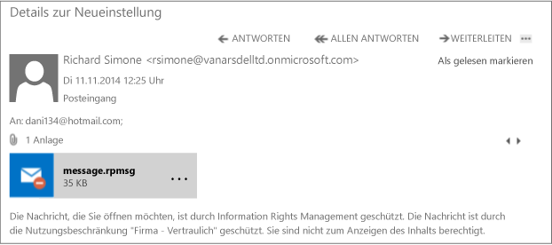

# Vollbild-Bild: eine externe e-Mail von DLP und Azure RMS gesch&#252;tzt

Zurück zu [Azure RMS in Aktion: Richtlinien zum automatischen Schützen von E-Mails mit Exchange Online und zum Verhindern von Datenverlusten](http://technet.microsoft.com/library/jj585026.aspx#BKMK_Example_DLP)

