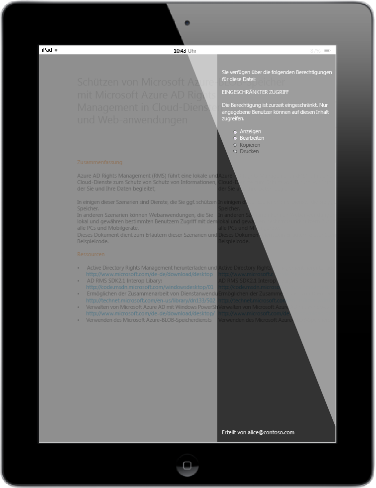

# Vollbild-Bild: Bob die Anlage &#246;ffnet, auf seine iPad

Zurück zu [Azure RMS in Aktion: Anlagen sicher für mobile Benutzer freigeben](http://technet.microsoft.com/library/jj585026.aspx#BKMK_Example_SharingApp).

