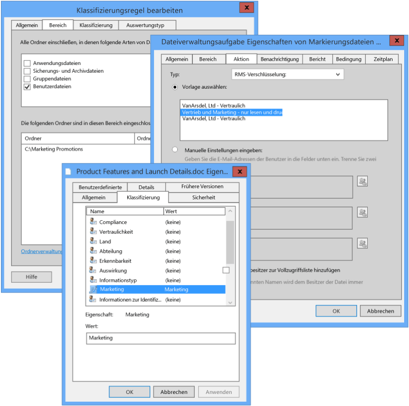

# Vollbild-Bild: Konfigurieren der FCI f&#252;r die Marketing-Klassifizierung

Zurück zu [Azure RMS in Aktion: Automatischer Schutz von Dateien auf Dateiservern, auf denen Windows Server und Dateiklassifizierungsinfrastruktur ausgeführt wird](http://technet.microsoft.com/library/jj585026.aspx#BKMK_Example_FCI).

