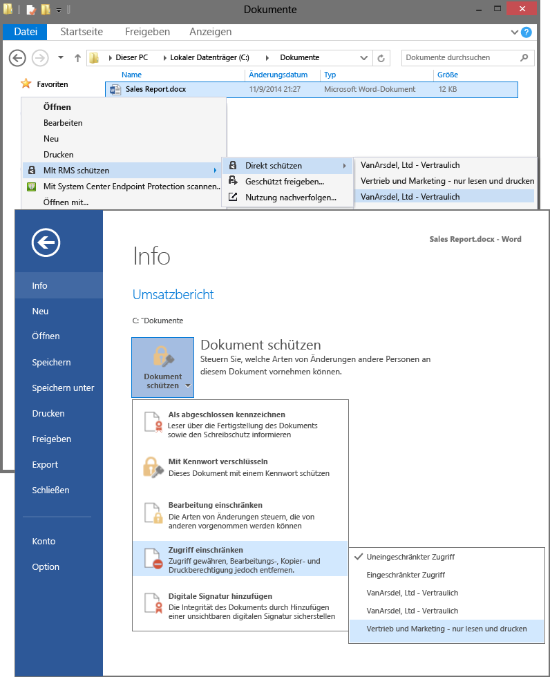

# Vollbild-Bild: W&#228;hlen Sie die RMS-Vorlagen in Clientanwendungen, z. B. Datei-Explorer und Word

Zurück zu [Azure RMS in Aktion: Aktivieren und Konfigurieren von Rights Management](http://technet.microsoft.com/library/jj585026.aspx#BKMK_Example_ManagementPortal)

