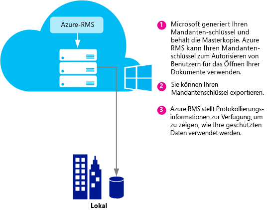
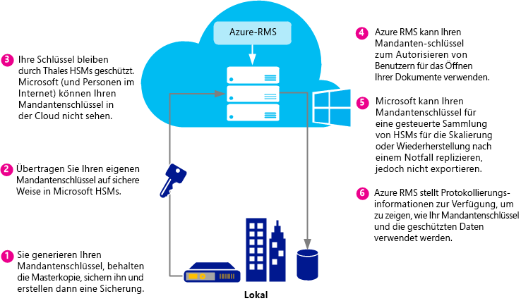
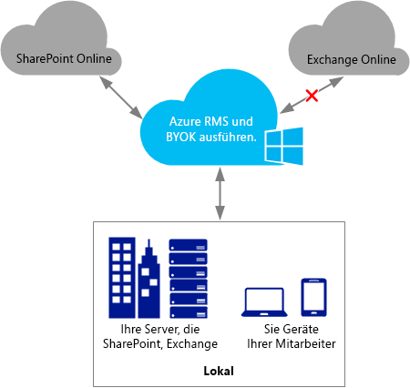
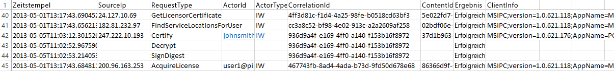

# Planen und Implementieren Ihres Azure Rights Management-Mandantenschl&#252;ssels
Verwenden Sie die Informationen in diesem Thema soll Ihnen bei der Planung und Verwaltung von der Verwaltung von Informationsrechten (RMS) Mandanten Dienstschlüssel für Azure RMS. Beispielsweise können anstelle von Microsoft Verwalten Ihres mandantenschlüssels (Standard), Sie verwalten möchten Ihren eigenen mandantenschlüssel, um bestimmte Vorschriften einzuhalten, die für Ihre Organisation gelten.  Verwalten Ihres eigenen mandantenschlüssels wird auch bezeichnet um als Ihren eigenen Schlüssel oder BYOK zu bringen.

> [!NOTE]
> Der RMS-mandantenschlüssel ist auch der Schlüssel (Server Licensor Certificate, SLC). Azure RMS pflegt eine oder mehrere Schlüssel für jede Organisation, die Azure RMS abonniert. Wenn ein Schlüssel für RMS in einer Organisation (z. B. Benutzerschlüssel, Computerschlüssel, dokumentationsverschlüsselungsschlüssel) verwendet wird, verketten sie kryptografisch Ihre RMS-mandantenschlüssel.

**Auf einen Blick:** mithilfe der folgenden Tabelle als eine kurze Einführung in der empfohlenen mandantenschlüsseltopologie. Verwenden Sie dann die zusätzlichen Abschnitte, um weitere Informationen.

Wenn Sie Azure RMS bereitstellen, mit einem mandantenschlüssel, der von Microsoft verwaltet wird, können Sie später auf BYOK ändern. Sie können nicht Ihren Azure RMS-mandantenschlüssel jedoch derzeit aus BYOK von Microsoft verwaltet ändern.

|Geschäftsanforderung <br /> <br />|Empfohlene mandantenschlüsseltopologie <br /> <br />|
|------------------------|------------------------------------------|
|Bereitstellen von Azure RMS schnell und ohne spezielle hardware <br /> <br />|Von Microsoft verwaltet wird <br /> <br />|
|Benötigen Sie alle IRM-Funktionen in Exchange Online mit Azure RMS <br /> <br />|Von Microsoft verwaltet wird <br /> <br />|
|Die Schlüssel sind von Ihnen erstellte und in einem Hardwaresicherheitsmodul (HSM) geschützt <br /> <br />|BYOK <br /> <br />Derzeit führt diese Konfiguration eingeschränkter IRM-Funktionalität in Exchange Online. Weitere Informationen finden Sie im Abschnitt [BYOK pricing and restrictions](../../ems/AADRightsMgmt/Planning-and-Implementing-Your-Azure-Rights-Management-Tenant-Key.md#BKMK_Pricing). <br /> <br />|
Verwenden Sie in den folgenden Abschnitten, um welche mandantenschlüsseltopologie Auswahl Topologie zu verwenden, sich mit des Lebenszyklus des mandantenschlüssels, Implementierung schalten Sie Ihren eigenen Schlüssel (BYOK) und welche Schritte weiter:

- [Choose your tenant key topology: Managed by Microsoft (the default) or managed by you (BYOK)](../../ems/AADRightsMgmt/Planning-and-Implementing-Your-Azure-Rights-Management-Tenant-Key.md#BKMK_ChooseTenantKey)

- [BYOK pricing and restrictions](../../ems/AADRightsMgmt/Planning-and-Implementing-Your-Azure-Rights-Management-Tenant-Key.md#BKMK_Pricing)

- [Implementing bring your own key (BYOK)](../../ems/AADRightsMgmt/Planning-and-Implementing-Your-Azure-Rights-Management-Tenant-Key.md#BKMK_ImplementBYOK)

- [Next steps](../../ems/AADRightsMgmt/Planning-and-Implementing-Your-Azure-Rights-Management-Tenant-Key.md#BKMK_NextSteps)

## <a name="BKMK_ChooseTenantKey"></a>Wählen Sie Ihren Mandanten wichtige Topologie: verwaltet von Microsoft (Standard) oder von Ihnen (BYOK)
Entscheiden Sie, welche mandantenschlüsseltopologie für Ihre Organisation am besten geeignet ist. In der Standardeinstellung Azure RMS Ihren mandantenschlüssel generiert und verwaltet die meisten Aspekte des Lebenszyklus des mandantenschlüssels. Dies ist die einfachste Option mit dem geringsten Verwaltungsaufwand. In den meisten Fällen müssen nicht selbst Sie wissen, dass Sie einen mandantenschlüssel besitzen. Sie registrieren sich einfach für Azure RMS, und der Rest des Key Management-Prozesses wird von Microsoft behandelt.

Alternativ sollten Sie vollständige Kontrolle über Ihren mandantenschlüssel, die Erstellen Ihres mandantenschlüssels und Aufbewahrung der Masterkopie bei Ihnen vor Ort umfasst. Dieses Szenario wird häufig als bezeichnet bring your own Key (BYOK). Mit dieser Option geschieht Folgendes:

1. Sie generieren Ihren mandantenschlüssel lokal, im Einklang mit Ihren IT-Richtlinien.

2. Sie Übertragung sichere den mandantenschlüssel aus einem Hardwaresicherheitsmodul (HSM) in Ihrem Besitz erläutert, die im Besitz und von Microsoft verwaltet werden. Während dieses Prozesses verlässt Ihr mandantenschlüssel nie die hardwareschutzgrenzen.

3. Wenn Sie Ihren mandantenschlüssel an Microsoft übertragen, bleibt er durch Thales HSMs geschützt. Microsoft arbeitet mit thales zusammen, um sicherzustellen, dass Ihr mandantenschlüssel von Microsofts HSMs extrahiert werden kann.

Es ist, zwar optional wird wahrscheinlich auch soll die nahe in Echtzeit Verwendung Protokolle von Azure RMS zu sehen, genau wie und wann Ihr mandantenschlüssel verwendet wird.

> [!NOTE]
> Als zusätzliche Schutzmaßnahme verwendet Azure RMS getrennte Security Worlds für seine Rechenzentren in Nordamerika, EMEA (Europa, Naher Osten und Afrika) und Asien. Wenn Sie Ihren eigenen mandantenschlüssel verwalten, ist es an die Security World der Region gebunden, die RMS-Mandanten registriert ist. Beispielsweise kann kein mandantenschlüssel eines Europäischen Kunden in Rechenzentren in Nordamerika oder Asien verwendet werden.

## <a name="BKMK_OverviewLifecycle"></a>Der Lebenszyklus des mandantenschlüssels
Wenn Sie sich entscheiden, dass Microsoft Ihren mandantenschlüssel verwalten soll, wickelt Microsoft die meisten Vorgänge des schlüssellebenszyklus. Wenn Sie beabsichtigen, Ihren mandantenschlüssel verwalten, sind Sie jedoch für viele der Vorgänge des schlüssellebenszyklus sowie einige zusätzliche Verfahren verantwortlich.

Die folgenden Diagramme zeigen und vergleichen diese beiden Optionen. Das erste Diagramm zeigt, wie wenig Verwaltungsaufwand für Sie in der Standardkonfiguration bei den mandantenschlüssel von Microsoft verwaltet wird.



Das zweite Diagramm zeigt die zusätzlichen Schritte erforderlich, wenn Sie Ihren eigenen mandantenschlüssel verwalten.



Wenn Sie Microsoft Ihren mandantenschlüssel verwalten können, ist keine weitere Aktion erforderlich, damit Sie zum Generieren des Schlüssels und können Sie die folgenden Abschnitte überspringen und direkt zu [Next steps](../../ems/AADRightsMgmt/Planning-and-Implementing-Your-Azure-Rights-Management-Tenant-Key.md#BKMK_NextSteps).

Wenn Sie Ihren mandantenschlüssel selbst verwalten möchten, lesen Sie in den folgenden Abschnitten Weitere Informationen.

Azure RMS verwendet Thales HSMs, um Ihre Schlüssel zu schützen.

Thales e-Security ist ein weltweit führender Anbieter von Verschlüsselung und Cyber Security-Lösungen, die Finanzdienstleister, High-Tech, Fertigung, Behörden und IT-Branche. Mit einer 40 Unternehmensgeschichte Schutz von Unternehmens- und Regierungsinformationen werden Thales-Lösungen von vier der fünf größten Energie- und Luftfahrtunternehmen sowie 22 NATO-Ländern verwendet werden und mehr als 80 Prozent der Zahlungstransaktionen weltweit sichern.

Microsoft hat wurde in Zusammenarbeit mit thales zusammen, um den Status der Kunst HSMs zu verbessern. Diese Erweiterungen können Sie die normalen Vorteile der gehosteten Dienste ohne aufgeben Kontrolle über Ihre Schlüssel zu erhalten. Insbesondere ermöglichen diese Verbesserungen Microsoft die Verwaltung der HSMs, damit Sie nicht zu verfügen. Als Cloud-Dienst wechselt Azure RMS kurzfristig um nutzungsspitzen Ihrer Organisation zu erfüllen. Gleichzeitig, Ihren Schlüssel in die HSMs von Microsoft geschützt ist: Sie behalten die Kontrolle über den Lebenszyklus des Schlüssels, da Sie den Schlüssel generieren und übertragen Sie sie in die HSMs von Microsoft.

Weitere Informationen finden Sie unter [Thales HSMs und Azure RMS](http://www.thales-esecurity.com/msrms/cloud) auf der Thales-Website.

## <a name="BKMK_Pricing"></a>BYOK – Preise und Einschränkungen
Unternehmen, die IT-Abteilung verwalteten Azure-Abonnement haben kann BYOK verwenden und ihre Nutzung ohne Aufpreis protokollieren. Organisationen, die für die Verwendung von RMS für Einzelpersonen können keine BYOK und Protokollierung, da sie keine Tenant-Administrator, um diese Funktionen zu konfigurieren.

> [!NOTE]
> Weitere Informationen zu RMS für Einzelpersonen finden Sie unter [RMS für Einzelpersonen und Azure Rights Management](../../ems/AADRightsMgmt/RMS-for-Individuals-and-Azure-Rights-Management.md).



BYOK und Protokollierung arbeiten nahtlos mit jeder Anwendung, die in Azure RMS integriert. Dies umfasst Cloud Services wie SharePoint Online, lokale Server, auf denen Exchange und SharePoint ausgeführt, die mit Azure RMS mithilfe des RMS-Verbindungsdienst und Clientanwendungen wie Office 2013. Sie erhalten Protokolle, unabhängig davon, die welche Anwendung Anforderungen an Azure RMS stellt.

Es gibt eine Ausnahme: derzeit **Azure RMS-BYOK ist nicht kompatibel mit Exchange Online**.  Wenn Sie Exchange Online verwenden möchten, empfiehlt sich die Bereitstellung von Azure RMS im Schlüsselverwaltungsdienst-Standardmodus, in denen Microsoft generiert und verwaltet den Schlüssel. Sie können auf BYOK später, z. B. verschoben, wenn Exchange Online Azure RMS BRING unterstützt. Wenn Sie nicht warten können, ist eine weitere Option jedoch Azure RMS mit BYOK nun mit eingeschränkter Funktionalität von RMS für Exchange Online (ungeschützten e-Mail-Nachrichten und Anlagen nicht geschützt voll funktionsfähig bleiben) bereitstellen:

- Geschützte e-Mails oder geschützten Anlagen in Outlook Web Access können nicht angezeigt werden.

- Geschützte e-Mails auf mobilen Geräten, die mithilfe von Exchange ActiveSync IRM können nicht angezeigt werden.

- Transport-Entschlüsselung (z. B. zum Scannen nach Malware) und Journal Entschlüsselung ist nicht möglich, so geschützten e-Mails und geschützten Anlagen werden übersprungen.

- Transport Schutz Geschäftsregeln und Verhinderung von Datenverlust (DLP), die IRM-Richtlinien erzwingen ist nicht möglich, so dass RMS-Schutz mit diesen Methoden angewendet werden kann.

- Server-basierte Suche für geschützte e-Mails, damit geschützte e-Mails übersprungen werden.

Bei Verwendung von Azure RMS BRING mit eingeschränkter Funktionalität für RMS für Exchange Online funktioniert RMS mit e-Mail-Clients in Outlook auf Windows- und Mac und auf andere e-Mail-Clients, die Exchange ActiveSync IRM nicht verwenden.

Wenn Sie von AD RMS in Azure RMS migrieren, Sie möglicherweise Ihren Schlüssel als eine vertrauenswürdige Veröffentlichungsdomäne (TPD) importiert haben zu Exchange Online (auch als BYOK in der Exchange-Terminologie von Azure RMS BRING getrennt ist). In diesem Szenario müssen Sie die vertrauenswürdige Veröffentlichungsdomäne von Exchange Online zur Vermeidung von in Konflikt stehenden Vorlagen und Richtlinien entfernen. Weitere Informationen finden Sie unter [Remove-RMSTrustedPublishingDomain](https://technet.microsoft.com/library/jj200720%28v=exchg.150%29.aspx) aus der Bibliothek für Exchange Online-Cmdlets.

Manchmal ist die Azure RMS BRING-Ausnahme für Exchange Online kein Problem in der Praxis. Führen Sie z. B. Organisationen, die BYOK und Protokollierung benötigen, ihre Daten Applications (Exchange, SharePoint, Office) lokal und verwenden Azure RMS für Funktionen, die nicht leicht verfügbar mit AD RMS (z. B. Zusammenarbeit mit anderen Unternehmen und Zugriff von mobilen Clients) lokal. BYOK und Protokollierung funktionieren gut in diesem Szenario und die Organisation die volle Kontrolle über ihre Azure RMS-Abonnement.

## <a name="BKMK_ImplementBYOK"></a>Implementieren von schalten Sie Ihren eigenen Schlüssel (BYOK)
Verwenden Sie den Informationen und Verfahren in diesem Abschnitt, wenn Sie sich entschieden haben, generieren und Verwalten Ihres mandantenschlüssels; die in Ihrem Szenario Schlüssel (BYOK):

- [Prerequisites for BYOK](../../ems/AADRightsMgmt/Planning-and-Implementing-Your-Azure-Rights-Management-Tenant-Key.md#BKMK_Preqs)

- [Generate and transfer your tenant key – over the Internet](../../ems/AADRightsMgmt/Planning-and-Implementing-Your-Azure-Rights-Management-Tenant-Key.md#BKMK_BYOK_Internet)

- [Generate and transfer your tenant key – in person](../../ems/AADRightsMgmt/Planning-and-Implementing-Your-Azure-Rights-Management-Tenant-Key.md#BKMK_BYOK_InPerson):

> [!IMPORTANT]
> Wenn Sie bereits begonnen haben, verwenden Sie [!INCLUDE[aad_rightsmanagement_1](../../ems/AADRightsMgmt/includes/aad_rightsmanagement_1_md.md)] (der Dienst ist aktiviert), und Benutzer haben, die Office 2010 ausführen, wenden Sie sich an Microsoft Customer Support Services (CSS), bevor Sie diese Verfahren ausführen. Je nach Szenario und Anforderungen, können Sie immer noch BYOK verwenden jedoch mit einigen Einschränkungen bzw. zusätzlichen Schritten.
> 
> Wenden Sie auch CSS auf, wenn Ihre Organisation bestimmte Richtlinien für die Behandlung von Schlüsseln verfügt.

### <a name="BKMK_Preqs"></a>Erforderliche Komponenten für BYOK
Finden Sie in der folgenden Tabelle eine Liste der erforderlichen Komponenten für bring your own Key (BYOK).

|Anforderung <br /> <br />|Weitere Informationen <br /> <br />|
|---------------|-------------------------|
|Ein Abonnement, das Azure RMS unterstützt. <br /> <br />|Weitere Informationen zu den verfügbaren Abonnements finden Sie die [Cloud subscriptions that support Azure RMS](../../ems/AADRightsMgmt/Requirements-for-Azure-Rights-Management.md#BKMK_SupportedSubscriptions) im Abschnitt der [Anforderungen für Azure Rights Management](../../ems/AADRightsMgmt/Requirements-for-Azure-Rights-Management.md) Thema. <br /> <br />|
|Verwenden Sie nicht RMS für Einzelpersonen oder Exchange Online. Oder, wenn Sie Exchange Online verwenden, Sie verstehen und akzeptieren Sie die Grenzen der Verwendung von BYOK mit dieser Konfiguration. <br /> <br />|Weitere Informationen zu den aktuellen Einschränkungen bei BYOK finden Sie unter den [BYOK pricing and restrictions](../../ems/AADRightsMgmt/Planning-and-Implementing-Your-Azure-Rights-Management-Tenant-Key.md#BKMK_Pricing) in diesem Thema. **Important:** Derzeit ist BYOK nicht kompatibel mit Exchange Online. <br />|
|Thales HSM, Smartcards und Support-software <br /> <br />Wenn Sie von AD RMS in Azure RMS Migrieren mithilfe von Softwareschlüssel, Hardware, benötigen Sie mindestens Version des 11.62 für die Thales-Treiber. <br /> <br />|Sie benötigen Zugriff auf ein Thales Hardwaresicherheitsmodul sowie grundlegende Kenntnisse zum Betrieb von Thales HSMs. Finden Sie unter [Thales Hardwaresicherheitsmodul](http://www.thales-esecurity.com/msrms/buy) für die Liste der kompatiblen Modelle oder zum Kauf eines HSM, wenn Sie nicht besitzen. <br /> <br />|
|Wenn Sie über das Internet übertragen statt physisch in Redmond, USA vorhanden möchten:<ol><li>Eine offline-X 64-Arbeitsstation mit einer minimalen Windows-Betriebssystem Windows 7 und Thales nShield-Software, die mindestens Version 11.62.   Wenn diese Arbeitsstation Windows 7 ausgeführt wird, müssen Sie [Installieren Sie Microsoft .NET Framework 4.5](http://go.microsoft.com/fwlink/?LinkId=225702). </li><li>Eine Arbeitsstation, die mit dem Internet verbunden ist und eine minimale Windows-Betriebssystem von Windows 7. </li><li>Ein USB-Laufwerk oder ein anderes mobiles Speichergerät, das mindestens 16 MB freien Speicherplatz verfügt. </li> </ol>|Diese erforderlichen Komponenten sind nicht erforderlich, wenn Sie nach Redmond Reisen und Ihren mandantenschlüssel persönlich zu übertragen. <br /> <br />Aus Sicherheitsgründen wird empfohlen, dass die erste Arbeitsstation nicht mit einem Netzwerk verbunden ist. Allerdings ist dies nicht programmtechnisch erforderlich. **Note:** In den folgenden Anleitungen wird diese Arbeitsstation als der nicht verbundenen Arbeitsstation bezeichnet. <br />Wenn Ihr mandantenschlüssel für ein Produktionsnetzwerk ist, empfehlen wir außerdem, dass Sie eine zweite getrennte Arbeitsstation verwenden, um das Toolset herunterzuladen und den mandantenschlüssel hochzuladen. Aber Sie können derselben Arbeitsstation zu Testzwecken verwenden, wie im ersten Beispiel. **Note:** In den folgenden Anleitungen wird diese zweite Arbeitsstation als die Arbeitsstation mit Internetverbindung bezeichnet. <br />|
|Optional: Azure-Abonnement <br /> <br />|Wenn Sie die Mandanten Schlüsselverwendung (und Rights Management-Nutzung) protokollieren möchten, benötigen Sie ein Abonnement von Azure sowie ausreichenden Speicherplatz auf Azure, um Ihre Protokolle zu speichern. <br /> <br />|
Die Verfahren zum Generieren und verwenden Ihres eigenen mandantenschlüssels hängen davon ab, ob Sie diese über das Internet oder persönlich vornehmen möchten:

- **Über das Internet:** dies erfordert einige zusätzliche Konfigurationsschritte wie das Herunterladen und Verwenden eines Toolsets und Windows PowerShell-Cmdlets. Sie müssen jedoch nicht physisch in einer Microsoft-Einrichtung Ihres mandantenschlüssels übertragen werden. Sicherheit wird mithilfe der folgenden Methoden beibehalten:

   - Sie generieren den mandantenschlüssel auf einer offlinearbeitsstation, die wodurch die Angriffsfläche verringert wird.

   - Der mandantenschlüssel verschlüsselt mit einem Key Exchange Key (KEK), die verschlüsselte bleibt, bis sie an die Azure RMS-HSMs übertragen werden. Nur die verschlüsselte Version Ihres mandantenschlüssels verlässt die ursprüngliche Arbeitsstation.

   - Ein Tool legt Eigenschaften für Ihren mandantenschlüssel, der Ihren mandantenschlüssel an die Azure RMS Security World bindet. Also nach Azure RMS-HSMs empfangen und Ihren mandantenschlüssel zu entschlüsseln, können nur diesen verwenden. Ihr mandantenschlüssel kann nicht exportiert werden. Diese Bindung wird durch den Thales HSMs erzwungen.

   - Zum Verschlüsseln Ihres mandantenschlüssels Key Exchange Key (KEK) wird in Azure RMS-HSMs generiert und kann nicht exportiert werden. Die HSMs erzwingen, dass es kann keine unverschlüsselte Version des Schlüsselaustauschschlüssels außerhalb der HSMs der. Darüber hinaus enthält das Toolset Beglaubigung von Thales, dass der Schlüsselaustauschschlüssel nicht exportiert kann und in einem Original-HSM von Thales hergestellt wurde, die generiert wurde.

   - Das Toolset enthält eine Beglaubigung von Thales, dass die Azure RMS Security World ebenfalls auf einem von Thales hergestellten Original-HSM generiert wurde. Dies zeigt Ihnen, dass Microsoft Originalhardware verwendet wird.

   - Microsoft verwendet separate getrennte Schlüsselaustauschschlüssel sowie getrennte Security Worlds in jeder geografischen Region, der sicherstellt, dass Ihr mandantenschlüssel kann nur in Rechenzentren in der Region, in dem Sie verschlüsselt, verwendet werden. Beispielsweise kann kein mandantenschlüssel eines Europäischen Kunden in Rechenzentren in Nordamerika oder Asien verwendet werden.

   > [!NOTE]
   >    Ihres mandantenschlüssels kann nicht vertrauenswürdige Computer und Netzwerke sicher verschieben, da es verschlüsselt und gesichert mit Level Zugriffssteuerungsberechtigungen für Azure RMS nur Ihren HSMs und die HSMs von Microsoft verwendet werden kann. Die Skripts, die im Toolset zum Überprüfen der Sicherheitsmaßnahmen und Lesen Weitere Informationen zur Funktionsweise von Thales bereitgestellt werden können: [Verwaltung von Hardware-Schlüssel in der RMS-Cloud](https://www.thales-esecurity.com/knowledge-base/white-papers/hardware-key-management-in-the-rms-cloud).

- **Persönlich:** dies erfordert, dass Sie wenden Sie sich an Microsoft Customer Support Services (CSS), um eine schlüsselübertragung für Azure RMS zu vereinbaren. Sie müssen eine Microsoft-Niederlassung in Redmond, Washington, USA, Ihren mandantenschlüssel in die Azure RMS Security World übertragen Reisen.

### <a name="BKMK_BYOK_Internet"></a>Generieren Sie und übertragen Sie Ihres mandantenschlüssels – über das Internet
Verwenden Sie die folgenden Verfahren, Reisen, um eine Microsoft-Funktion, die den mandantenschlüssel persönlich zu übertragen, sondern über das Internet übertragen werden sollen:

- [Prepare your Internet-connected workstation](../../ems/AADRightsMgmt/Planning-and-Implementing-Your-Azure-Rights-Management-Tenant-Key.md#BKMK_InternetPrepareWorkstation)

- [Prepare your disconnected workstation](../../ems/AADRightsMgmt/Planning-and-Implementing-Your-Azure-Rights-Management-Tenant-Key.md#BKMK_DisconnectedPrepareWorkstation)

- [Generate your tenant key](../../ems/AADRightsMgmt/Planning-and-Implementing-Your-Azure-Rights-Management-Tenant-Key.md#BKMK_InternetGenerate)

- [Prepare your tenant key for transfer](../../ems/AADRightsMgmt/Planning-and-Implementing-Your-Azure-Rights-Management-Tenant-Key.md#BKMK_InternetPrepareTransfer)

- [Transfer your tenant key to Azure RMS](../../ems/AADRightsMgmt/Planning-and-Implementing-Your-Azure-Rights-Management-Tenant-Key.md#BKMK_InternetTransfer)

#### <a name="BKMK_InternetPrepareWorkstation"></a>Vorbereiten Sie Ihrer Arbeitsstation mit Internetzugriff
Um Ihre Arbeitsstation vorzubereiten, die mit dem Internet verbunden ist, führen Sie diese 3 Schritte aus:

- [Step 1: Install Windows PowerShell for Azure Rights Management](../../ems/AADRightsMgmt/Planning-and-Implementing-Your-Azure-Rights-Management-Tenant-Key.md#BKMK_PrepareInternetConnectedWorkstation1)

- [Step 2: Get your Azure Active Directory tenant ID](../../ems/AADRightsMgmt/Planning-and-Implementing-Your-Azure-Rights-Management-Tenant-Key.md#BKMK_PrepareInternetConnectedWorkstation2)

- [Step 3: Download the BYOK toolset](../../ems/AADRightsMgmt/Planning-and-Implementing-Your-Azure-Rights-Management-Tenant-Key.md#BKMK_PrepareInternetConnectedWorkstation3)

##### <a name="BKMK_PrepareInternetConnectedWorkstation1"></a>Schritt 1: Installieren von WindowsPowerShell für Azure Rights Management
Herunterladen und Installieren von Windows PowerShell-Modul für Azure Rights Management, von der Arbeitsstation Internetzugang.

> [!NOTE]
> Wenn Sie dieses Windows PowerShell-Modul zuvor heruntergeladen haben, führen Sie den folgenden Befehl überprüfen, ob die Versionsnummer mindestens 2.1.0.0 ist: **(Get-Module aadrm -ListAvailable).Version**

Installationshinweise finden Sie unter [Installieren WindowsPowerShell für Azure Rights Management](../../ems/AADRightsMgmt/Installing-Windows-PowerShell-for-Azure-Rights-Management.md).

##### <a name="BKMK_PrepareInternetConnectedWorkstation2"></a>Schritt 2: Abrufen der Azure Active Directory-Mandanten-ID
Starten Sie Windows PowerShell mit dem **als Administrator ausführen** aus, und führen Sie die folgenden Befehle:

- Verwenden der [Connect-AadrmService](http://msdn.microsoft.com/library/windowsazure/dn629415.aspx) Cmdlet mit dem Azure RMS-Dienst herstellen:

   ```
   Connect-AadrmService
   ```
   Wenn Sie dazu aufgefordert werden, geben Sie Ihre [!INCLUDE[aad_rightsmanagement_1](../../ems/AADRightsMgmt/includes/aad_rightsmanagement_1_md.md)] mandantenadministrator-Anmeldeinformationen (in der Regel verwenden Sie ein Konto, ein globaler Administrator für Azure Active Directory oder Office 365 ist).

- Verwenden der [Get-AadrmConfiguration](http://msdn.microsoft.com/library/windowsazure/dn629410.aspx) Cmdlet, um die Konfiguration Ihres Mandanten anzuzeigen:

   ```
   Get-AadrmConfiguration
   ```
   Speichern Sie die GUID aus der Ausgabe aus der ersten Zeile (BPOSId). Dies ist Ihre Azure Active Directory-Mandanten-ID, die Sie später benötigen, wenn Sie Ihren mandantenschlüssel für den Upload vorbereiten.

- Verwenden der [Disconnect-AadrmService](http://msdn.microsoft.com/library/windowsazure/dn629416.aspx) -Cmdlet zum Trennen des Azure RMS-Diensts, bis Sie bereit sind, um den Schlüssel hochzuladen:

   ```
   Disconnect-AadrmService
   ```

Schließen Sie das Windows PowerShell-Fenster nicht.

##### <a name="BKMK_PrepareInternetConnectedWorkstation3"></a>Schritt 3: Laden Sie das BYOK-toolset
Wechseln Sie zum Microsoft Download Center und [BYOK-Toolset herunterladen](http://go.microsoft.com/fwlink/?LinkId=335781) für Ihre Region:

|Region <br /> <br />|Paketname <br /> <br />|
|----------|-------------|
|Nordamerika <br /> <br />|AzureRMS-BYOK-Tools-Vereinigtes States.zip <br /> <br />|
|Europa <br /> <br />|AzureRMS-BYOK-Tools-Europe.zip <br /> <br />|
|Asien <br /> <br />|AzureRMS-BYOK-Tools-AsiaPacific.zip <br /> <br />|
Das Toolset enthält Folgendes:

- Ein Key Exchange Key (KEK)-Paket, eine Name beginnt mit **BYOK-KEK-Pkg -**.

- Ein Security World-Paket, eine Name beginnt mit **BYOK-SecurityWorld-Pkg -**.

- Ein Python-Skript namens **verifykeypackage.py**.

- Eine ausführbare Befehlszeilendatei namens **KeyTransferRemote.exe**, eine Datei mit Metadaten mit dem Namen **KeyTransferRemote.exe.config**, und die zugehörigen DLLs.

- Eine Visual C++ Redistributable Package namens **vcredist_x64.exe**.

Kopieren Sie das Paket auf einem USB-Laufwerk oder anderen tragbaren Speichergeräten.

#### <a name="BKMK_DisconnectedPrepareWorkstation"></a>Vorbereiten Sie Ihrer nicht verbundenen Arbeitsstation
Zur Vorbereitung Ihrer Arbeitsstation, die nicht mit einem Netzwerk (entweder das Internet oder Ihr internes Netzwerk) verbunden ist 2 gehen Sie folgendermaßen vor:

- [Step 1: Prepare the disconnected workstation with Thales HSM](../../ems/AADRightsMgmt/Planning-and-Implementing-Your-Azure-Rights-Management-Tenant-Key.md#BKMK_PrepareDisconnectedWorkstation1)

- [Step 2: Install the BYOK toolset on the disconnected workstation](../../ems/AADRightsMgmt/Planning-and-Implementing-Your-Azure-Rights-Management-Tenant-Key.md#BKMK_PrepareDisconnectedWorkstation2)

##### <a name="BKMK_PrepareDisconnectedWorkstation1"></a>Schritt 1: Vorbereiten der nicht verbundenen Arbeitsstation mit Thales HSM
Installieren Sie auf der nicht verbundenen Arbeitsstation die unterstützende nCipher (Thales)-Software auf einem Windows-Computer zu, und fügen Sie dann ein Thales HSM an diesen Computer.

Stellen Sie sicher, dass die Thales-Tools in Ihrem Pfad befinden **(%nfast_home%\bin** und **%nfast_home%\python\bin**). Geben Sie beispielsweise Folgendes ein:

```
set PATH=%PATH%;”%nfast_home%\bin”;”%nfast_home%\python\bin”
```
Weitere Informationen finden Sie im Benutzerhandbuch des Thales HSM enthalten, oder besuchen Sie die Thales-Website für Azure RMS unter [http://www.thales-esecurity.com/msrms/cloud](http://www.thales-esecurity.com/msrms/cloud).

##### <a name="BKMK_PrepareDisconnectedWorkstation2"></a>Schritt 2: Installieren Sie das BYOK-Toolset auf der nicht verbundenen Arbeitsstation
Kopieren Sie das BYOK-Toolset-Paket aus dem USB-Laufwerk oder anderen tragbaren Speichergeräten, und führen Sie dann Folgendes:

1. Extrahieren Sie die Dateien aus dem heruntergeladenen Paket in einen beliebigen Ordner.

2. Aus diesem Ordner vcredist_x64.exe ausführen.

3. Gehen Sie zum Installieren der Visual C++-Laufzeitkomponenten für Visual Studio 2012.

#### <a name="BKMK_InternetGenerate"></a>Generieren Sie Ihres mandantenschlüssels
Auf der nicht verbundenen Arbeitsstation diese 3 Schritte, um Ihren eigenen mandantenschlüssel zu generieren:

- [Step 1: Create a security world](../../ems/AADRightsMgmt/Planning-and-Implementing-Your-Azure-Rights-Management-Tenant-Key.md#BKMK_InternetGenerate1)

- [Step 2: Validate the downloaded package](../../ems/AADRightsMgmt/Planning-and-Implementing-Your-Azure-Rights-Management-Tenant-Key.md#BKMK_InternetGenerate2)

- [Step 3: Create a new key](../../ems/AADRightsMgmt/Planning-and-Implementing-Your-Azure-Rights-Management-Tenant-Key.md#BKMK_InternetGenerate3)

##### <a name="BKMK_InternetGenerate1"></a>Schritt 1: Erstellen Sie eine Security world
Starten Sie ein Eingabeaufforderungsfenster, und führen Sie das Thales-Programm neue Welt.

```
new-world.exe --initialize --cipher-suite=DLf1024s160mRijndael --module=1 --acs-quorum=2/3
```
Dieses Programm erstellt eine **Security World** Datei % NFAST_KMDATA%\local\world, die in den Ordner C:\ProgramData\nCipher\Key Management Data\local entspricht. Sie können unterschiedliche Werte für das Quorum, aber in unserem Beispiel aufgefordert, jeweils drei leere Karten und Pins einzugeben. Klicken Sie dann zwei Karten müssen Sie den administrativen Zugriff auf die Security World (der angegebene Quorum) haben.  Diese Karten werden dann die **Administrator Card Set** für die neue Security World. Sie können zu diesem Zeitpunkt Geben Sie das Kennwort oder die PIN für jede ACS-Karte oder später mit einem Befehl hinzufügen.

> [!TIP]
> Überprüfen Sie die Konfigurationsstatus der aktuellen Ihrer HSM mithilfe der **nkminfo** Befehl.

Führen Sie dann folgende Schritte aus:

1. Installieren Sie den Thales CNG-Anbieter, wie in der Thales-Dokumentation beschrieben, und konfigurieren Sie, um die neue Security World zu verwenden.

2. Sichern Sie die World-Datei in **%nfast_kmdata%\local**. Sichern Sie und schützen Sie die World-Datei, die Administrator Cards und ihre Pins und stellen Sie sicher, dass keine einzelne Person Zugriff auf mehr als eine Karte.

##### <a name="BKMK_InternetGenerate2"></a>Schritt 2: Überprüfen Sie das heruntergeladene Paket
Dieser Schritt ist optional, aber empfohlen, damit Sie Folgendes überprüfen:

- Der Schlüssel, der im Toolset enthalten ist Exchange wurde aus einem Original-HSM von Thales generiert.

- Der Hash der Azure RMS Security World, die im Toolset enthalten ist, wurde in einem Original-HSM von Thales generiert.

- Der Exchange-Schlüssel kann nicht exportiert werden.

> [!NOTE]
> Um das heruntergeladene Paket zu überprüfen, muss das HSM muss verbunden sein, eingeschaltet und eine Security World darauf (z. B. dasjenige, das Sie gerade erstellt haben).

1. Führen Sie das Skript verifykeypackage.py hübschen eine der folgenden, abhängig von Ihrer Region:

   - Für Nordamerika:

      ```
      python verifykeypackage.py -k BYOK-KEK-pkg-NA-1 -w BYOK-SecurityWorld-pkg-NA-1
      ```

   - Für Europa:

      ```
      python verifykeypackage.py -k BYOK-KEK-pkg-EU-1 -w BYOK-SecurityWorld-pkg-EU-1
      ```

   - Für Asien:

      ```
      python verifykeypackage.py -k BYOK-KEK-pkg-AP-1 -w BYOK-SecurityWorld-pkg-AP-1
      ```

   > [!TIP]
   >    Die Thales-Software umfasst Python-Übersetzer am %NFAST_HOME%\python\bin

2. Vergewissern Sie sich, dass Sie Folgendes angezeigt wird, die erfolgreiche Überprüfung anzeigt: **Ergebnis: Erfolg**

Dieses Skript überprüft die Kette der Signaturgeber bis zu Thales-Stammschlüssel. Der Hash dieses Stammschlüssels in das Skript eingebettet ist, und sein Wert sollte **59178a47 de508c3f 291277ee 184f46c4 f1d9c639**. Sie können diesen Wert auch einzeln bestätigen, besuchen die [Thales-Website](http://www.thalesesec.com/).

Sie nun können einen neuen Schlüssel zu erstellen, die die RMS-mandantenschlüssel.

##### <a name="BKMK_InternetGenerate3"></a>Schritt 3: Erstellen eines neuen Schlüssels
Generieren Sie einen CNG-Schlüssel unter Verwendung der Thales **Generatekey** und **Cngimport** Programme.

Führen Sie den folgenden Befehl zum Generieren des Schlüssels:

```
generatekey --generate simple type=RSA size=2048 protect=module ident=contosokey plainname=contosokey nvram=no pubexp=
```
Wenn Sie diesen Befehl ausführen, gehen Sie folgendermaßen vor:

- Für die Größe des Schlüssels wir empfehlen 2048 unterstützt werden aber auch 1024-Bit-RSA-Schlüssel für bestehende AD RMS-Kunden, die solche Schlüssel haben und zu Azure RMS migrieren.

- Ersetzen Sie den Wert der *Contosokey* für die **Ident** und **Plainname** mit einem String-Wert. Um den Verwaltungsaufwand zu minimieren, und verringert das Risiko von Fehlern, empfehlen wir, den gleichen Wert für beide verwenden und alle Kleinbuchstaben verwenden.

- Die Pubexp bleibt in diesem Beispiel leer (Standard), jedoch können Sie bestimmte Werte angeben. Weitere Informationen finden Sie in der Thales-Dokumentation.

Führen Sie dann den folgenden Befehl ein, um den Schlüssel in CNG zu importieren:

```
cngimport --import -M --key=contosokey --appname=simple contosokey
```
Wenn Sie diesen Befehl ausführen, gehen Sie folgendermaßen vor:

- Ersetzen Sie *Contosokey* mit dem gleichen Wert, der im angegebenen [Step 1: Create a security world](../../ems/AADRightsMgmt/Planning-and-Implementing-Your-Azure-Rights-Management-Tenant-Key.md#BKMK_InternetGenerate1) aus der *generieren Ihres mandantenschlüssels* Abschnitt.

- Verwenden der **- M** auswählen, sodass der Schlüssel für dieses Szenario geeignet ist. Ohne diesen Schritt werden der resultierende Schlüssel einem benutzerspezifischen Schlüssel für den aktuellen Benutzer.

Dieser Befehl erstellt eine tokenschlüsseldatei in Ihrem %NFAST_KMDATA%\local-Ordner mit einem Namen mit **Key_caping_** gefolgt von einer SID. Beispiel: **key_caping_machine--801c1a878c925fd9df4d62ba001b94701c039e2fb**. Diese Datei enthält einen verschlüsselten Schlüssel.

> [!TIP]
> Sie sehen den aktuellen Konfigurationsstatus Ihrer Schlüssel mithilfe der **nkminfo –k** Befehl.

Sichern Sie diese Tokenschlüsseldatei an einem sicheren Ort.

> [!IMPORTANT]
> Wenn Sie Ihren Schlüssel später in Azure RMS übertragen, kann nicht Microsoft diesen Schlüssel für Sie exportieren, sodass es äußerst wichtig ist, dass Sie Ihren Schlüssel und die Security World gut geschützt sichern. Wenden Sie sich an Thales, Leitfäden und bewährte Methoden zum Sichern Ihres Schlüssels.

Sie können nun auf Ihren mandantenschlüssel in Azure RMS zu übertragen.

#### <a name="BKMK_InternetPrepareTransfer"></a>Vorbereiten Sie Ihres mandantenschlüssels für die Übertragung
Auf der nicht verbundenen Arbeitsstation diese 4 Schritte, um Ihren eigenen mandantenschlüssel vorzubereiten:

- [Step 1: Create a copy of your key with reduced permissions](../../ems/AADRightsMgmt/Planning-and-Implementing-Your-Azure-Rights-Management-Tenant-Key.md#BKMK_InternetPrepareTransfer1)

- [Step 2: Inspect the new copy of the key](../../ems/AADRightsMgmt/Planning-and-Implementing-Your-Azure-Rights-Management-Tenant-Key.md#BKMK_InternetPrepareTransfer2)

- [Step 3: Encrypt your key by using Microsoft’s Key Exchange Key](../../ems/AADRightsMgmt/Planning-and-Implementing-Your-Azure-Rights-Management-Tenant-Key.md#BKMK_InternetPrepareTransfer3)

- [Step 4: Copy your key transfer package to the Internet-connected workstation](../../ems/AADRightsMgmt/Planning-and-Implementing-Your-Azure-Rights-Management-Tenant-Key.md#BKMK_InternetPrepareTransfer4)

##### <a name="BKMK_InternetPrepareTransfer1"></a>Schritt 1: Erstellen einer Kopie Ihres Schlüssels mit verringerten Berechtigungen
Um die Berechtigungen für Ihren mandantenschlüssel zu reduzieren, führen Sie folgende Schritte aus:

- Über eine Befehlszeile, führen Sie einen der folgenden, abhängig von Ihrer Region:

   - Für Nordamerika:

      ```
      KeyTransferRemote.exe -ModifyAcls -KeyAppName simple -KeyIdentifier contosokey -ExchangeKeyPackage BYOK-KEK-pkg-NA-1 -NewSecurityWorldPackage BYOK-SecurityWorld-pkg-NA-1
      ```

   - Für Europa:

      ```
      KeyTransferRemote.exe -ModifyAcls -KeyAppName simple -KeyIdentifier contosokey -ExchangeKeyPackage BYOK-KEK-pkg-EU-1 -NewSecurityWorldPackage BYOK-SecurityWorld-pkg-EU-1
      ```

   - Für Asien:

      ```
      KeyTransferRemote.exe -ModifyAcls -KeyAppName simple -KeyIdentifier contosokey -ExchangeKeyPackage BYOK-KEK-pkg-AP-1 -NewSecurityWorldPackage BYOK-SecurityWorld-pkg-AP-1
      ```

Wenn Sie diesen Befehl ausführen, ersetzen *Contosokey* mit demselben Wert, den Sie im angegebenen [Step 1: Create a security world](../../ems/AADRightsMgmt/Planning-and-Implementing-Your-Azure-Rights-Management-Tenant-Key.md#BKMK_InternetGenerate1) aus der *generieren Ihres mandantenschlüssels* Abschnitt.

Sie werden aufgefordert, Ihre Security World ACS-Karten einzustecken und angegeben, Kennwörter oder PINS...

Wenn der Befehl abgeschlossen ist, sehen Sie **Ergebnis: Erfolg** und die Kopie Ihres mandantenschlüssels mit verringerten Berechtigungen befindet sich in der Datei mit dem Namen Key_xferacId_*&lt; Contosokey &gt;*.

##### <a name="BKMK_InternetPrepareTransfer2"></a>Schritt 2: Überprüfen Sie die neue Kopie des Schlüssels
Führen Sie den Thales optional Dienstprogramme, um die minimalen Berechtigungen für den neuen mandantenschlüssel bestätigen:

- aclprint.py:

   ```
   "%nfast_home%\bin\preload.exe" -m 1 -A xferacld -K contosokey "%nfast_home%\python\bin\python" "%nfast_home%\python\examples\aclprint.py"
   ```

- Kmfile-Dump.exe:

   ```
   "%nfast_home%\bin\kmfile-dump.exe" "%NFAST_KMDATA%\local\key_xferacld_contosokey"
   ```

Wenn Sie diesen Befehl ausführen, ersetzen Sie *Contosokey* mit demselben Wert, den Sie im angegebenen [Step 1: Create a security world](../../ems/AADRightsMgmt/Planning-and-Implementing-Your-Azure-Rights-Management-Tenant-Key.md#BKMK_InternetGenerate1) aus der *generieren Ihres mandantenschlüssels* Abschnitt.

##### <a name="BKMK_InternetPrepareTransfer3"></a>Schritt 3: Verschlüsseln Sie Ihren Schlüssel mithilfe des Microsoft Exchange-Schlüssel
Führen Sie abhängig von Ihrer Region einen der folgenden Befehle:

- Für Nordamerika:

   ```
   KeyTransferRemote.exe -Package -KeyIdentifier contosokey -ExchangeKeyPackage BYOK-KEK-pkg-NA-1 -NewSecurityWorldPackage BYOK-SecurityWorld-pkg-NA-1 -TenantBposId GUID -KeyFriendlyName ContosoFirstkey
   ```

- Für Europa:

   ```
   KeyTransferRemote.exe -Package -KeyIdentifier contosokey -ExchangeKeyPackage BYOK-KEK-pkg-EU-1 -NewSecurityWorldPackage BYOK-SecurityWorld-pkg-EU-1 -TenantBposId GUID -KeyFriendlyName ContosoFirstkey
   ```

- Für Asien:

   ```
   KeyTransferRemote.exe -Package -KeyIdentifier contosokey -ExchangeKeyPackage BYOK-KEK-pkg-AP-1 -NewSecurityWorldPackage BYOK-SecurityWorld-pkg-AP-1 -TenantBposId GUID -KeyFriendlyName ContosoFirstkey
   ```

Wenn Sie diesen Befehl ausführen, gehen Sie folgendermaßen vor:

- Ersetzen Sie *Contosokey* mit der ID, die Sie zum Generieren des Schlüssels verwendet [Step 1: Create a security world](../../ems/AADRightsMgmt/Planning-and-Implementing-Your-Azure-Rights-Management-Tenant-Key.md#BKMK_InternetGenerate1) aus der *generieren Ihres mandantenschlüssels* Abschnitt.

- Ersetzen Sie *GUID* mit Ihrem Azure Active Directory-Mandanten-ID, die Sie im abgerufen [Step 2: Get your Azure Active Directory tenant ID](../../ems/AADRightsMgmt/Planning-and-Implementing-Your-Azure-Rights-Management-Tenant-Key.md#BKMK_PrepareInternetConnectedWorkstation2) aus der *Vorbereiten Ihrer Arbeitsstation Internetzugang* Abschnitt.

- Ersetzen Sie *ContosoFirstKey* mit einer Bezeichnung, die für den Namen der Ausgabedatei verwendet wird.

Wenn dies abgeschlossen es zeigt **Ergebnis: Erfolg** und es wird eine neue Datei im aktuellen Ordner mit dem folgenden Namen: transferpackage-*ContosoFirstkey*.byok

##### <a name="BKMK_InternetPrepareTransfer4"></a>Schritt 4: Kopieren Sie Ihr schlüsselübertragungspaket auf die Arbeitsstation mit Internetzugriff 
Verwenden Sie ein USB-Laufwerk oder anderen tragbaren Speichergeräten, kopieren Sie die Ausgabedatei aus dem vorherigen Schritt (keytransferpackage-*ContosoFirstkey*.byok) auf Ihre Arbeitsstation mit Internetzugriff.

> [!NOTE]
> Verwenden Sie Sicherheitsmaßnahmen, um die Datei zu schützen, da sie Ihren privaten Schlüssel enthält.

#### <a name="BKMK_InternetTransfer"></a>In Azure RMS übertragen
Führen Sie auf der Arbeitsstation Internetzugang diese 3 Schritte, um Ihren neuen mandantenschlüssel in Azure RMS zu übertragen:

- [Step 1: Connect to Azure RMS](../../ems/AADRightsMgmt/Planning-and-Implementing-Your-Azure-Rights-Management-Tenant-Key.md#BKMK_InternetTransfer1)

- [Step 2: Upload the key package](../../ems/AADRightsMgmt/Planning-and-Implementing-Your-Azure-Rights-Management-Tenant-Key.md#BKMK_InternetTransfer2)

- [Step 3: Enumerate your tenant keys – as needed](../../ems/AADRightsMgmt/Planning-and-Implementing-Your-Azure-Rights-Management-Tenant-Key.md#BKMK_InternetTransfer3)

##### <a name="BKMK_InternetTransfer1"></a>Schritt 1: Verbinden Sie mit Azure RMS
Zurück zu Windows PowerShell-Fenster, und geben Sie Folgendes ein:

1. Wiederherstellen der Verbindung zu der [!INCLUDE[aad_rightsmanagement_1](../../ems/AADRightsMgmt/includes/aad_rightsmanagement_1_md.md)] Service:

   ```
   Connect-AadrmService
   ```

2. Verwenden der [Get-AadrmKeys](http://msdn.microsoft.com/library/windowsazure/dn629420.aspx) Cmdlet, um die aktuelle Konfiguration der Mandanten-Schlüssel finden Sie unter:

   ```
   Get-AadrmKeys
   ```

##### <a name="BKMK_InternetTransfer2"></a>Schritt 2: Laden Sie das Schlüsselpaket hoch
Verwenden der [Add-AadrmKey](http://msdn.microsoft.com/library/windowsazure/dn629418.aspx) Cmdlet, um das schlüsselübertragungspaket, das Sie aus der nicht verbundenen Arbeitsstation kopiert haben:

```
Add-AadrmKey –KeyFile <PathToPackageFile> -Verbose
```
> [!WARNING]
> Sie werden aufgefordert, diese Aktion zu bestätigen. Es ist wichtig zu verstehen, dass diese Aktion nicht rückgängig gemacht werden kann. Wenn Sie einen mandantenschlüssel hochladen, wird es automatisch primäre mandantenschlüssel Ihrer Organisation und Benutzer beginnen, diesen mandantenschlüssel verwenden, wenn sie Dokumente und Dateien schützen.

Wenn der Upload erfolgreich ist, wird die folgende Meldung angezeigt: **der Rights Management-Dienst den Schlüssel erfolgreich hinzugefügt.**

Erwarten Sie eine Verzögerung der Replikation der Änderung in alle [!INCLUDE[aad_rightsmanagement_1](../../ems/AADRightsMgmt/includes/aad_rightsmanagement_1_md.md)] Rechenzentren.

##### <a name="BKMK_InternetTransfer3"></a>Schritt 3: Auflisten der mandantenschlüssel – nach Bedarf
Verwenden das Cmdlet "Get-AadrmKeys" erneut, um die Änderung an Ihrem mandantenschlüssel anzuzeigen, und wann immer Sie möchten eine Liste Ihrer mandantenschlüssel anzeigen. Die angezeigten mandantenschlüssel umfassen den anfänglichen mandantenschlüssel, den Microsoft für Sie generiert, und alle mandantenschlüssel, die Sie hinzugefügt haben:

```
Get-AadrmKeys
```
Der mandantenschlüssel, die markiert ist **Active** ist diejenige, die Ihre Organisation derzeit verwendet, um Dokumente und Dateien zu schützen.

Sie haben alle der folgenden Schritte bringen Ihren eigenen Schlüssel über das Internet und können jetzt abgeschlossen [Next steps](../../ems/AADRightsMgmt/Planning-and-Implementing-Your-Azure-Rights-Management-Tenant-Key.md#BKMK_NextSteps).

### <a name="BKMK_BYOK_InPerson"></a>Generieren Sie und übertragen Sie Ihres mandantenschlüssels – persönlich
Verwenden Sie die folgenden Verfahren, wenn Sie Ihren mandantenschlüssel über das Internet übertragen möchten, sondern stattdessen Ihren mandantenschlüssel persönlich zu übertragen.

- [Generate your tenant key](../../ems/AADRightsMgmt/Planning-and-Implementing-Your-Azure-Rights-Management-Tenant-Key.md#BKMK_GenerateKey)

- [Transfer your tenant key to Azure RMS](../../ems/AADRightsMgmt/Planning-and-Implementing-Your-Azure-Rights-Management-Tenant-Key.md#BKMK_Transfer)

#### <a name="BKMK_GenerateKey"></a>Generieren Sie Ihres mandantenschlüssels
Führen Sie diese 3 Schritte, um Ihren eigenen mandantenschlüssel zu generieren:

- [Step 1: Prepare a workstation with Thales HSM](../../ems/AADRightsMgmt/Planning-and-Implementing-Your-Azure-Rights-Management-Tenant-Key.md#BKMK_GenerateYourKey1)

- [Step 2: Create a security world](../../ems/AADRightsMgmt/Planning-and-Implementing-Your-Azure-Rights-Management-Tenant-Key.md#BKMK_GenerateYourKey2)

- [Step 3: Create a new key](../../ems/AADRightsMgmt/Planning-and-Implementing-Your-Azure-Rights-Management-Tenant-Key.md#BKMK_GenerateYourKey3)

##### <a name="BKMK_GenerateYourKey1"></a>Schritt 1: Vorbereiten einer Arbeitsstation mit Thales HSM
Installieren Sie die unterstützende nCipher (Thales)-Software auf einem Windows-Computer. Schließen Sie ein Thales HSM an diesen Computer. Stellen Sie sicher, dass die Thales-Tools in Ihrem Pfad befinden. Weitere Informationen finden Sie im Benutzerhandbuch des Thales HSM enthalten, oder besuchen Sie die Thales-Website für Azure RMS unter [http://www.thales-esecurity.com/msrms/cloud](http://www.thales-esecurity.com/msrms/cloud).

##### <a name="BKMK_GenerateYourKey2"></a>Schritt 2: Erstellen Sie eine Security world
Starten Sie ein Eingabeaufforderungsfenster, und führen Sie das Thales-Programm neue Welt.

```
new-world.exe --initialize --cipher-suite=DLf1024s160mRijndael --module=1 --acs-quorum=2/3
```
Dieses Programm erstellt eine **Security World** Datei % NFAST_KMDATA%\local\world, die in den Ordner C:\ProgramData\nCipher\Key Management Data\local entspricht. Sie können unterschiedliche Werte für das Quorum, aber in unserem Beispiel aufgefordert, jeweils drei leere Karten und Pins einzugeben. Dann erhalten zwei Karten vollständigen Zugriff auf die Security World.  Diese Karten werden dann die **Administrator Card Set** für die neue Security World.

Führen Sie dann folgende Schritte aus:

1. Installieren Sie den Thales CNG-Anbieter, wie in der Thales-Dokumentation beschrieben, und konfigurieren Sie, um die neue Security World zu verwenden.

2. Sichern Sie die World-Datei. Sichern Sie und schützen Sie die World-Datei, die Administrator Cards und ihre Pins und stellen Sie sicher, dass keine einzelne Person Zugriff auf mehr als eine Karte.

Sie nun können einen neuen Schlüssel zu erstellen, die die RMS-mandantenschlüssel.

##### <a name="BKMK_GenerateYourKey3"></a>Schritt 3: Erstellen eines neuen Schlüssels
Generieren Sie einen CNG-Schlüssel unter Verwendung der Thales **Generatekey** und **Cngimport** Programme.

Führen Sie den folgenden Befehl zum Generieren des Schlüssels:

```
generatekey --generate simple type=RSA size=2048 protect=module ident=contosokey plainname=contosokey nvram=no pubexp=
```
Wenn Sie diesen Befehl ausführen, gehen Sie folgendermaßen vor:

- Für die Größe des Schlüssels wir empfehlen 2048 unterstützt werden aber auch 1024-Bit-RSA-Schlüssel für bestehende AD RMS-Kunden, die solche Schlüssel haben und zu Azure RMS migrieren.

- Ersetzen Sie den Wert der *Contosokey* für die **Ident** und **Plainname** mit einem String-Wert. Um den Verwaltungsaufwand zu minimieren, und verringert das Risiko von Fehlern, empfehlen wir, den gleichen Wert für beide verwenden und alle Kleinbuchstaben verwenden.

- Die Pubexp bleibt in diesem Beispiel leer (Standard), jedoch können Sie bestimmte Werte angeben. Weitere Informationen finden Sie in der Thales-Dokumentation.

Führen Sie dann den folgenden Befehl ein, um den Schlüssel in CNG zu importieren:

```
cngimport --import –M --key=contosokey --appname=simple contosokey
```
Wenn Sie diesen Befehl ausführen, gehen Sie folgendermaßen vor:

- Ersetzen Sie *Contosokey* mit demselben Wert, den Sie in Schritt 1 angegeben.

- Verwenden der **- M** auswählen, sodass der Schlüssel für dieses Szenario geeignet ist. Ohne diesen Schritt werden der resultierende Schlüssel einem benutzerspezifischen Schlüssel für den aktuellen Benutzer.

Dieser Befehl erstellt eine tokenschlüsseldatei in Ihrem %NFAST_KMDATA%\local-Ordner mit einem Namen mit **Key_caping_** gefolgt von einer SID. Beispiel: **key_caping_machine--801c1a878c925fd9df4d62ba001b94701c039e2fb**. Diese Datei enthält einen verschlüsselten Schlüssel.

Sichern Sie diese Tokenschlüsseldatei an einem sicheren Ort.

> [!IMPORTANT]
> Wenn Sie Ihren Schlüssel später in Azure RMS übertragen, müssen Microsoft eine nicht wiederherstellbare Kopie Ihres Schlüssels. Dies bedeutet, dass niemand Ihren Schlüssel aus den HSMs bei Microsoft abrufen kann. Dadurch können Sie die exklusive Kontrolle über Ihren mandantenschlüssel beibehalten werden sollen. Daher ist es äußerst wichtig, dass Sie Ihren Schlüssel und die Security World gut geschützt sichern. Wenden Sie sich an Thales, Leitfäden und bewährte Methoden zum Sichern Ihres Schlüssels.

Sie können nun auf Ihren mandantenschlüssel in Azure RMS zu übertragen.

#### <a name="BKMK_Transfer"></a>In Azure RMS übertragen
Nachdem Sie Ihren eigenen Schlüssel generiert haben, müssen Sie es in Azure RMS übertragen, bevor Sie ihn verwenden. Für ein Höchstmaß an Sicherheit ist diese Übertragung ein manueller Prozess, der Microsoft-Niederlassung in Redmond, Washington, USA, fliegen erforderlich ist. Um diesen Vorgang abzuschließen, führen Sie diese 3 Schritte aus:

- [Step 1: Bring your key to Microsoft](../../ems/AADRightsMgmt/Planning-and-Implementing-Your-Azure-Rights-Management-Tenant-Key.md#BKMK_TransferYourKey1)

- [Step 2: Transfer your key to the Window Azure RMS security world](../../ems/AADRightsMgmt/Planning-and-Implementing-Your-Azure-Rights-Management-Tenant-Key.md#BKMK_TransferYourKey2)

- [Step 3: Closing procedures](../../ems/AADRightsMgmt/Planning-and-Implementing-Your-Azure-Rights-Management-Tenant-Key.md#BKMK_TransferYourKey3)

- Wenden Sie sich an Microsoft Customer Support Services (CSS), um eine schlüsselübertragung für Azure RMS zu vereinbaren. Bringen Sie zu Microsoft in Redmond Folgendes ein:

   - Ein Quorum Ihrer Administrator Cards. Wenn Sie in die obigen Anweisungen befolgt [Step 2: Create a security world](../../ems/AADRightsMgmt/Planning-and-Implementing-Your-Azure-Rights-Management-Tenant-Key.md#BKMK_GenerateYourKey2), sind dies beliebige zwei Ihrer drei Karten.

   - Ausführen Ihrer Administrator Cards und Pins, normalerweise zwei (einer pro Karte) autorisierte Mitarbeiter.

   - Ihre Security World-Datei (% NFAST_KMDATA%\local\world) auf einem USB-Laufwerk.

   - Ihre Tokenschlüsseldatei auf einem USB-Laufwerk.

1. Beim Eintreffen von Microsoft, um den Schlüssel zu übertragen, geschieht Folgendes:

   - Microsoft bietet Ihnen eine offlinearbeitsstation, die in den Ordner C:\Temp\Destination ein Thales HSM angeschlossen, Thales-Software installiert und eine Azure RMS Security World-Datei, die bereits geladen wurde.

   - Auf dieser Arbeitsstation Laden Sie Ihre Security World-Datei und die Tokenschlüsseldatei von Ihrem USB-Laufwerk in den Ordner "C:\Temp\Source".

   - Azure RMS-Bediener übertragen Ihren Schlüssel sicher an die Azure RMS Security World mithilfe von Thales-Hilfsprogrammen.

   Dieser Vorgang sieht ähnlich dem folgenden, wobei der letzte Parameter der Key-Xfer-Im in diesem Beispiel den Namen Ihres Tokenschlüsseldatei ersetzt:

   **C:\ &gt; mk-reprogram.exe--Besitzer c:\Temp\Destination hinzufügen c:\Temp\Source**

   **C:\ &gt; Key-Xfer-im.exe c:\Temp\Source c:\Temp\Destination - Modul c:\Temp\Source\key_caping_machine--801c1a878c925fd9df4d62ba001b94701c039e2fb**

2. MK-Reprogram bittet Sie Azure RMS Operatoren und ihre jeweiligen Administrator Cards und Pins anschließen. Diese Befehle geben eine Tokenschlüsseldatei in C:\Temp\Destination, die den von Azure RMS Security World geschützten Schlüssel enthält.

- In Ihrer Anwesenheit gehen Azure RMS-Operatoren:

   - Führen Sie ein Tool, das Microsoft entwickelten in Zusammenarbeit mit Thales, die zwei Berechtigungen entfernt: die Berechtigung zum Wiederherstellen des Schlüssels und die Berechtigung zum Ändern von Berechtigungen. Nachdem dies geschehen ist, wird diese Kopie Ihres Schlüssels an die Azure RMS Security World gesperrt. Thales HSMs gestatten Azure RMs-Bediener nicht mit ihren Administrator Cards Textkopie Ihres Schlüssels wiederherstellen.

   - Kopieren Sie die sich ergebende Schlüsseldatei auf ein USB-Laufwerk zu später in den Azure RMS-Dienst hochzuladen.

   - Das HSM Factory zurücksetzen und Bereinigen der Arbeitsstation.

Alle haben nun die Schritte, die für Ihren eigenen Schlüssel persönlich und können zurück auf Ihre Organisation für die nächsten Schritte abgeschlossen.

## <a name="BKMK_NextSteps"></a>Nächste Schritte

1. Starten Sie Ihren mandantenschlüssel zu verwenden:

   - Wenn Sie dies nicht bereits getan haben müssen Sie jetzt Rights Management aktivieren, damit Ihre Organisation Verwendung von RMS beginnen kann. Benutzer beginnen sofort auf die Verwendung Ihres mandantenschlüssels (verwaltet von Microsoft oder von Ihnen verwalteten).

      Weitere Informationen zur Aktivierung finden Sie unter [Aktivieren von Azure Rights Management](../../ems/AADRightsMgmt/Activating-Azure-Rights-Management.md).

   - Wenn Sie hatte Rights Management bereits aktiviert wurde und nun Ihren eigenen mandantenschlüssel verwalten, gestaffelter Übergang der Benutzer vom alten zum neuen mandantenschlüssel und dieser gestaffelte Übergang kann ein paar Wochen in Anspruch nehmen. Dokumente und Dateien, die mit dem alten mandantenschlüssel geschützt wurden bleibt autorisierte Benutzer zugreifen können.

2. Erwägen Sie die Aktivierung der nutzungsprotokollierung, in dem alle Transaktionen protokolliert werden, die RMS durchführt.

   Wenn Sie Ihren eigenen mandantenschlüssel verwalten, enthält die Protokollierung Informationen über Ihren mandantenschlüssel. Siehe das folgende Beispiel einer Protokolldatei in Excel angezeigt, in dem die **Entschlüsseln** und **SignDigest** Anforderungstypen anzeigen, dass der mandantenschlüssel verwendet wird.

   

   Weitere Informationen zur nutzungsprotokollierung finden Sie unter [Protokollieren und Analysieren von Azure Rights Management-Nutzung](../../ems/AADRightsMgmt/Logging-and-Analyzing-Azure-Rights-Management-Usage.md).

3. Verwalten Sie Ihren mandantenschlüssel.

   Weitere Informationen finden Sie unter [Vorgänge für Ihren Azure Rights Management-Mandantenschlüssel](../../ems/AADRightsMgmt/Operations-for-Your-Azure-Rights-Management-Tenant-Key.md).

## Siehe auch
[Konfigurieren von Azure Rights Management](../../ems/AADRightsMgmt/Configuring-Azure-Rights-Management.md)

