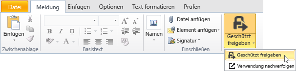
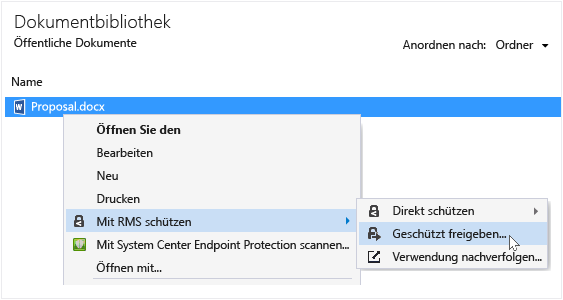
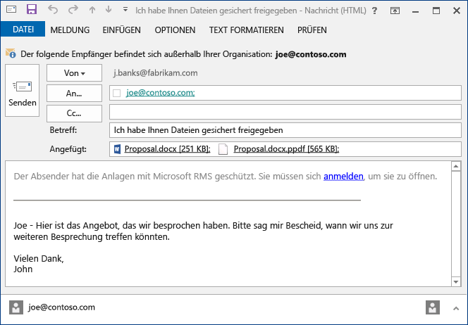

# Sch&#252;tzen Sie eine Datei, die Sie mithilfe von Rights Management-freigabeanwendung per e-Mail freigeben
Wenn Sie eine Datei schützen, die Sie per E-Mail freigeben, wird eine neue Version der ursprünglichen Datei erstellt. Die ursprüngliche Datei bleibt ungeschützt, während die neue Version geschützt und automatisch an die von Ihnen zu sendende E-Mail angefügt wird.

In einigen Fällen (bei Dateien, die in Microsoft Word, Excel und PowerPoint erstellt werden) erstellt die RMS-Freigabeanwendung zwei Versionen der Datei, die an die E-Mail-Nachricht angefügt werden. Die zweite Version der Datei weist die Dateinamenerweiterung **PPDF** auf. Hierbei handelt es sich um eine PDF-Schattenkopie der Datei. Mit dieser Version der Datei wird sichergestellt, dass die Empfänger die Datei immer lesen können, und zwar auch dann, wenn auf deren Computer nicht die Anwendung installiert ist, die Sie zum Erstellen der Datei verwendet haben. Dies kommt häufig vor, wenn Personen ihre E-Mails auf mobilen Geräten lesen und die E-Mail-Anlagen anzeigen möchten. In dem Fall benötigen sie für das Öffnen der Datei lediglich die RMS-Freigabeanwendung. Anschließend können sie die angefügte Datei lesen, können diese jedoch nicht ändern, bis sie die andere Version der Datei in einer Anwendung öffnen, die RMS unterstützt.

Wenn Ihre Organisation Azure RMS verwendet, können Sie die Dateien nachverfolgen, die Sie mithilfe der Freigabe schützen:

-   Wählen Sie eine Option zum Empfangen von E-Mails aus, wenn jemand versucht, die geschützten Dateianlagen zu öffnen. Bei jedem Zugriff auf die Datei werden Sie informiert, wer wann versucht hat, die Datei zu öffnen und ob die Person erfolgreich war (wurde erfolgreich authentifiziert).

-   Verwenden Sie die Website zum Nachverfolgen von Dokumentationen. Sie können die Freigabe der Datei sogar aufheben, indem Sie den Zugriff hierauf auf der Website zum Nachverfolgen von Dokumenten widerrufen. Weitere Informationen finden Sie unter [Verfolgen Sie und aufzuheben Sie Ihre Dokumente, wenn Sie die RMS-Freigabe verwenden](../../ems/RMS_Client/Track-and-revoke-your-documents-when-you-use-the-RMS-sharing-application.md).

## Verwenden von Outlook: Zum Schützen einer Datei, die Sie per E-Mail freigeben

1.  Erstellen Sie Ihre E-Mail-Nachricht, und fügen Sie die Datei an. Klicken Sie dann auf der Registerkarte **Nachricht** in der Gruppe **RMS** auf **Geschützt freigeben** und dann erneut auf **Geschützt freigeben**:

    

    Wenn diese Schaltfläche nicht angezeigt wird, ist die RMS-Freigabeanwendung entweder nicht oder nicht in der neuesten Version auf Ihrem Computer installiert, oder der Computer muss neu gestartet werden muss, um die Installation abzuschließen. Weitere Informationen dazu, wie die Freigabeanwendung installiert wird, finden Sie unter [Herunterladen und Installieren der Rights Management-freigabeanwendung](../../ems/RMS_Client/Download-and-install-the-Rights-Management-sharing-application.md).

2.  Geben Sie die gewünschten Optionen für diese Datei im Dialogfeld [Geschützt freigeben](http://technet.microsoft.com/library/dn574738.aspx) an, und klicken Sie dann auf **Jetzt senden**.

### Weitere Möglichkeiten zum Schützen einer Datei, die Sie per E-Mail freigeben
Neben dem Freigeben einer geschützten Datei mithilfe von Outlook können Sie auch die folgenden Alternativen verwenden:

-   Im Datei-Explorer: Diese Methode kann für alle Dateien angewendet werden.

-   In einer Office-Anwendung: Diese Methode funktioniert in Anwendungen, die von der RMS-Freigabeanwendung unterstützt werden. Sie müssen hierfür das Office-Add-In verwenden, das Sie im Menüband in der Gruppe **RMS** finden.

##### Verwenden des Datei-Explorers oder einer Office-Anwendung: Zum Schützen einer Datei, die Sie per E-Mail freigeben

1.  Verwenden Sie eine der folgenden Optionen:

    -   Im Datei-Explorer: Klicken Sie mit der rechten Maustaste auf die Datei, wählen Sie **Mit RMS schützen** und dann **Geschützt freigeben** aus:

        

    -   Bei den Office-Anwendungen wie Word, Excel und PowerPoint: Vergewissern Sie sich zunächst, dass Sie die Datei gespeichert haben. Klicken Sie dann auf der Registerkarte **Start** ihn der Gruppe **RMS** auf **Geschützt freigeben**, und klicken Sie dann erneut auf **Geschützt freigeben**:

        

    Wenn diese Optionen für den Schutz nicht angezeigt werden, ist die RMS-Freigabeanwendung entweder nicht oder nicht in der neuesten Version auf Ihrem Computer installiert, oder der Computer muss neu gestartet werden muss, um die Installation abzuschließen. Weitere Informationen dazu, wie die Freigabeanwendung installiert wird, finden Sie unter [Herunterladen und Installieren der Rights Management-freigabeanwendung](../../ems/RMS_Client/Download-and-install-the-Rights-Management-sharing-application.md).

2.  Geben Sie die gewünschten Optionen für diese Datei im Dialogfeld [Geschützt freigeben](http://technet.microsoft.com/library/dn574738.aspx) an, und klicken Sie dann auf **Senden**.

3.  Möglicherweise wird kurz danach ein Dialogfeld angezeigt, das angibt, dass Ihre Datei geschützt wird. Anschließend wird eine E-Mail-Nachricht erstellt, die den Empfängern mitteilt, dass die Anlagen mit Microsoft RMS geschützt sind und dass sie sich anmelden müssen. Wenn die Empfänger auf den Link klicken, um sich anzumelden, werden Anleitungen und Links angezeigt, um sicherzustellen, dass Ihre geschützte Anlage geöffnet werden kann.

    Beispiel:

    

    Vielleicht fragen Sie sich: [What’s the .ppdf file that’s automatically created?](../../ems/RMS_Client/Dialog-box-options-for-the-Rights-Management-sharing-application.md#BKMK_PPDF)

4.  Optional: Sie können alle gewünschten Elemente in dieser E-Mail-Nachricht ändern. So können Sie beispielsweise den Betreff oder den Text der E-Mail-Nachricht ändern oder vervollständigen.

    > [!WARNING]
    > Sie können zwar Personen zu dieser E-Mail-Nachricht hinzufügen oder hieraus löschen, damit werden jedoch nicht die Berechtigungen für die Anlage geändert, die Sie im Dialogfeld **Geschützt freigeben** festgelegt haben. Wenn Sie diese Berechtigungen ändern möchten, um einer zusätzlichen Person beispielsweise die Berechtigung zum Öffnen der Datei zu gewähren, schließen Sie die E-Mail-Nachricht, ohne sie zu speichern oder zu senden, und beginnen Sie erneut mit Schritt 1.

5.  Senden Sie die E-Mail-Nachricht.

## Beispiele und weitere Anweisungen
Beispiele für die Verwendung der Rights Management-Freigabeanwendung sowie weitere Anweisungen finden Sie in den folgenden Abschnitten des Benutzerhandbuchs für die Rights Management-Freigabeanwendung

-   [Examples for using the RMS sharing application](../../ems/RMS_Client/Rights-Management-sharing-application-user-guide.md#BKMK_SharingExamples)

-   [What do you want to do?](../../ems/RMS_Client/Rights-Management-sharing-application-user-guide.md#BKMK_SharingInstructions)

## Siehe auch
[Rights Management freigabeanwendung – Benutzerhandbuch](../../ems/RMS_Client/Rights-Management-sharing-application-user-guide.md)

