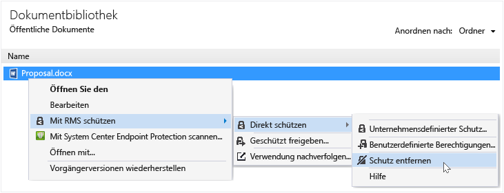

# Rights Management freigabeanwendung – Benutzerhandbuch - Revision f&#252;r einzelnes Thema
Die Microsoft Rights Management (RMS) Freigabe-Anwendung für Windows hilft schützen Sie wichtige Dokumente und Bilder von Personen, die, sollte nicht sehen, auch wenn Sie per e-Mail senden oder auf ein anderes Gerät zu speichern. Sie können diese Anwendung auch öffnen und Verwenden von Dateien, die andere Personen geschützt haben, indem Sie mithilfe der gleichen Rights Management-Technologie.

Sie benötigen lediglich einen Computer mit mindestens Windows 7 und ein lokales Administratorkonto die RMS-Freigabe-Anwendung zu installieren. Klicken Sie dann [herunterladen und installieren](http://go.microsoft.com/fwlink/?LinkId=303970) dieses kostenlose Anwendung von Microsoft.

Wenn Sie Fragen, die in diesem Handbuch nicht beantwortet werden haben, finden Sie unter [häufig gestellte Fragen zur Microsoft Rights Management Freigabe-Anwendung für Windows](http://go.microsoft.com/fwlink/?LinkId=303971).

Hier sind lediglich einige Beispiele dafür, wie Sie die gemeinsame Nutzung von Anwendung, zum Schutz von Dateien verwenden können.

|Ich möchte...|Vorgehensweise|
|-----------------|------------------|
|**… jemand vertrauen sicher Finanzinformationen freigeben, wer ist außerhalb meiner Organisation**  Sie arbeiten mit einem Partnerunternehmen und möchten sie ein Excel-Arbeitsblatt per e-Mail senden, die geplante Verkaufszahlen enthält. Sie sollen die Zahlen jedoch nicht geändert werden.|Verwenden Sie die Schaltfläche geschützt freigeben, auf dem Menüband in Excel, Typ, der die e-Mail-Adressen der beiden Benutzer im Partnerunternehmen arbeiten, wählen Sie auf dem Schieberegler Viewer, und auf senden.  Wenn die e-Mail-Adresse im Partnerunternehmen eingeht, nur die Empfänger der e-Mail können die Kalkulationstabelle anzeigen und sie können nicht speichern, bearbeiten, drucken oder weiterleiten.  Details: Finden Sie unter **schützen eine Datei, die Sie per e-Mail freigeben** in den [What do you want to do?](../../ems/RMS_Client/Rights-Management-sharing-application-user-guide---revision-for-single-topic.md#BKMK_UsingMSRMSApp) dieses Handbuchs.|
|**… sicher ein Dokument per e-Mail zu senden, um Personen, die ein iOS-Gerät verwendet**  Möchten Sie ein streng vertraulich Word-Dokument an einem Kollegen per e-Mail zu senden, die Sie kennen, überprüft regelmäßig auf ihre iOS-Gerät eine e-Mail.|Sie verwenden Datei-Explorer auf die Datei, und wählen die Freigabe geschützt. In der RMS-freigabeanwendung den zulassen-Verbrauch auf alle Geräte-Option auswählen, und senden Sie die Datei als Anlage an den Kollegen.  Der Empfänger erhält die e-Mail auf ihrem Gerät iOS, klickt auf den Link in der e-Mail, die sie erfahren, wie die gemeinsame Nutzung von Anwendung herunterzuladen, wird die Version für iOS-Geräte installiert und zeigt dann das Dokument.  Details: Finden Sie unter **schützen eine Datei, die Sie per e-Mail freigeben** in den [What do you want to do?](../../ems/RMS_Client/Rights-Management-sharing-application-user-guide---revision-for-single-topic.md#BKMK_UsingMSRMSApp) dieses Handbuchs.|
|**… Lesen einer Anlage erhaltene in einer e-Mail-Nachricht, die eine sicheren freigegebenen Dateianlage aufweist, aber ich nicht gelesen werden, da Mein Unternehmen Rights Management nicht verwendet**  Die e-Mail-Versand ist jemand, der Sie vertrauen, da Sie mit diesen Unternehmen in der Vergangenheit schon und Sie vermuten, dass sie Sie Informationen zu einem potenziellen neuen Geschäftschance senden können.|Führen Sie die Schritte in der e-Mail, und klicken Sie auf den Link zum Registrieren für Microsoft Rights Management. Microsoft wird bestätigt, dass Ihre Organisation verfügt nicht über ein Abonnement für Office 365, sendet eine e-Mail an den freien Anmeldevorgang abgeschlossen, und Sie sich mit Ihr neues Konto anmelden. Klicken Sie auf den zweiten Link in der e-Mail an die Rights Management-Freigabe-app installieren zu können, öffnen Sie dann die e-Mail-Anlage zu der neuen Unternehmenschancen lesen.  Details: Finden Sie unter **anzeigen und verwenden Dateien, die durch Rights Management geschützt sind** in den [What do you want to do?](../../ems/RMS_Client/Rights-Management-sharing-application-user-guide---revision-for-single-topic.md#BKMK_UsingMSRMSApp) dieses Handbuchs.|
|**… Schützen Sie vertrauliche Dateien auf meinem Laptop, damit sie von Personen außerhalb meiner Firma zugegriffen werden kann**  Sie viel reisen, und verwenden Ihren Laptop zum Abrufen und Aktualisieren von Dateien in einem Ordner, der vor nicht autorisiertem Zugriff geschützt werden müssen.|Sie haben die RMS-Freigabe-Anwendung auf Ihrem Laptop installiert. Verwenden Sie Datei-Explorer zum Schutz von Dateien mithilfe einer Vorlage, die die Dateien schnell schützt. Wenn der Laptop gestohlen wird, müssen Sie dafür gesorgt, dass niemand außerhalb Ihres Unternehmens auf diese Dokumente zugreifen kann.  Details: Finden Sie unter **schützen eine Datei auf einem Gerät (direkt schützen)** in den [What do you want to do?](../../ems/RMS_Client/Rights-Management-sharing-application-user-guide---revision-for-single-topic.md#BKMK_UsingMSRMSApp) dieses Handbuchs.|

## Was möchten Sie tun?
Verwenden Sie die folgenden Schritte können Sie die Arbeit mit geschützten Dateien.

### Herunterladen und Installieren der Rights Management-freigabeanwendung

1.  Klicken Sie auf die [Microsoft Rights Management](http://go.microsoft.com/fwlink/?LinkId=303970) Seite der Microsoft-Website.

2.  In der **Computer** auf das Symbol für die **RMS-app für Windows** und das Installationspaket von Microsoft Rights Management für gemeinsame Nutzung von Anwendung auf Ihrem Computer speichern.

3.  Die komprimierte Datei, die heruntergeladen wurde, und doppelklicken Sie dann auf einen Doppelklick **setup.exe**. Wenn Sie aufgefordert werden, um den Vorgang fortzusetzen, klicken Sie auf **Ja**.

    > [!TIP]
    > Sie müssen möglicherweise einen Bildlauf bis zum Ende der Liste im aktuellen Ordner finden Sie unter **setup.exe**.

4.  Auf der **Setup Microsoft RMS** auf **Weiter**, und warten Sie, bis die Installation abgeschlossen.

5.  Wenn die Installation abgeschlossen ist, klicken Sie auf **Starten** auf Ihren Computer neu starten und die Installation abzuschließen. Klicken Sie auf **Schließen** und starten Sie den Computer später, um die Installation abzuschließen.

Sie nun können zum Schützen Ihrer Dateien oder Dateien, die von anderen geschützte lesen.

#### Weitere Informationen
Benötigen Sie ein lokales Administratorkonto, um die gemeinsame Nutzung von Anwendung installieren. Wenn Sie nicht als lokaler Administrator anmelden können, können Sie die **als Administrator ausführen** option, wenn Sie in Schritt 3 Setup.exe ausführen.

### Schützen eine Datei auf einem Gerät (direkt schützen)

1.  Wählen Sie im Datei-Explorer eine Datei, einen Ordner oder mehrere Dateien zu schützen. Mit der rechten Maustaste, und wählen Sie dann **direkt schützen**. Beispiel:

    

    > [!NOTE]
    > Wenn Sie nicht sehen, den **direkt schützen** Option ist es wahrscheinlich, dass die freigabeanwendung nicht auf Ihrem Computer installiert ist oder der Computer neu gestartet werden, muss um die Installation abzuschließen. Weitere Informationen zur Installation der freigegebenen Anwendung finden Sie unter der **herunterladen und Installieren der Rights Management-freigabeanwendung** Anweisungen in der [What do you want to do?](../../ems/RMS_Client/Rights-Management-sharing-application-user-guide---revision-for-single-topic.md#BKMK_UsingMSRMSApp) dieses Handbuchs.

2.  Führen Sie einen der folgenden Schritte aus:

    -   Wählen Sie eine Vorlage: Hierbei handelt es sich um vordefinierte Berechtigungen, die Zugriff und die Verwendung auf Personen in Ihrer Organisation einschränken. Ist dies das erste Mal haben Sie eine Datei auf diesem Computer schützen, müssen Sie zuerst auswählen **unternehmensdefinierter Schutz** Vorlagen herunterladen. Der Name der Vorlagen beginnen mit dem Namen Ihres Unternehmens und dann einen aussagekräftigen Namen der Berechtigung. Beispiel: **Contoso - nur vertrauliche Ansicht**

    -   Wählen Sie **benutzerdefinierte Berechtigungen**: Wählen Sie diese Option aus, wenn die Vorlagen nicht das Maß an Schutz bereitstellen, die Sie benötigen. Beispielsweise Personen außerhalb Ihrer Organisation Zugriff gewähren möchten, oder Sie explizit die Schutzoptionen selbst festlegen möchten. Geben Sie die Optionen, die für diese Datei in der **Schutz hinzufügen** (Dialogfeld), und klicken Sie dann auf **Übernehmen**.

        > [!NOTE]
        > Weitere Informationen zu den Optionen in diesem Dialogfeld finden Sie unter der **Geben Sie die Optionen im Dialogfeld Rights Management** Anweisungen in der [What do you want to do?](../../ems/RMS_Client/Rights-Management-sharing-application-user-guide---revision-for-single-topic.md#BKMK_UsingMSRMSApp) dieses Handbuchs.

3.  Schnell möglicherweise ein Dialogfeld, Ihnen mitzuteilen, dass die Datei geschützt ist, und der Fokus dann Datei-Explorer angezeigt. Die ausgewählte Datei oder die Dateien sind nun geschützt. In einigen Fällen (wenn zusätzlicher Schutz die Erweiterung ändert) wird die ursprüngliche Datei im Datei-Explorer durch eine neue Datei mit der Verwaltung von Informationsrechten Schutz Schloss-Symbol ersetzt. Beispiel:

    

Wenn Sie später den Schutz einer Datei aufheben müssen, finden Sie unter der **Aufheben des Schutzes für eine Datei** Anweisungen in der [What do you want to do?](../../ems/RMS_Client/Rights-Management-sharing-application-user-guide---revision-for-single-topic.md#BKMK_UsingMSRMSApp) dieses Handbuchs.

#### Weitere Informationen
Wenn Sie eine Datei direkt schützen, wird die ursprüngliche, nicht geschützte Datei ersetzt. Sie können dann die Datei lassen, wo er ist in einem anderen Ordner oder Gerät kopieren, oder geben Sie den Ordner an, dass es im und die Datei geschützt bleibt. Sie können auch die geschützte Datei an eine e-Mail-Nachricht anfügen, direkt aus dem Datei-Explorer oder einer Office-Anwendung zwar empfohlen, eine geschützte Datei per e-Mail freigeben (finden Sie unter **schützen eine Datei, die Sie per e-Mail freigeben** in den [What do you want to do?](../../ems/RMS_Client/Rights-Management-sharing-application-user-guide---revision-for-single-topic.md#BKMK_UsingMSRMSApp) dieses Handbuchs).

Das gleiche Verfahren können mehrere Dateien zur gleichen Zeit oder einen Ordner zu schützen. Wenn Sie einen Ordner schützen, werden alle Dateien in diesem Ordner automatisch ausgewählt für Schutz jedoch neue Dateien, die Sie in diesem Ordner erstellen, wird nicht automatisch geschützt.

Wenn Sie keine Fehler angezeigt, wenn Sie versuchen, Dateien zu schützen, finden Sie unter [häufig gestellte Fragen zur Microsoft Rights Management Freigabe-Anwendung für Windows](http://go.microsoft.com/fwlink/?LinkId=303971).

### Schützen einer Datei, die Sie per e-Mail freigeben

1.  Verwenden Sie eine der folgenden Optionen:

    -   Für Datei-Explorer: Mit der rechten Maustaste in der Datei, und wählen Sie **Freigabe geschützt**:

        

    -   Für die Office-Anwendung: Stellen Sie sicher, dass Sie zuerst die Datei gespeichert haben. Klicken Sie dann auf die **Schutz** auf **Freigabe geschützt**.

        

    > [!NOTE]
    > Wenn Sie diese Optionen für die Freigabe der Schutzgruppe nicht angezeigt werden, ist es wahrscheinlich, dass die freigabeanwendung nicht auf Ihrem Computer installiert ist oder der Computer neu gestartet werden, muss um die Installation abzuschließen. Weitere Informationen zur Installation der freigegebenen Anwendung finden Sie unter der **herunterladen und Installieren der Rights Management-freigabeanwendung** Anweisungen in der [What do you want to do?](../../ems/RMS_Client/Rights-Management-sharing-application-user-guide---revision-for-single-topic.md#BKMK_UsingMSRMSApp) dieses Handbuchs.

2.  Geben Sie die Optionen, die für diese Datei in der **geschütztes freigeben** (Dialogfeld), und klicken Sie dann auf **Senden**.

    

    > [!NOTE]
    > Weitere Informationen zu den Optionen in diesem Dialogfeld finden Sie unter der **Geben Sie die Optionen im Dialogfeld Rights Management** Anweisungen in der [What do you want to do?](../../ems/RMS_Client/Rights-Management-sharing-application-user-guide---revision-for-single-topic.md#BKMK_UsingMSRMSApp) dieses Handbuchs.

3.  Möglicherweise ein Dialogfeld darüber informiert, die Datei geschützt ist, und Sie sehen dann eine e-Mail-Nachricht erstellt, wenn Sie mit dem Betreff schnell **ich haben Dateien auf sichere Weise mit Ihnen gemeinsam**. In dieser e-Mail-Nachricht wird die ausgewählten Datei angefügt und der Text der e-Mail enthält Links für die folgenden geschützt:

    -   RMS für Einzelpersonen

    -   Die RMS-Freigabe

    -   Dieses Benutzerhandbuch

    Beispiel:

    

4.  Optional: Sie können nichts ändern, die Sie in dieser e-Mail-Nachricht verwenden möchten. Sie können z. B. hinzufügen oder ändern Sie den Betreff oder Text der Nachricht.

    > [!WARNING]
    > Obwohl Sie können hinzufügen oder Entfernen von Personen aus dieser e-Mail-Nachricht, dies ändert nicht die Berechtigungen für die Anlage, die Sie in der **geschütztes freigeben** (Dialogfeld). Wenn Sie diese Berechtigungen ändern möchten, z. B. Geben Sie eine neue Person Berechtigungen für die Datei geöffnet ist, schließen die e-Mail-Nachricht ohne Speichern oder senden und zurück zu Schritt 1.

5.  Senden Sie die e-Mail-Nachricht.

#### Weitere Informationen
Wenn Sie eine Datei, die Sie per e-Mail freigeben schützen, wird eine neue Version der ursprünglichen Datei erstellt. Die ursprüngliche Datei bleibt ungeschützt und die neue Version ist geschützt und automatisch an eine e-Mail-Nachricht angefügt, die Sie dann senden.

Die e-Mail-Nachricht wurde ein Standardbetreff und Standardtext, die Sie ändern können, bevor Sie sie senden.

Es gibt zwei Arten, um eine Datei zu schützen, die Sie per e-Mail freigeben:

-   Datei-Explorer: Diese Methode funktioniert für alle Dateien.

-   Von einer Office-Anwendung: Diese Methode kann für Programme, die die Rights Management-freigabeanwendung unterstützt, mit dem Office-add-Ins, damit Sie sehen die **Schutz** Gruppe auf dem Menüband.

> [!NOTE]
> In dieser Version von Rights Management-freigabeanwendung ist keine add-in für Outlook, die Sie schützen von Dateien und e-Mail-Nachrichten direkt aus dem Outlook-Anwendung ermöglicht. Verwenden Sie stattdessen das Verfahren in diesem Abschnitt.

### Anzeigen und Verwenden von Dateien, die durch Rights Management geschützt sind

#### Eine geschützte Datei anzeigen
Doppelklicken Sie auf die geschützte Datei, und geben Sie Ihre Anmeldeinformationen ein, wenn Sie dazu aufgefordert werden, mithilfe von Datei-Explorer oder die e-Mail-Nachricht mit der Anlage. Wie die Datei geöffnet wird, hängt davon ab, wie sie geschützt wurde.

-   Wenn die Datei i. d. r. geschützt wurde (er besitzt die Erweiterung "pFile"):

    Sie sehen eine **geschützte Datei** Dialogfeld aus der freigegebenen Anwendung kennen, wissen Sie, wer die Datei geschützt und, die Sie bitte die Co-Besitzerberechtigungen zu berücksichtigen. Sie werden darüber informiert, dass beim Öffnen der Datei, die diese Aktion überwacht wird.

    

    Klicken Sie auf **Öffnen** zum Lesen der Datei.

-   Wenn die Datei systemintern geschützt wurde (er besitzt keine Erweiterung "pFile"):

    Die Datei wird geöffnet, mit der Anwendung, die der ursprünglichen Erweiterung zugeordnet ist, und ein Banner Einschränkung wird am oberen Rand der Datei angezeigt. Banner möglicherweise angezeigt, dass die Berechtigungen, die auf die Datei angewendet werden kann, oder es einen Link, um sie anzuzeigen. Beispielsweise könnte Folgendes angezeigt, wo Sie klicken müssen **Berechtigung ist zurzeit eingeschränkt** den tatsächlichen Berechtigungen, die auf die Datei angewendet werden und die Personen, die darauf zugreifen können:

    

    Diese Datei auch überwacht wird und überwachten bleibt, wie sie geschützt ist.

##### Weitere Informationen
Bevor Sie die geschützte Datei anzeigen können, muss zunächst RMS bestätigen, dass Sie berechtigt sind, die Datei anzeigen, indem überprüfen Ihren Benutzernamen und Ihr Kennwort. In einigen Fällen könnte dies zwischengespeichert werden, und Ihre Anmeldeinformationen gefragt, werden nicht angezeigt. In anderen Fällen werden Sie aufgefordert, Ihre Anmeldeinformationen einzugeben.

Wenn Ihre Organisation Windows Azure Rights Management (Windows Azure RMS) oder AD RMS nicht verwendet, können Sie sich für ein kostenloses Konto anwenden, die Ihre Anmeldeinformationen akzeptieren, damit Sie Dateien öffnen können, die mithilfe von RMS geschützt sind. Wenn für dieses Konto anwenden möchten, klicken Sie auf den Link zu beantragen [RMS für Einzelpersonen](http://go.microsoft.com/fwlink/?LinkId=309469).

#### Verwenden Sie Dateien, die (z. B. bearbeiten und Drucken der Datei) geschützt sind
Wenn die geschützte Datei die Erweiterung "pFile" hat:

-   Speichern Sie die geöffnete Datei zu, und geben Sie ihm eine neue Erweiterung, die der Anwendung zugeordnet ist, die Sie verwenden möchten.

    Z. B. wenn eine Datei mit der Datei namens document.vsdx.pfile geschützt wurde, zeigen Sie die Datei, und speichern Sie die Datei im Datei-Explorer als document.vsdx.

    Die neue Datei ist nicht mehr geschützt. Wenn Sie es schützen möchten, müssen Sie dies manuell vornehmen. Eine Anleitung finden Sie **zum Schutz einer Datei auf einem Gerät (direkt schützen) mithilfe von Rights Management-freigabeanwendung** in der [What do you want to do?](../../ems/RMS_Client/Rights-Management-sharing-application-user-guide---revision-for-single-topic.md#BKMK_UsingMSRMSApp) dieses Handbuchs.

Wenn die ursprünglich geschützte Datei nicht über die Erweiterung "pFile":

-   Keine Ansicht die Datei nicht möglich, wenn Sie eine Anwendung haben, die Verwaltung von Informationsrechten versteht. Diese Programme heißen Rights Management Wandlung Applications. Anwendung von Office 2013 und Office 2010 (z. B. Word, Excel, PowerPoint und Outlook) sind Beispiele für Programme, die für die Verwaltung von Informationsrechten Wandlung sind. Aber Clientanwendungen, die nicht von Microsoft, wie z. B. anderen Softwareherstellern und eigene Line-of-Business-Anwendung stammen möglicherweise auch für die Verwaltung von Informationsrechten Wandlung sein.

    Programme, die für die Verwaltung von Informationsrechten wissen, wie Sie Dateien öffnen, die durch andere Rights Management geschützt sind Wandlung sind Wandlung Applications. Sie bleiben auch den Schutz, der Sie angewendet wird, auch wenn Sie die Datei bearbeiten, oder auf einen anderen Dateinamen oder einen anderen Speicherort speichern. Diese Programme können Sie die Datei entsprechend den Berechtigungen, die derzeit auf die Datei angewendet werden, wenn Sie Berechtigungen zum Verwenden der Datei verfügen, können Sie dies tun. Z. B. wenn die Datei im schreibgeschützten Modus geschützt wurde, werden es nicht möglich, ändern oder Drucken der Datei.

### Aufheben des Schutzes für eine Datei
Datei-Explorer mit der Maustaste der Datei (z. B. Sample.ptxt), klicken Sie auf **direkt schützen**, und klicken Sie dann auf **Schutz entfernen**:

Möglicherweise werden Sie zur Eingabe von Anmeldeinformationen aufgefordert.

#### Weitere Informationen
Die ursprüngliche geschützte Datei ist (z. B. Sample.ptxt) gelöscht und mit einer Datei mit dem gleichen Namen, jedoch mit der ungeschützten Erweiterung (z. B. "Sample.txt") ersetzt.

Beim Entfernen des Schutzes aus einer Datei (d. h. eine Datei aufheben), die zuvor mithilfe der RMS-Freigabe geschützt wurde, verwenden Sie die **Schutz entfernen** Option vom Datei-Explorer.

> [!IMPORTANT]
> Sie müssen einen Besitzer der Datei beim Entfernen des Schutzes sein.

### Verwenden von Tastenkombinationen in der Rights Management-freigabeanwendung
Drücken Sie die **Alt** Taste, um die verfügbaren Zugriffstasten finden Sie unter, und drücken Sie dann die **Alt** + Zugriffstaste, eine Option auszuwählen.

#### Weitere Informationen
Beispielsweise in der **geschütztes freigeben** (Dialogfeld), drücken Sie **Alt** Zugriffstasten, und drücken dann die **Alt + u** Auswählen der **müssen Benutzer Anmeldename jedes Mal, wenn sie diese Datei öffnen** Kontrollkästchen.

### Geben Sie die Optionen im Dialogfeld Rights Management

|Option|Beschreibung|
|----------|----------------|
|**BENUTZER**|Geben Sie die e-Mail-Adressen der Personen, die die Datei geöffnet werden soll. Verwenden Sie Semikolons für mehrere Adressen. Dabei kann es sich um e-Mail-Adressen außerhalb oder innerhalb Ihrer Organisation handeln.  Beispiel: Janetm@contoso.com; pdover@fabricom.com|
|**Verbrauch auf allen Geräten zulassen**|Wenn Sie diese Option auswählen, die Benutzern das Öffnen der Datei auf mobilen Geräten wie z. B. einem iPad ermöglicht, die Berechtigungen automatisch auf festgelegt **Co Besitzer** (alle Berechtigungen), damit generischer Schutz verwendet wird, um die Datei zu schützen.|
|**BERECHTIGUNGEN**|Verschieben Sie den Schieberegler, um die Berechtigung, die Sie für diese Datei verwenden möchten.  In einigen Fällen werden die Berechtigungen werden automatisch Co Besitzer festgelegt und können nicht geändert werden. Dies geschieht, wenn Sie die Option **Verbrauch auf allen Geräten ermöglichen**. Und auch geschieht, wenn Sie eine Datei schützen, die systemintern durch RMS geschützt werden können und daher generisch geschützt werden müssen. Die freigabeanwendung wird bestimmt, basierend auf der Erweiterung. **Tip:** Sie können die [Microsoft Rights Management](http://go.microsoft.com/fwlink/?LinkId=303970) Seite auf der Microsoft-Website, schnell zu überprüfen, welche Anwendung integrierten Schutz zu unterstützen.|
|**Benutzer müssen Benutzernamen jedes Mal, wenn sie diese Datei öffnen**|Wählen Sie diese Option, wenn Sie höhere Sicherheit für eine Datei benötigen, da es erfordert, dass der Benutzer immer authentifiziert werden, jedes Mal, wenn sie auf die Datei zugreifen. Um dies tun, wenn ihre Anmeldeinformationen nicht zwischengespeichert sind, aufgefordert werden, für ihren Benutzernamen und Ihr Kennwort. Diese Einstellung erfordert jedoch, dass diese Benutzer immer Zugriff auf das Internet zum Öffnen der Datei haben, und aufgefordert werden, eine Datei und wartenden Entsperren für der Authentifizierungsprozess beendet kann frustrierend sein.|
|**Inhalt läuft ab am**|Wählen Sie diese Option nur für zeitempfindliche-Dateien, die die Benutzer die von Ihnen ausgewählten nicht nach einem Datum zu öffnen, die Sie angeben. Öffnen Sie die ursprüngliche Datei ist weiterhin möglich.|

#### Weitere Informationen
Verwenden Sie die Tabelle können Sie die Optionen in der freigegebenen Anwendung angeben **Schutz hinzufügen** Dialogfeld oder **geschütztes freigeben** (Dialogfeld). Dieses Dialogfeld wird angezeigt, wenn Sie eine Datei zu schützen, und wählen Sie die benutzerdefinierte Berechtigungen oder eine freigegebene Datei zu schützen.

Weitere Informationen zum Schützen einer Datei und schützen eine Datei freigeben, finden Sie die [What do you want to do?](../../ems/RMS_Client/Rights-Management-sharing-application-user-guide---revision-for-single-topic.md#BKMK_UsingMSRMSApp) dieses Handbuchs.

## Siehe auch
[Rights Management freigabeanwendung – Administratorhandbuch](../../ems/RMS_Client/Rights-Management-sharing-application-administrator-guide.md)
 [Microsoft Rights Management-freigabeanwendung herunterladen](http://go.microsoft.com/fwlink/?LinkId=303970)
 [Häufig gestellte Fragen zur Microsoft Rights Management-Freigabeanwendung für Windows](http://go.microsoft.com/fwlink/?LinkId=303971)

