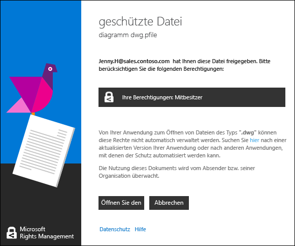

# Anzeigen und Verwenden von Dateien, die durch Rights Management gesch&#252;tzt sind
Wenn die Rights Management-Freigabeanwendung (RMS) auf Ihrem Computer installiert ist, können Sie eine geschützte Datei anzeigen, indem Sie einfach auf sie doppelklicken. Die Datei ist möglicherweise eine Anlage einer E-Mail-Nachricht, oder sie wird möglicherweise angezeigt, wenn Sie den Datei-Explorer verwenden.

> [!NOTE]
> Bevor Sie die geschützte Datei anzeigen können, muss RMS bestätigen, dass Sie zum Anzeigen der Datei berechtigt sind. Dazu überprüft RMS Ihren Benutzernamen und Ihr Kennwort. In einigen Fällen können Ihre Anmeldeinformationen zwischengespeichert sein, und Sie sehen keine Eingabeaufforderung, in der nach diesen Informationen gefragt wird. In anderen Fällen werden Sie aufgefordert, Ihre Anmeldeinformationen einzugeben.
> 
> Wenn Ihre Organisation weder Azure Rights Management (Azure RMS) noch AD RMS verwendet, können Sie ein kostenloses Konto beantragen, für das Ihre Anmeldeinformationen akzeptiert werden, sodass Sie Dateien öffnen können, die mithilfe von RMS geschützt wurden:
> 
> -   Um dieses Konto zu beantragen, klicken Sie auf den Link, um [RMS for Individuals](http://go.microsoft.com/fwlink/?LinkId=309469) zu beantragen.
> 
>     Wenn Sie sich anmelden, verwenden Sie Ihre Unternehmens-E-Mail-Adresse anstelle einer privaten E-Mail-Adresse. Wenn Sie sich anmelden, weil Sie per E-Mail eine geschützte Dateianlage erhalten haben, verwenden Sie die E-Mail-Adresse, die zum Senden der E-Mail-Nachricht an Sie verwendet wurde.
> -   Weitere Informationen finden Sie unter [RMS for Individuals und Azure Rights Management](http://technet.microsoft.com/library/dn592127.aspx).

## So zeigen Sie eine geschützte Datei an
Doppelklicken Sie im Datei-Explorer oder in der E-Mail-Nachricht, die die Anlage enthält, auf die geschützte Datei, und geben Sie Ihre Anmeldeinformationen ein, wenn Sie dazu aufgefordert werden.

Sollten zwei Versionen der Datei mit verschiedenen Dateinamenerweiterungen angezeigt werden, öffnen Sie die Datei mit der PPDF-Erweiterung nur dann, wenn sich die andere Datei nicht öffnen lässt. Wenn Sie auch die PPDF-Version nicht öffnen können, installieren Sie zunächst die [RMS-Freigabeanwendung](http://technet.microsoft.com/library/dn574734.aspx), mit der Dateien geöffnet werden können, die eine PPDF-Dateinamenerweiterung haben.

> [!NOTE]
> Weitere Informationen finden Sie unter [What’s the .ppdf file that’s automatically created?](../../ems/RMS_Client/Dialog-box-options-for-the-Rights-Management-sharing-application.md#BKMK_PPDF).

Wie die Datei geöffnet wird, hängt davon ab, wie sie geschützt wurde. Sie können dies anhand der Dateinamenerweiterung erkennen. In jedem Fall kann das Öffnen der Datei überwacht werden, und die Überwachung erfolgt solange, wie die Datei geschützt ist. Wenn die Datei als E-Mail-Anhang gesendet wurde, wird der Absender möglicherweise jedes Mal, wenn Sie die Datei öffnen, per E-Mail benachrichtigt.

|Dateinamenerweiterung und Schutz|Weitere Informationen|
|------------------------------------|-------------------------|
|Die Datei hat die Dateinamenerweiterung **.pfile**.  Die Datei wurde generisch geschützt.|Wenn Sie die Datei öffnen, sehen Sie das Dialogfeld **Geschützte Datei** der Freigabeanwendung. In dem Dialogfeld wird Ihnen mitgeteilt, wer die Datei geschützt hat und dass von Ihnen erwartet wird, dass Sie die Mitbesitzerberechtigungen berücksichtigen. Klicken Sie auf **Öffnen**, um die Datei zu lesen.  |
|Die Datei hat eine **PPDF**-Dateinamenerweiterung oder ist eine geschützte Text- oder Bilddatei (etwa **PTXT** oder **PJPG**).  Die Datei wurde systemeigen als schreibgeschützte Kopie geschützt.|Die Datei wird mit dem Viewer geöffnet, der mit der RMS-Freigabeanwendung installiert wurde. Diese Datei ist schreibgeschützt, selbst wenn Sie sie woanders speichern oder umbenennen.|
|Andere Dateinamenerweiterungen.  Die Datei wurde systemeigen geschützt.|Die Datei wird mit der Anwendung geöffnet, die mit der ursprünglichen Dateinamenerweiterung verknüpft ist, und am Anfang der Datei wird ein Beschränkungsbanner angezeigt. Auf dem Banner werden möglicherweise die Berechtigungen angezeigt, die auf das Dokument angewendet wurden, oder in ihm wird ein Link bereitgestellt, um diese anzuzeigen. Beispielsweise könnte Folgendes angezeigt werden, sodass Sie auf **Die Berechtigung ist zurzeit eingeschränkt** klicken müssen, um die tatsächlichen Berechtigungen, die auf die Datei angewendet wurden, sowie die Personen zu sehen, die darauf zugreifen können:  |

## So verwenden Sie Dateien, die geschützt wurden (z. B. Bearbeiten und Drucken der Datei)
Wenn Sie die geschützte Datei nicht nur lesen, sondern beispielsweise bearbeiten, kopieren und drucken möchten:

|Dateinamenerweiterung|Anweisungen|
|-------------------------|---------------|
|Die Datei hat die Dateinamenerweiterung **.pfile**.|Speichern Sie die geöffnete Datei, und geben Sie ihr eine neue Dateinamenerweiterung, die mit der Anwendung verknüpft ist, die Sie verwenden möchten.  Wurde eine Datei z. B. mit dem Dateinamen „dokument.vsdx.pfile“ geschützt, zeigen Sie die Datei an, und speichern Sie die Datei im Datei-Explorer als „dokument.vsdx“.  Die neue Datei ist nicht mehr geschützt. Wenn Sie sie schützen möchten, müssen Sie dies manuell tun. Anweisungen finden Sie unter [Schützen eine Datei auf einem Gerät &#40;direkt schützen&#41; mithilfe von Rights Management-freigabeanwendung](../../ems/RMS_Client/Protect-a-file-on-a-device--protect-in-place--by-using-the-Rights-Management-sharing-application.md).|
|Die Datei hat eine **PPDF**-Dateinamenerweiterung oder ist eine geschützte Text- oder Bilddatei (etwa **PTXT** oder **PJPG**).|Sie können die Datei nur anzeigen, und wenn Sie sie umbenennen oder verschieben, bleibt die Datei weiterhin geschützt.|
|Andere Dateinamenerweiterungen.|Damit diese Dateien verwendet werden können, muss Ihr Gerät eine Anwendung haben, die Rights Management versteht. Diese Anwendungen werden als RMS-fähige Anwendungen bezeichnet. Anwendungen aus Office 2016, Office 2013 und Office 2010 (z. B. Word, Excel, PowerPoint und Outlook) sind Beispiele für Anwendungen, die für Rights Management geeignet sind. Aber auch Anwendungen, die nicht von Microsoft stammen, z. B. Branchenanwendungen anderer Softwarehersteller oder Ihre eigenen Branchenanwendungen, sind möglicherweise für Rights Management geeignet.  Anwendungen, die für Rights Management geeignet sind, wissen, wie Dateien zu öffnen sind, die durch andere Rights Management-fähige Anwendungen geschützt wurden. Sie behalten außerdem den auf sie angewendeten Schutz, selbst wenn Sie die Datei bearbeiten oder unter einem anderen Dateinamen oder an einem anderen Speicherort speichern. Diese Anwendungen ermöglichen es Ihnen, die Datei entsprechend den Berechtigungen zu verwenden, die derzeit auf sie angewendet sind. Wenn Sie also die Berechtigungen haben, die Datei zu verwenden, können Sie dies tun. Beispielsweise könnte es sein, dass Sie die Datei bearbeiten, aber nicht drucken können.|

## Beispiele und weitere Anweisungen
Beispiele für die Verwendung der Rights Management-Freigabeanwendung sowie weitere Anweisungen finden Sie in den folgenden Abschnitten des Benutzerhandbuchs für die Rights Management-Freigabeanwendung

-   [Examples for using the RMS sharing application](../../ems/RMS_Client/Rights-Management-sharing-application-user-guide.md#BKMK_SharingExamples)

-   [What do you want to do?](../../ems/RMS_Client/Rights-Management-sharing-application-user-guide.md#BKMK_SharingInstructions)

## Siehe auch
[Rights Management freigabeanwendung – Benutzerhandbuch](../../ems/RMS_Client/Rights-Management-sharing-application-user-guide.md)

